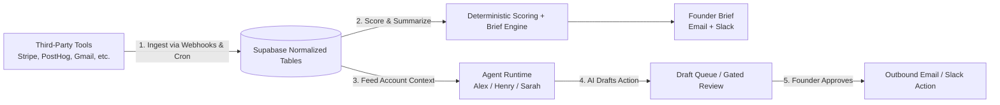

# Allel — Complete Product, Architecture & Codebase Guide

> **The Canonical Guide to Allel.** Everything from the founder mental model and product positioning to the multi-tenant database schema, AI SDK 6 agent runtime, in-loop tool routing, integration sync engine, trust boundaries, and streaming UI layer.
>
> Verified against the working tree as of **2026-08-22**. This document combines and supersedes `ALLEL_COMPLETE_GUIDE.md` and the original `ALLEL.md`. Agent-loop internals and prompt specifics are detailed in [AGENT.md](file:///Users/kushagrasingh/dev/allel/AGENT.md); active fix tasks and implementation briefs live in [TODO.md](file:///Users/kushagrasingh/dev/allel/TODO.md).

---

## Table of Contents

1. [Product Definition & ICP](#1-product-definition--icp)
2. [The Core Operating Loop](#2-the-core-operating-loop)
3. [System Architecture (The 8 Layers)](#3-system-architecture-the-8-layers)
4. [Database & Data Model](#4-database--data-model)
5. [The Integration & Ingestion Layer](#5-the-integration--ingestion-layer)
6. [The Deterministic Scoring & Brief Engine](#6-the-deterministic-scoring--brief-engine)
7. [The Agent Runtime Layer & Personas](#7-the-agent-runtime-layer--personas)
8. [Reliable Tool Routing & In-Loop Expansion (TC-1, TC-2, TC-3)](#8-reliable-tool-routing--in-loop-expansion)
9. [The Dual-Memory System](#9-the-dual-memory-system)
10. [Human-in-the-Loop & Trust Boundaries](#10-human-in-the-loop--trust-boundaries)
11. [Observability & Run Inspection](#11-observability--run-inspection)
12. [Frontend & Streaming UI Architecture](#12-frontend--streaming-ui-architecture)
13. [Runtime Paths: 3 Key Execution Triggers](#13-runtime-paths-3-key-execution-triggers)
14. [Directory & Codebase Map](#14-directory--codebase-map)
15. [What This Architecture Is Not](#15-what-this-architecture-is-not)
16. [Known Gaps & Next Product Moves](#16-known-gaps--next-product-moves)

---

## 1. Product Definition & ICP

### What The Product Is
**Allel is a founder-facing retention operations product that helps save revenue automatically.**

It is not primarily a generic "AI chat tool", nor is it a CRM or an open-ended workflow canvas. 
The core value proposition:
- **Detect churn risk early** across billing, usage, support, CRM, and engineering signals.
- **Explain why churn is happening** with concrete, multi-source evidence.
- **Draft the next best save action fast** (e.g., rescue discounts, targeted founder emails).
- **Deliver one daily operating brief** to the founder's inbox and Slack.
- **Provide a unified operator console** (`/dashboard`) with persona-driven AI co-founders.

### Ideal Customer Profile (ICP)
- **Target**: Founder-led B2B SaaS teams (1 to 20 people, roughly `$1k–$50k MRR`).
- **Situation**: Operating customer success manually without a dedicated CS organization.
- **Core Pain**:
  - *"Signals exist, but they are scattered across Stripe, PostHog, Gmail, Intercom, Linear, and Sentry."*
  - *"I don't have time to manually triage churn risk every morning."*
  - *"By the time I notice an account went silent, it has already canceled."*

### Positioning Guidance
- **Lead with**: *"Retention agent that saves revenue automatically"*, *"You are losing users and don't know why"*, *"Daily founder brief with the next best action"*.
- **Avoid leading with**: Generic "AI assistant" tropes, vague "all-in-one workspace" buzzwords, or ungrounded automation claims.

---

## 2. The Core Operating Loop



1. **Connect data sources**: Founder connects Stripe, PostHog, Gmail, Slack, Intercom, HubSpot, Linear, Sentry, Notion, Airtable, Calendar.
2. **Normalize data**: Allel converts messy provider events into unified schema tables (`customer_accounts`, `account_signals`, `account_contacts`, `account_timeline`).
3. **Score and brief deterministically**: TypeScript algorithms (not LLMs) compute 6-factor risk scores and assemble the daily founder brief. Financial numbers and churn metrics are never hallucinated.
4. **Agent reasoning**: Personas analyze drop-offs, inspect logs, search docs, and generate follow-up drafts.
5. **Human approval**: Drafts land in `follow_up_drafts`. The agent **cannot** self-approve or send emails autonomously.

---

## 3. System Architecture (The 8 Layers)

```
┌──────────────────────────────────────────────────────────────────────┐
│ 1. Frontend Shell (Next.js 15.5 App Router, React 19.1, Tailwind 4)  │
│    - Dashboard home (agent panel), Accounts, Drafts, Settings        │
│    - AgentFeed: streaming chat with tool-call and reasoning parts    │
├──────────────────────────────────────────────────────────────────────┤
│ 2. API & Edge Handlers (src/app/api/**)                              │
│    - /api/agent (streaming chat via AI SDK 6 ToolLoopAgent)          │
│    - /api/webhooks/stripe & /posthog (real-time ingestion)            │
│    - /api/cron/daily-run (scheduled morning ops run)                 │
│    - /api/agent/runs (workflow inspection), /api/drafts/[id]/*        │
├──────────────────────────────────────────────────────────────────────┤
│ 3. Agent Runtime Engine (src/lib/agent/)                             │
│    - AI SDK 6 ToolLoopAgent, OpenAI / Azure models, stopWhen: 25     │
│    - In-loop activeTools + prepareStep schema expansion              │
│    - Personas: Alex (co-founder), Henry (growth), Sarah (retention)   │
│    - Adaptive Levenshtein domain router + workflow stage allowlists  │
├──────────────────────────────────────────────────────────────────────┤
│ 4. Memory Architecture (src/lib/agent/)                              │
│    - Compacted chat memory: trailing window + rolling summary        │
│    - Durable account memory (account_memories) + refresh queue       │
├──────────────────────────────────────────────────────────────────────┤
│ 5. Deterministic Scoring & Brief Layer                               │
│    - src/lib/engine/score-engine.ts: 6-factor weighted 0–100 score   │
│    - src/lib/briefs/generate-workspace-brief.ts: canonical brief     │
├──────────────────────────────────────────────────────────────────────┤
│ 6. Integration Sync Engine (src/lib/integrations/)                   │
│    - Catalog of 18 providers: 8 syncable, 3 tool-only, 7 planned     │
│    - 8 *-sync.ts jobs, encrypted tokens, live integration guards     │
├──────────────────────────────────────────────────────────────────────┤
│ 7. Observability & Inspection (run-logger.ts, run-inspection.ts)     │
│    - Workflow grouping, token costs, step traces, latencies          │
├──────────────────────────────────────────────────────────────────────┤
│ 8. Database & Auth (Supabase PostgreSQL + RLS)                       │
│    - Multi-tenant workspaces, encrypted tokens, normalized accounts  │
└──────────────────────────────────────────────────────────────────────┘
```

---

## 4. Database & Data Model

All data is multi-tenant and workspace-scoped through Supabase Row-Level Security (RLS) on `workspace_id`. Migrations live in `supabase/migrations/` (16 files) creating **21 tables**.

### Primary Operating Tables

| Table | Role |
| :--- | :--- |
| `workspaces`, `workspace_members` | Multi-tenant isolation and user role membership. |
| `integration_connections`, `integration_tokens` | Provider connection status, health, and AES-256-GCM encrypted credentials. |
| `customer_accounts` | The core entity: customer company, `mrr_cents`, `churn_risk_score` (0–100), `health_status`, `plan_name`, `billing_status`. |
| `account_contacts` | Verified contacts attached to an account, used for email/draft resolution. |
| `account_signals` | Discrete health or risk events (failed invoice, usage drop, negative sentiment). |
| `account_timeline` | Unified chronological activity feed across all connected tools. |
| `follow_up_drafts` | Agent-drafted outbound emails awaiting founder approval, plus approval provenance columns. |
| `draft_outcomes` | Post-send outcome tracking used by the revenue-saved metric. |
| `founder_briefs`, `founder_brief_items` | Daily high-signal summary of what changed and what to do next. |
| `account_memories`, `account_memory_refresh_queue` | Durable per-account synthesis and bounded asynchronous refresh queue. |
| `agent_conversations` | Persisted chat transcript, compacted summary, and account context per session. |
| `agent_runs` | Audit log of every agent invocation: workflow, stage, persona, provider, tokens, cost, step trace, and expansion requests. |
| `webhook_events` | Webhook idempotency records and processing state. |
| `churn_scores`, `churn_score_factors` | Normalized score history read by the `getChurnScoreHistory` tool. |
| `tool_approval_requests` | Backing table for the chat-mode tool approval interceptor. |

---

## 5. The Integration & Ingestion Layer

Located in `web/src/lib/integrations/`. `catalog.ts` is the single source of truth for provider capabilities.

### The 3 Provider Tiers

1. **Syncable (8)** — Data is synced into Supabase on connect, cron, or webhook:
   `Stripe`, `PostHog`, `Gmail`, `Intercom`, `HubSpot`, `Slack`, `Sentry`, `Linear`.
2. **Tool-only (3)** — No periodic sync; live provider tools are invoked on-demand:
   `Notion`, `Airtable`, `Google Calendar`.
3. **Planned (7)** — Cataloged for future expansion:
   `Jira`, `GitHub`, `Zendesk`, `Salesforce`, `Supabase`, `Google Docs`, `Google Drive`.

> **Note on Web Research**: Web search and crawling run via Tavily (`TAVILY_API_KEY`) through `webSearchTool`, `webExtractTool`, `webCrawlTool`, and `webMapTool`.

### Ingestion Mechanisms
- **Webhooks** (`/api/webhooks/stripe`, `/api/webhooks/posthog`): Real-time ingestion on subscription cancellations or usage drop-offs. Handled with idempotency via `webhook_events`.
- **Daily Cron** (`/api/cron/daily-run`, scheduled `30 4 * * *` in `web/vercel.json`): Polls all connected providers with per-provider failure isolation.
- **Live Integration Guard**: `wrapToolWithLiveIntegrationGuard` wraps all 136 tool definitions to ensure unverified or disconnected providers fail cleanly without returning fabricated mock data.

---

## 6. The Deterministic Scoring & Brief Engine

### Scoring — `web/src/lib/engine/score-engine.ts`
`scoreAccount()` calculates a 6-factor weighted score from 0 to 100 (where 100 = critical churn risk):
$$\text{score} = \sum (\text{factor\_weight} \times \text{normalized\_signal})$$
Unconnected integrations fall back to neutral baselines so missing integrations neither falsely inflate nor deflate risk.

### Brief Generation — `web/src/lib/briefs/generate-workspace-brief.ts`
TypeScript queries live account records, sums financial metrics, ranks accounts needing attention, and generates `founder_brief_items`.
- **Integrity Rule**: Automated agent runs do **not** own brief records. The deterministic generator rebuilds briefs from authoritative state.
- **Delivery**: Dispatched by email via connected Gmail (`sendEmail`) and posted to Slack (`syncSlackWorkspace()`).

---

## 7. The Agent Runtime Layer & Personas

Located in `web/src/lib/agent/`.

### The 3 Personas (`personas.ts`)

| Persona ID | Display Name | Role | Tool Scope |
| :--- | :--- | :--- | :--- |
| `alex` | **Alex** (Allel) | Co-founder / Generalist | Full registered tool universe (all 136 tools) |
| `henry` | **Henry** | Head of Growth | Growth & research: Tavily, read-only CRM/Support, Gmail read/draft, Slack, Notion |
| `sarah` | **Sarah** | Head of Retention | Retention: Stripe billing, PostHog usage, rescue drafts, account health |

### Workflow Stages (`workflows.ts`)
Automated workflows decompose into staged execution phases:
- `detect` & `verify`: Strictly read-only tools.
- `analyze`: Read-only plus account-state updates (signals, timeline, notes).
- `draft`: Read-only plus draft operations (`generateFollowUpDraft`, `updateDraftContent`, `rejectDraft`).

---

## 8. Reliable Tool Routing & In-Loop Expansion

Allel implements a 3-guarantee tool-calling architecture:

```text
persona + workflow policy ceiling (Hard Security Boundary)
        │
        ▼
eligible capability tools (e.g., Alex = 136 tools, Henry = 32 tools)
        │
        ├── deterministic router ──► initially activeTools (~12 tools)
        │                              + requestMoreTools meta-tool
        │
        ▼
ToolLoopAgent contains all eligible definitions internally
but sends only `activeTools` schemas to LLM on step 1
        │
        ▼
model calls requestMoreTools({ domain: 'stripe', reason: '...' })
        │
        ▼
next `prepareStep` derives requested domains from prior step tool calls
        │
        ▼
activeTools = initial tools ∪ eligible tools in requested domains
        │
        ▼
model receives expanded schemas in the SAME loop turn without restarting stream
```

### TC-1: Adaptive Levenshtein Fuzzy Matcher
- Exact regex match pass (0ms).
- Adaptive Levenshtein distance:
  - Tokens 4–5 chars: distance $\le 1$
  - Tokens 6+ chars: distance $\le 2$
  - Tokens $\le 3$ chars: never fuzzy-matched (prevents false matches like `cat` -> `calendar`)
- Independent multi-domain scoring (e.g. `"check my emials and calandar"` matches both Gmail and Calendar).
- Chat turns with no signal fall back to core capability tools (~7 tools) instead of dumping 136 schemas.

### TC-2: In-Loop `prepareStep` & `requestMoreTools`
- Meta-tool returns `expansion_requested` or `outside_policy`.
- AI SDK 6 `prepareStep` dynamically updates `activeTools` and system instructions per step.
- Concurrency-safe: pure functional derivation from `steps`, zero shared mutable state across requests.

### TC-3: Auditability & Telemetry
- Expansion requests are tracked in `agent_runs.metadata.toolExpansionRequests`.

---

## 9. The Dual-Memory System

### 1. Chat Memory (`chat-memory.ts`)
- Preserves a bounded trailing transcript (`MAX_PERSISTED_AGENT_MESSAGES = 40`).
- Compacts older messages into a rolling summary (`MAX_COMPACTED_SUMMARY_CHARS = 1800`).
- Tracks mentioned accounts (up to 4), recent goals, and commitments in `agent_conversations`.

### 2. Durable Account Memory (`account-memory.ts`)
- Stored in `account_memories`: account synthesis, drop-off context, and open loops.
- Retrieved via `getAccountMemory` tool.
- Changes enqueue bounded background refreshes in `account_memory_refresh_queue`.

---

## 10. Human-in-the-Loop & Trust Boundaries

### Outbound Action Gate
- AI agent calls `generateFollowUpDraft(...)` to stage an email in `follow_up_drafts`.
- `approveDraftForActor()` **strictly rejects** `actor === 'agent'`.
- `sendDraftForActor()` requires status `ready_to_send` and verified human founder approval provenance.
- `approveDraft` and `sendApprovedDraft` tools are **excluded** from `ALL_TOOLS`.

### Inbound History Security
- Client `user` messages are accepted; `system` and `tool` roles from the client are discarded.
- `assistant` messages are accepted only if accompanied by a valid HMAC-SHA256 signature (`ui-message-utils.ts`).

---

## 11. Observability & Run Inspection

Located in `web/src/lib/agent/run-logger.ts` and `run-inspection.ts`.
- Every turn logs to `agent_runs`: workflow ID, stage, persona, tokens, estimated cost, step traces, and tool expansion requests.
- Workflow inspection APIs with cursor pagination:
  - `GET /api/agent/runs` — list workflows
  - `GET /api/agent/runs/[workflowId]` — workflow step-by-step detail

---

## 12. Frontend & Streaming UI Architecture

- **Stack**: Next.js 15.5.14 (App Router), React 19.1.0, Tailwind CSS 4, AI SDK 6 UI streaming.
- **Surfaces**:
  - `/` & `/pricing`: Marketing landing pages.
  - `/dashboard`: Primary founder console with streaming `AgentFeed` and persona switcher.
  - `/dashboard/accounts`: Account list and account detail with timeline and signal cards.
  - `/dashboard/drafts`: Draft queue for reviewing, editing, approving, and sending outreach.
  - `/dashboard/settings`: Live integration management with credential validation and connect modals.
  - `/dashboard/flows`: Workflows route (backend APIs live, UI screen in backlog).

---

## 13. Runtime Paths: 3 Key Execution Triggers

1. **Morning Cron Run** (`GET /api/cron/daily-run`): Provider sync $\rightarrow$ memory refresh $\rightarrow$ AI workflow stages $\rightarrow$ deterministic brief generation $\rightarrow$ Email & Slack delivery.
2. **Real-Time Webhook** (`POST /api/webhooks/stripe` / `/posthog`): Signature verification $\rightarrow$ account normalization $\rightarrow$ brief refresh $\rightarrow$ Next.js `after()` follow-up agent reasoning.
3. **Founder Chat Stream** (`POST /api/agent`): Auth & workspace resolution $\rightarrow$ HMAC history validation $\rightarrow$ memory injection $\rightarrow$ ToolLoopAgent execution with in-loop schema expansion $\rightarrow$ assistant signing $\rightarrow$ run logging.

---

## 14. Directory & Codebase Map

```
allel/
├── web/
│   ├── src/
│   │   ├── app/
│   │   │   ├── api/agent/           # Streaming chat, history, run inspection
│   │   │   ├── api/cron/daily-run/  # Daily automated retention workflow
│   │   │   ├── api/webhooks/        # Stripe & PostHog webhook receivers
│   │   │   ├── api/drafts/[id]/     # Founder-only approve and send
│   │   │   ├── api/integrations/    # Gmail OAuth callback, direct connect
│   │   │   ├── dashboard/           # Home, accounts, drafts, settings, flows
│   │   │   ├── page.tsx             # Landing page
│   │   │   └── layout.tsx           # Root layout & providers
│   │   ├── components/
│   │   │   ├── agent-feed/          # ChatProvider, AgentPane, AgentFeed, TimelineNodes
│   │   │   ├── dashboard/           # Workspace layout, HomeAgentPanel, LeftPane
│   │   │   └── ui/                  # UI primitives
│   │   ├── lib/
│   │   │   ├── agent/               # ToolLoopAgent, tools, personas, router, memory, logging
│   │   │   ├── ai/                  # Model resolution, Azure OpenAI normalization
│   │   │   ├── briefs/              # Deterministic brief generation and email/slack delivery
│   │   │   ├── drafts/              # Draft workflows, send, outcome tracking
│   │   │   ├── engine/              # 6-factor risk scoring engine
│   │   │   ├── integrations/        # Provider catalog, sync jobs, tokens, health guards
│   │   │   ├── supabase/            # Supabase clients (browser, server, admin)
│   │   │   └── workspaces/          # Workspace provisioning and RLS context
│   │   └── middleware.ts            # Supabase session refresh
│   └── vercel.json                  # Daily cron configuration
├── supabase/
│   └── migrations/                  # 16 SQL migrations (21 tables, RLS)
├── ALLEL.md                         # This canonical product & architecture guide
├── AGENT.md                         # Agent runtime, prompts, and persona allowlists
├── TODO.md                          # Active task backlog & verified test baselines
└── tool_calling.md                  # Detailed tool calling & self-healing architecture
```

---

## 15. What This Architecture Is Not

- **Not an unconstrained autonomous agent**: Outbound communications require strict human founder approval.
- **Not a black-box LLM scoring system**: Churn risk and financial sums are computed with deterministic TypeScript code.
- **Not a toy chat wrapper**: Features live provider guards, HMAC history verification, in-loop schema routing, and multi-tenant RLS isolation.

---

## 16. Known Gaps & Next Product Moves

1. **Workflow Inspection UI**: Build the founder UI for `/dashboard/flows` on top of the live `/api/agent/runs` APIs.
2. **Server Chat Hydration**: Switch chat bootstrapping from local storage to explicit first-load hydration from `/api/agent/history`.
3. **Semantic Memory Layer**: Complement heuristic compaction with vector-indexed account memory retrieval.
4. **Provider Readiness Dashboard**: Surface direct provider connection health and remediation instructions on `/dashboard/settings`.
