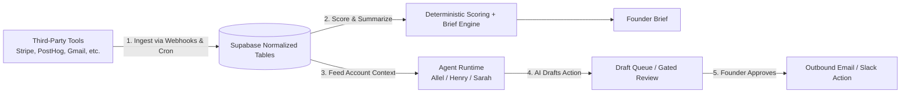

# Allel: Complete End-to-End Architecture & Codebase Guide

> Canonical architecture document for Allel. Everything from the mental model to the database tables, agent runtime, integrations, trust boundaries, and UI layer.
>
> Verified against the working tree on **2026-08-21**. This document absorbed the former `ARCHITECTURE.md` and `FRONTEND.md`, both of which were deleted after their content was folded in here. Agent-loop specifics live in `AGENT.md`; product positioning lives in `ALLEL.md`.
>
> Paths in this document are repo-relative from the repository root.

---

## Table of Contents

1. [What Allel Is](#1-what-allel-is)
2. [The Core Loop](#2-the-core-loop)
3. [System Architecture (The 8 Layers)](#3-system-architecture-the-8-layers)
4. [Database & Data Model](#4-database--data-model)
5. [The Integration & Ingestion Layer](#5-the-integration--ingestion-layer)
6. [The Deterministic Scoring & Brief Engine](#6-the-deterministic-scoring--brief-engine)
7. [The Agent Runtime Layer & Personas](#7-the-agent-runtime-layer--personas)
8. [The Dual-Memory System](#8-the-dual-memory-system)
9. [Human-in-the-Loop & Trust Boundaries](#9-human-in-the-loop--trust-boundaries)
10. [Observability & Run Inspection](#10-observability--run-inspection)
11. [Frontend & Streaming UI Architecture](#11-frontend--streaming-ui-architecture)
12. [Runtime Paths: The 3 Key Execution Triggers](#12-runtime-paths-the-3-key-execution-triggers)
13. [Directory & Codebase Map](#13-directory--codebase-map)
14. [What This Architecture Is Not](#14-what-this-architecture-is-not)
15. [Known Gaps](#15-known-gaps)

---

## 1. What Allel Is

### The Problem
When running an early-to-mid stage B2B SaaS startup (1–20 people, $1k–$50k MRR), **churn signals are scattered everywhere**:
- A customer's credit card failed on **Stripe**.
- Their product usage dropped on **PostHog**.
- They sent a frustrated ticket on **Intercom** / **Gmail**.
- Their engineers filed a blocker bug on **Linear** / **Sentry**.

Founders don't have time to check ten dashboards every morning. By the time they notice a customer left, it's already too late.

### The Solution
**Allel is a founder-facing retention operations platform.** It connects to your tools, pulls the data into one normalized customer record, scores churn risk deterministically, and gives AI agent personas the context to draft rescue emails, summarize daily priorities, and investigate accounts — while keeping the founder in control of anything that leaves the building.

---

## 2. The Core Loop



1. **Connect tools.** The founder connects Stripe, PostHog, Gmail, Intercom, Slack, and others.
2. **Normalize data.** Allel ingests events and converts them into standardized tables (`customer_accounts`, `account_signals`, `account_contacts`, `account_timeline`).
3. **Score and brief deterministically.** TypeScript, not an LLM, computes risk scores and assembles the founder brief. No hallucinated numbers on financial or account facts.
4. **Agent reasoning.** Personas analyze at-risk accounts, investigate drop-offs, and draft rescue outreach.
5. **Human approval.** Drafts land in `follow_up_drafts`. The agent loop **cannot** approve or send them — see §9.

---

## 3. System Architecture (The 8 Layers)

```
┌──────────────────────────────────────────────────────────────────────┐
│ 1. Frontend Shell (Next.js 15.5 App Router, React 19.1, Tailwind 4)  │
│    - Dashboard home (agent panel), Accounts, Drafts, Settings        │
│    - AgentFeed: streaming chat with tool-call and reasoning parts    │
├──────────────────────────────────────────────────────────────────────┤
│ 2. API & Edge Handlers (src/app/api/**)                              │
│    - /api/agent (streaming chat via AI SDK 6)                        │
│    - /api/webhooks/stripe & /posthog (real-time ingestion)            │
│    - /api/cron/daily-run (scheduled morning ops run)                 │
│    - /api/agent/runs (workflow inspection), /api/drafts/[id]/*        │
├──────────────────────────────────────────────────────────────────────┤
│ 3. Agent Runtime Engine (src/lib/agent/)                             │
│    - AI SDK 6 ToolLoopAgent, OpenAI models, stopWhen stepCountIs(25) │
│    - Personas: Allel (generalist), Henry (growth), Sarah (retention) │
│    - Persona tool filtering + per-stage workflow allowlists          │
├──────────────────────────────────────────────────────────────────────┤
│ 4. Memory Architecture (src/lib/agent/)                              │
│    - Compacted chat memory: trailing window + rolling summary        │
│    - Durable account memory (account_memories) + refresh queue       │
├──────────────────────────────────────────────────────────────────────┤
│ 5. Deterministic Scoring & Brief Layer                               │
│    - src/lib/engine/score-engine.ts: 6-factor weighted 0–100 score   │
│    - src/lib/briefs/generate-workspace-brief.ts: canonical brief     │
├──────────────────────────────────────────────────────────────────────┤
│ 6. Integration Sync Engine (src/lib/integrations/)                   │
│    - Catalog of 18 providers: 8 syncable, 3 tool-only, 7 planned     │
│    - 8 *-sync.ts jobs, encrypted tokens, connection health           │
├──────────────────────────────────────────────────────────────────────┤
│ 7. Observability (src/lib/agent/run-logger.ts, run-inspection.ts)    │
│    - Workflow grouping, token costs, step traces, latencies          │
├──────────────────────────────────────────────────────────────────────┤
│ 8. Database & Auth (Supabase PostgreSQL + RLS)                       │
│    - Multi-tenant workspaces, encrypted tokens, normalized accounts  │
└──────────────────────────────────────────────────────────────────────┘
```

### Layer file map

| Layer | Core files |
| :--- | :--- |
| Workspace / auth | `web/src/lib/supabase/*`, `web/src/lib/workspaces/ensure-workspace.ts`, `web/src/middleware.ts` |
| Integration catalog / connection | `web/src/lib/integrations/catalog.ts`, `connection-state.ts`, `connection-guard.ts`, `provider-tokens.ts`, `web/src/app/dashboard/settings/actions.ts` |
| Ingestion / sync | `web/src/lib/integrations/*-sync.ts`, `web/src/app/api/webhooks/{stripe,posthog}/route.ts`, `web/src/app/api/cron/daily-run/route.ts` |
| Deterministic scoring & brief | `web/src/lib/engine/score-engine.ts`, `web/src/lib/briefs/generate-workspace-brief.ts`, `deliver-brief-email.ts` |
| Agent runtime | `web/src/lib/agent/agent.ts`, `tools.ts`, `personas.ts`, `runtime-context.ts`, `ui-message-utils.ts`, `chat-memory.ts`, `account-memory.ts`, `workflows.ts` |
| Draft lifecycle | `web/src/lib/drafts/draft-workflows.ts`, `send-draft.ts`, `outcome-tracker.ts` |
| Inspection / observability | `web/src/lib/agent/run-logger.ts`, `run-inspection.ts`, `web/src/app/api/agent/runs/route.ts`, `web/src/app/api/agent/runs/[workflowId]/route.ts` |
| Application surfaces | `web/src/app/dashboard/**`, `web/src/components/dashboard/**`, `web/src/components/agent-feed/**` |

The frontend reads normalized data and invokes server actions and route handlers. The backend still owns every durable state transition.

---

## 4. Database & Data Model

All data is multi-tenant and workspace-scoped through Supabase Row-Level Security on `workspace_id`. Migrations live in `supabase/migrations/` (16 files) and create **21 tables**.

### Primary operating tables

| Table | Role |
| :--- | :--- |
| `workspaces`, `workspace_members` | Tenant isolation and membership. |
| `integration_connections`, `integration_tokens` | Provider connection state and AES-256-GCM encrypted credentials. |
| `customer_accounts` | The heart of Allel: one customer/company, with `mrr_cents`, `churn_risk_score` (0–100), `health_status`, `plan_name`, `billing_status`. |
| `account_contacts` | People attached to an account, used for email/contact resolution. |
| `account_signals` | Discrete health or risk data points (usage drop, invoice failed, negative sentiment). |
| `account_timeline` | Unified chronological activity feed across all connected tools. |
| `follow_up_drafts` | Agent-drafted outbound emails awaiting founder approval, plus approval provenance columns. |
| `draft_outcomes` | Post-send outcome tracking used by the revenue-saved metric. |
| `founder_briefs`, `founder_brief_items` | Daily high-signal summary of what changed and what to do. |
| `account_memories`, `account_memory_refresh_queue` | Durable per-account synthesis and its bounded refresh queue. |
| `agent_conversations` | Persisted chat transcript, compacted summary, and account context per workspace + user + persona + session. |
| `agent_runs` | Audit log of every agent invocation: workflow, stage, persona, provider, tokens, cost, step trace. |
| `webhook_events` | Webhook idempotency and processing state. |
| `churn_scores`, `churn_score_factors` | Normalized score history read by the `getChurnScoreHistory` tool. |
| `tool_approval_requests` | Backing table for the chat-mode tool approval interceptor. |
| `score_snapshots` | JSON score-snapshot history. **Effectively orphaned:** its only accessor is `web/src/lib/engine/score-history.ts`, which has no importer outside `compound-signals.ts`, itself unreferenced. Nothing in a live code path writes this table. |

The product does not reason directly over raw provider payloads most of the time. It reasons over normalized state plus curated memory.

---

## 5. The Integration & Ingestion Layer

Located in `web/src/lib/integrations/`. `catalog.ts` is the single source of truth for provider capability, and both the settings UI and backend guards read from it.

### The three tiers (verified against `catalog.ts`)

**Syncable (8)** — provider data is normalized into Supabase on connect, cron, or webhook:
Stripe, PostHog, Gmail, Intercom, HubSpot, Slack, Sentry, Linear.

**Tool-only (3)** — no local copy; the agent must deliberately call a live provider tool:
Notion, Airtable, Google Calendar.

**Planned (7)** — visible in the catalog, intentionally unavailable:
Jira, GitHub, Zendesk, Salesforce, Supabase, Google Docs, Google Drive.

Two caveats worth knowing:

- **Slack is classified `syncable` but does not ingest.** `syncSlackWorkspace()` generates Allel's own founder brief and posts it to Slack. It never reads channel history, users, or files into normalized storage. Inbound Slack content is only reachable through on-demand tool calls. See `INTEGRATION_AUDIT.md` for the full finding.
- **Tavily web research is not a catalog provider.** It is an agent-only capability gated by `TAVILY_API_KEY`, exposed through `webSearchTool`, `webExtractTool`, `webCrawlTool`, and `webMapTool`.
- **Google Docs tools are registered ahead of the catalog.** `searchGoogleDocsTool`, `readGoogleDocTool`, and `createGoogleDocTool` are in the tool registry even though `google_docs` is marked `planned` and has no entry in the tool-to-provider map.

### Connection responsibilities

- Validate provider credentials before publishing `connected` state (inconsistently — see `INTEGRATION_AUDIT.md` root cause 6).
- Encrypt and store tokens; only Google providers implement access-token refresh.
- Connect, disconnect, and trigger syncs from `web/src/app/dashboard/settings/actions.ts`.
- Persist connection health (`connected`, `needs_attention`) and recent sync metadata.
- `requireIntegrationConnected()` in `connection-guard.ts` blocks missing, disconnected, unhealthy, and legacy-demo connection rows before any token use.

Pipedream-backed OAuth is **no longer active**. `settings/actions.ts` records that the Pipedream actions were removed in favour of direct API connections; Gmail and Google Calendar share the only implemented OAuth initiation/callback route (`web/src/app/api/integrations/gmail/callback/route.ts`). `@pipedream/sdk` remains a declared dependency with zero imports, and `metadata.pipedream_account_id` is preserved only for pre-existing connection rows.

### How ingestion works

- **Webhooks** (`/api/webhooks/stripe`, `/api/webhooks/posthog`): real-time ingestion when a subscription cancels or usage drops. Idempotency is tracked in `webhook_events`.
- **Daily cron** (`/api/cron/daily-run`, scheduled `30 4 * * *` in `web/vercel.json`): polls connected providers for fresh state with per-provider failure isolation.

---

## 6. The Deterministic Scoring & Brief Engine

### Scoring — `web/src/lib/engine/score-engine.ts`

`scoreAccount()` computes a 6-factor weighted score in the range 0–100, where higher means more at risk: `score = Σ (factor_weight × normalized_signal)`. `buildSignalsFromAccount()` bridges raw database columns into the engine's input shape and falls back to conservative defaults when enrichment data from integrations is absent, so unconnected providers neither inflate nor deflate a score.

### Brief — `web/src/lib/briefs/generate-workspace-brief.ts`

Why deterministic? We do not ask an LLM to produce core metrics like "MRR at risk is $4,200". A TypeScript algorithm queries live account state, computes exact sums and counts, ranks the top accounts needing attention, and writes structured `founder_brief_items`.

The important rule: **automated agent runs do not own founder brief records.** Syncs, webhooks, and agent actions update live state; the deterministic generator rebuilds the brief afterward. `createBriefItem` and `updateBriefSummary` are explicitly named as forbidden actions in the agent's runtime instruction block.

Delivery goes out through `deliver-brief-email.ts`, which sends via the connected Gmail account (`sendEmail` from `lib/integrations/gmail.ts`), and, when Slack is connected, through `syncSlackWorkspace()`. `notify-founder.ts` uses the same two channels for urgent alerts. Resend appears in the codebase only in `/api/waitlist`.

---

## 7. The Agent Runtime Layer & Personas

Located in `web/src/lib/agent/`. See `AGENT.md` for the loop internals; this section is the system-level view.

### The 3 personas (`personas.ts`)

| Persona ID | Display name | Role | Tool scope |
| :--- | :--- | :--- | :--- |
| `alex` | **Allel** | AI Co-founder / generalist | No `activeTools` list, so the full registered tool universe |
| `henry` | **Henry** | Head of Growth | Curated growth/research subset: Tavily, read-only HubSpot and Intercom, Gmail read + draft, Slack, Notion, read-only account context |
| `sarah` | **Sarah** | Head of Retention | Curated retention subset: Stripe billing, PostHog usage, drafts, account health |

The `alex` ID is retained for backwards compatibility while the founder-facing identity is the unified "Allel". Each persona has its own instruction file — `allel-instructions.ts` (`COFOUNDER_INSTRUCTIONS`), `henry-instructions.ts`, `sarah-instructions.ts` — appended to the shared base `instructions.ts`.

### The tool execution loop (`agent.ts`)

1. Resolve the persona and its instruction suffix.
2. Filter the **136 registered tools** in `ALL_TOOLS` down to the persona's allowed set, then optionally narrow further by prompt relevance.
3. Inject a runtime contract block (`runtime-context.ts`) naming the exact tools available this run and the forbidden human-approval actions.
4. Construct an AI SDK 6 `ToolLoopAgent` with `stopWhen: stepCountIs(25)`, cached per persona + model + channel + tool selection.
5. Execute tool calls server-side and feed results back until a final answer or draft is produced.
6. Log the run into `agent_runs` with model-aware cost estimation and redacted step traces.

Model resolution is currently coarse: `resolveAgentModelId()` ignores its persona/runType/channel arguments and returns `process.env.OPENAI_MODEL_ID || 'gpt-5.6'`. The deterministic helpers in `web/src/lib/ai/ai.ts` use `process.env.OPENAI_MODEL_ID || 'gpt-4o'`. The `AGENT_CHAT_MODEL_ID` and `AGENT_AUTOMATION_MODEL_ID` constants exist but are not routed per run type.

### Workflow stages (`workflows.ts`)

Automated work decomposes into `detect → analyze → draft → verify`. Each stage has a backend-enforced allowlist in `WORKFLOW_STAGE_TOOL_ALLOWLISTS`, not just prompt guidance:

- `detect` and `verify`: read-only tools only.
- `analyze`: read-only plus account-state writes (risk, signals, timeline, contacts, notes).
- `draft`: read-only plus draft writes (`generateFollowUpDraft`, `rejectDraft`, `updateDraftContent`).

A read-heavy phase cannot inherit write tools because a prompt asked nicely.

---

## 8. The Dual-Memory System

### 1. Chat memory — `chat-memory.ts`
- Keeps a bounded trailing transcript (`MAX_PERSISTED_AGENT_MESSAGES = 40`).
- Compacts older messages into a rolling summary capped at `MAX_COMPACTED_SUMMARY_CHARS = 1800`.
- Tracks mentioned account IDs (up to 4), recent user goals (up to 3), and assistant commitments.
- Persisted in `agent_conversations`, scoped by workspace + user + persona + session.

### 2. Durable account memory — `account-memory.ts`
- Stored in `account_memories`: account summary, key signals, open loops, recent timeline context.
- Retrieved by personas through the `getAccountMemory` tool.
- When an account changes, a refresh is enqueued in `account_memory_refresh_queue` rather than fanned out across the whole workspace, and the queue is processed with bounded concurrency.

Both are deterministic snapshotting and heuristic summarization. Neither is semantic retrieval.

---

## 9. Human-in-the-Loop & Trust Boundaries

### Outbound: the AI never sends an email autonomously

The gate is enforced in `web/src/lib/drafts/draft-workflows.ts`, not in prompt text:

1. **Draft.** The agent calls `generateFollowUpDraft(...)`; a row lands in `follow_up_drafts`.
2. **Approve.** `approveDraftForActor()` **fails outright when `actor === 'agent'`** and stamps `approved_at` plus `approved_by_actor` on success.
3. **Send.** `sendDraftForActor()` also fails when `actor === 'agent'`, requires status `ready_to_send`, and requires founder approval provenance to be present.
4. **Not in the loop.** `approveDraft` and `sendApprovedDraft` tool definitions exist in `tools.ts` but are **not registered in `ALL_TOOLS`**, so no persona can call them. `runtime-context.ts` additionally lists them as forbidden actions in every run.
5. **Founder path.** Approval and send run through `/api/drafts/[id]/approve`, `/api/drafts/[id]/send`, and the `dashboard/drafts` server actions, all behind an authenticated session.

One caveat: the generic chat-mode approval interceptor is currently inert. `MANUAL_APPROVAL_REQUIRED_TOOL_NAMES` in `agent.ts` is an **empty array**, with a comment stating the interceptor is disabled until the approval UI is finished. The `tool_approval_requests` table, `approval-store.ts`, and `/api/agent/approvals` exist and work, but no tool is currently routed through them. Draft send remains gated regardless, because that gate lives in the draft workflow layer.

### Inbound: what the browser can define

The browser may provide:
- `user` messages
- the active persona selection
- local thread state for convenience

The browser is **not** trusted for assistant history, tool history, workspace identity, or server memory state. `ui-message-utils.ts` enforces this:
- Only `user` and `assistant` roles survive sanitization; `tool` and `system` messages from the client are dropped entirely.
- `user` messages pass unconditionally.
- An `assistant` message is accepted only if its metadata carries a valid HMAC-SHA256 signature over `workspaceId : personaId : messageId : sha256(canonical parts)`, and the workspace and persona in the metadata match the current request.
- Signing uses `AGENT_HISTORY_SIGNING_SECRET`, falling back to `OPENAI_API_KEY` if unset. Signature comparison uses `===`, not a constant-time compare.
- Workspace, persona, and memory context are injected server-side after sanitization.

### External content

Content from Gmail, Slack, Intercom, Notion, and web research passes through `external-content.ts` and is labeled untrusted before reaching the model. The remaining gap is richer source-aware inspection, not raw pass-through.

---

## 10. Observability & Run Inspection

Located in `web/src/lib/agent/run-logger.ts` and `run-inspection.ts`.

Every agent action is logged in `agent_runs`:
- `workflow_id` groups multi-step workflows (e.g. `cron_daily_review_<date>`).
- `stage`: `detect` → `analyze` → `draft` → `verify`.
- `persona_id`, `provider`, `job_index`, `parent_run_id` for attribution.
- `tokens_used` and estimated cost for spend tracking.
- Redacted step traces with inputs, tool arguments, and outputs.

`run-inspection.ts` groups those rows into workflow inspections (`groupAgentRunsByWorkflow`) and serves them through two authenticated, workspace-scoped APIs with cursor pagination at the **workflow** level rather than raw row truncation:
- `GET /api/agent/runs` — workflow list
- `GET /api/agent/runs/[workflowId]` — single workflow detail

> **No UI consumes these APIs.** `web/src/app/dashboard/flows/page.tsx` is a 7-line placeholder that renders an empty div, and the 782-line `components/dashboard/flows-page.tsx` implementation was deleted in the 2026-08-21 cleanup. The sidebar still links to `/dashboard/flows` as "Workflows". Run inspection today is a backend-only capability reachable by calling the APIs directly.

---

## 11. Frontend & Streaming UI Architecture

- **Stack:** Next.js 15.5.14 (App Router), React 19.1.0, Tailwind CSS 4 (`@tailwindcss/postcss` + `tw-animate-css`), AI SDK 6 with `@ai-sdk/openai`, Lucide and Tabler icons, `next-themes`.
- **Auth:** Supabase SSR session refresh runs in `web/src/middleware.ts` for every non-asset request.

### Surface map (verified route by route)

| Route | State |
| :--- | :--- |
| `/` | Marketing landing page. A Framer export inlined as a `RAW_LANDING_HTML` string literal in `web/src/app/page.tsx`, with a waitlist form posting to `/api/waitlist`. Not a redirect to the dashboard. |
| `/pricing` | Same pattern: inlined Framer HTML. |
| `/auth/login` | Email magic-link login. |
| `/dashboard` | Live. Renders `ChatProvider` wrapping `HomeAgentPanel` — a full-height agent panel. It does **not** use `WorkspaceLayout`. |
| `/dashboard/accounts` and `/dashboard/accounts/[id]` | Live. Account list; detail page loads signals, contacts, drafts, and timeline. |
| `/dashboard/drafts` | Live. Draft review, edit, approve, reject, send. |
| `/dashboard/settings` | Live. Searchable integration grid with real connect/disconnect server actions, connection state from the catalog, and `DirectConnectModal` for manual credentials. |
| `/dashboard/flows` | **Empty placeholder.** Linked from the sidebar as "Workflows". |
| `/dashboard/inbox` | **Empty placeholder.** It still imports `WorkspaceLayout`, `AgentPane`, and `DashboardLeftPane` but renders none of them. This is the only importer of `WorkspaceLayout`. |

Sidebar navigation (`components/app-sidebar.tsx`) exposes exactly three destinations: Home, Workflows, Connections. Accounts and Drafts are reachable only by direct URL.

### Chat UI shell

1. `ChatProvider` (`components/agent-feed/chat-provider.tsx`) holds one chat instance per persona and is mounted by `/dashboard`.
2. Each persona thread persists in scoped `sessionStorage`, keyed by user + workspace + session via `chat-session.ts` helpers.
3. `AgentPane` wires the prompt UI to the active persona; `HomeAgentPanel` mounts `AgentFeed` directly on `/dashboard`.
4. `AgentFeed` renders streaming text, reasoning, and tool-call parts from AI SDK streams through `timeline-nodes.tsx`.

Message content persists in `sessionStorage`; the recent-conversation list persists in `localStorage` under `allel.chat-history.v1`. The backend is durable, but the frontend still boots local-first. `/api/agent/history` exists; explicit fetch-and-restore on first load is not wired into the UI.

### Dashboard data modes

`web/src/lib/dashboard/data.ts` resolves a `DashboardMode` of `onboarding`, `live`, or `degraded` from backend reality — connected core integration count, account data presence, and query failures — and generates onboarding copy and degraded notices from it. It is consumed by `dashboard/accounts`, `dashboard/drafts`, and `components/dashboard/left-pane.tsx`. The left pane's only mount point is `/dashboard/inbox`, which currently renders nothing, so its brief-summary and task-list rendering is not reachable in the running app.

### Settings / connect path

1. Manual credential entry through `DirectConnectModal`, or Google OAuth for Gmail and Calendar.
2. Credential validation (depth varies by provider), then AES-256-GCM token encryption and storage.
3. An immediate sync for `syncable` providers, or a readiness metadata update for `tool_only` ones.
4. Connection-state persistence including health and last-sync metadata.
5. `revalidatePath` on the affected dashboard paths after connect/disconnect, with toast feedback in the UI.

---

## 12. Runtime Paths: The 3 Key Execution Triggers

### A. The morning cron run — `GET /api/cron/daily-run`

Guarded by `CRON_SECRET` and a rate limiter, then per workspace:
1. Sync each connected provider with isolated failure handling; record success/failure and integration run outcomes.
2. Enqueue recently touched account memories.
3. Process the queued memory refreshes with bounded concurrency.
4. Run the persona workflow jobs `detect → analyze → draft → verify` when AI is configured.
5. Rebuild the deterministic founder brief from live state.
6. Deliver the brief by email through the connected Gmail account and, if Slack is connected, post it to Slack.
7. Measure pending draft outcomes into `draft_outcomes`.
8. Log every stage into `agent_runs` under one `workflow_id`.

### B. The live webhook trigger — `POST /api/webhooks/stripe` (and `/posthog`)

1. Verify the signature and parse the event; record it in `webhook_events` for idempotency.
2. Resolve workspace and account context.
3. Update normalized state (risk score, signals, timeline) and enqueue an account-memory refresh.
4. Refresh the deterministic brief.
5. Register follow-up agent jobs with Next.js `after()` **before** marking the event processed, so a crash does not silently drop the follow-up.
6. Refresh the brief again after agent work lands; log grouped workflow stages for ingest, follow-up, failure fallback, and brief refresh.

### C. The founder chat trigger — `POST /api/agent?agentId=alex|henry|sarah`

1. Authenticate the user; resolve the workspace server-side.
2. Sanitize client UI messages (§9) and resolve the conversation session ID.
3. Load persisted transcript history plus the compacted summary and account context.
4. Merge trusted client history with server history.
5. Inject trusted workspace, persona, memory, and runtime-contract system context.
6. Run the persona agent, streaming text, reasoning, and tool calls to the browser.
7. Sign assistant metadata so it can become trusted history on the next turn.
8. Persist compacted conversation state and log the chat run.

---

## 13. Directory & Codebase Map

```
allel/
├── web/
│   ├── src/
│   │   ├── app/
│   │   │   ├── api/agent/           # streaming chat, approvals, history, run inspection
│   │   │   ├── api/cron/daily-run/  # daily automated retention workflow
│   │   │   ├── api/webhooks/        # Stripe & PostHog webhook receivers
│   │   │   ├── api/drafts/[id]/     # founder-only approve and send
│   │   │   ├── api/integrations/    # Gmail OAuth callback, Stripe/PostHog connect
│   │   │   ├── api/metrics/         # revenue-saved metric
│   │   │   ├── api/waitlist/        # landing-page waitlist capture
│   │   │   ├── dashboard/           # home, accounts, drafts, settings, flows, inbox
│   │   │   ├── page.tsx             # inlined Framer landing page
│   │   │   └── layout.tsx           # root layout, globals.css, theme provider
│   │   ├── components/
│   │   │   ├── agent-feed/          # chat provider, agent pane, feed, timeline nodes
│   │   │   ├── dashboard/           # workspace layout, left pane, home agent panel
│   │   │   └── ui/                  # vendored primitives (mostly unused)
│   │   ├── hooks/                   # (empty after cleanup)
│   │   ├── lib/
│   │   │   ├── agent/               # runtime, tools, personas, memory, workflows, logging
│   │   │   ├── ai/                  # AI SDK client, prompts, draft generator
│   │   │   ├── briefs/              # deterministic brief generation and delivery
│   │   │   ├── dashboard/           # dashboard projection, retained mock types
│   │   │   ├── drafts/              # draft lifecycle, send, outcome tracking
│   │   │   ├── engine/              # scoring, action selection, score history (dormant)
│   │   │   ├── integrations/        # catalog, provider clients, 8 sync jobs, tokens
│   │   │   ├── notifications/       # founder notification delivery
│   │   │   ├── security/            # validation, process-local rate limiting
│   │   │   ├── supabase/            # browser, server, service-role, middleware clients
│   │   │   └── workspaces/          # multi-tenant workspace provisioning
│   │   └── middleware.ts            # Supabase session refresh
│   ├── vercel.json                  # 30 4 * * * cron for /api/cron/daily-run
│   └── next.config.ts               # tracing root + 6 security headers
├── supabase/
│   └── migrations/                  # 16 SQL migrations, 21 tables, RLS policies
└── ALLEL_COMPLETE_GUIDE.md, AGENT.md, ALLEL.md, ...
```

### Root documentation

| Doc | Purpose |
| :--- | :--- |
| `ALLEL_COMPLETE_GUIDE.md` | **This file.** Canonical whole-system architecture. |
| `AGENT.md` | Agent-loop specifics: personas, tool families, workflow stages, chat trust, memory. |
| `ALLEL.md` | Product definition, ICP, positioning, next product moves. |
| `PRODUCT_COMPLETION_PLAN.md` | Completion plan. |
| `TODO.md` | Broad roadmap. |
| `REPOSITORY_RESEARCH.md` | Full repository assessment with prioritized findings. |
| `INTEGRATION_AUDIT.md` | Provider-by-provider integration audit (closed out). |
| `DEAD_CODE_AUDIT.md` | Dead-code and hygiene audit plus the cleanup record. |
| `web/README.md` | App-directory entry point: surfaces, stack, local setup. |

---

## 14. What This Architecture Is Not

It is not:
- a pure deterministic score engine
- a pure multi-agent orchestration fabric
- a pure frontend chat app

It currently is:

**A normalized SaaS operations architecture with deterministic state generation, compact memory layers, persona-driven agents, and a partially built operator console on top.**

What it does not have yet:
- a planner / executor split
- a verifier / critic loop beyond the current verify-stage prompt
- subagents
- any UI for replaying tool traces
- long-horizon semantic memory beyond compact summaries and account snapshots

---

## 15. Known Gaps

1. **No run-inspection UI.** The backend grouping and APIs are live; `/dashboard/flows` is empty. This is the largest gap between backend capability and founder-visible product.
2. **Chat bootstrap is local-first.** Server persistence, signing, and compaction all work, but the browser still restores from `sessionStorage` rather than fetching server history on load.
3. **Memory is heuristic.** Compaction and account snapshots are deterministic, not semantic retrieval.
4. **Provider readiness is uneven.** Connection status means different things per provider, Slack's "sync" is outbound-only, and some providers are cataloged ahead of backend readiness. See `INTEGRATION_AUDIT.md`.
5. **Model selection is not per-run.** `resolveAgentModelId()` discards its arguments.
6. **Chat-mode tool approval is inert.** The interceptor list is empty; only the draft approve/send path is gated.
7. **Dormant scoring code.** `score-history.ts` and `compound-signals.ts` are complete but unreferenced, leaving `score_snapshots` written by nothing and two competing score-history models (`churn_scores` vs `score_snapshots`) with no documented canonical role.
8. **Two build-correctness bugs are open** — the gitignored landing-page `.mp4` and the untracked, incomplete `web/.env.example`. Both are detailed at the top of `DEAD_CODE_AUDIT.md`.
