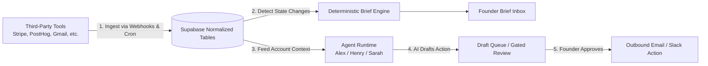

# Allel: Complete End-to-End Architecture & Codebase Guide

> **Everything you need to know about Allel** — from the core mental model to the database tables, agent runtime, integrations, security boundaries, and UI layer.

---

## Table of Contents

1. [What Allel Is (The 30-Second Pitch & Mentalffffffffffff Model)](#1-what-allel-is)
2. [The Core Loop (How Data Flows From Zero to Action)](#2-the-core-loop)
3. [System Architecture (The 8-Layer Cake)](#3-system-architecture)
4. [Database & Data Model (Supabase Tables & Relationships)](#4-database--data-model)
5. [The Integration & Ingestion Layer](#5-the-integration--ingestion-layer)
6. [The Deterministic Brief Engine](#6-the-deterministic-brief-engine)
7. [The Agent Runtime Layer & Personas](#7-the-agent-runtime-layer--personas)
8. [The Dual-Memory System](#8-the-dual-memory-system)
9. [Human-in-the-Loop & Trust Boundaries](#9-human-in-the-loop--trust-boundaries)
10. [Observability & Run Inspection (`/dashboard/flows`)](#10-observability--run-inspection)
11. [Frontend & Streaming UI Architecture](#11-frontend--streaming-ui-architecture)
12. [Walkthrough of the 3 Key Execution Triggers](#12-walkthrough-of-the-3-key-execution-triggers)
13. [Directory & Codebase Map](#13-directory--codebase-map)

---

## 1. What Allel Is

### The Problem
When running an early-to-mid stage B2B SaaS startup (1–20 people, $1k–$50k MRR), **churn signals are scattered everywhere**:
- A customer's credit card failed on **Stripe**.
- Their product usage dropped by 70% on **PostHog**.
- They sent a frustrated ticket on **Intercom** / **Gmail**.
- Their engineers filed a blocker bug on **Linear** / **Sentry**.

Founders don't have time to check 10 different dashboards every morning. By the time they notice a customer left, it's already too late.

### The Solution: Allel
**Allel is a founder-facing Retention Operations platform.** 
It connects to all your tools, pulls the data into **one normalized customer record**, spots churn risks before they happen, and has specialized **AI Agent Personas** (Alex, Henry, Sarah) draft rescue emails, summarize daily priorities, and help you take immediate action — while always keeping the founder in complete control of sending emails.

---

## 2. The Core Loop



1. **Connect Tools**: Founder connects Stripe, PostHog, Gmail, Intercom, Slack, etc.
2. **Normalize Data**: Allel ingests events and converts them into standardized tables (`customer_accounts`, `account_signals`, `account_timeline`).
3. **Deterministic Brief**: A deterministic script evaluates metrics and generates a daily "Founder Operating Brief" (no AI hallucinations for financial/account facts).
4. **Agent Reasoning**: Specialized AI personas analyze at-risk accounts, investigate drop-offs, and draft rescue outreach.
5. **Human Approval**: The agent creates an outbound draft with status `needs_approval`. It **never** sends an email without the founder clicking "Approve".

---

## 3. System Architecture (The 8 Layers)

```
┌─────────────────────────────────────────────────────────────┐
│ 1. Frontend Shell (Next.js 15 App Router, React 18, Tailwind)│
│    - Dashboard Inbox, Accounts, Flows (/flows), Settings    │
│    - AgentFeed (Streaming Chat UI, Tool Calling Cards)       │
├─────────────────────────────────────────────────────────────┤
│ 2. API & Edge Handlers                                      │
│    - /api/agent (Streaming Chat via Vercel AI SDK)          │
│    - /api/webhooks/stripe & posthog (Real-time Ingestion)   │
│    - /api/cron/daily-run (Scheduled Morning Ops Sync)       │
├─────────────────────────────────────────────────────────────┤
│ 3. Agent Runtime Engine (`src/lib/agent/`)                  │
│    - Tool Loop Agent (Anthropic Claude 3.5 / 3.7)           │
│    - Personas: Alex (Co-founder), Henry (Growth), Sarah     │
│    - Tool Allowlist & Security Boundaries                   │
├─────────────────────────────────────────────────────────────┤
│ 4. Memory Architecture                                      │
│    - Compacted Chat Memory (Sliding window + summary)       │
│    - Durable Account Memory (`account_memories`)            │
├─────────────────────────────────────────────────────────────┤
│ 5. Deterministic Brief Layer (`src/lib/briefs/`)            │
│    - Mathematical risk scoring, MRR at risk, priorities     │
├─────────────────────────────────────────────────────────────┤
│ 6. Integration Sync Engine (`src/lib/integrations/`)        │
│    - Stripe, PostHog, Gmail, Slack, HubSpot, Linear, Sentry │
├─────────────────────────────────────────────────────────────┤
│ 7. Observability & Run Logger (`src/lib/agent/run-logger.ts`)│
│    - Workflow grouping, token costs, step traces, latencies │
├─────────────────────────────────────────────────────────────┤
│ 8. Database & Auth (Supabase PostgreSQL + RLS)              │
│    - Multi-tenant workspaces, encrypted tokens, accounts    │
└─────────────────────────────────────────────────────────────┘
```

---

## 4. Database & Data Model

All data is multi-tenant and workspace-scoped using Supabase Row-Level Security (`workspace_id`).

### Primary Tables:
1. **`workspaces` & `workspace_members`**: Organization isolation. Every user belongs to one or more workspaces.
2. **`integration_connections` & `integration_tokens`**: Stores OAuth & API tokens for connected tools (encrypted using AES-GCM).
3. **`customer_accounts`**: The heart of Allel. Represents a single customer/company (e.g. Acme Corp) with:
   - `mrr_cents` (Monthly Recurring Revenue)
   - `churn_risk_score` (0–100)
   - `health_status` (`healthy`, `at_risk`, `churning`, `churned`)
   - `plan_name`, `billing_status`
4. **`account_signals`**: Specific data points indicating health or risk (e.g., `feature_usage_drop`, `invoice_failed`, `negative_sentiment_email`).
5. **`account_timeline`**: Unified chronological activity feed across all tools (e.g., Stripe invoice paid, Intercom conversation opened, Linear bug created).
6. **`follow_up_drafts`**: Emails drafted by the AI agent awaiting founder approval (`status = 'draft' | 'needs_approval' | 'ready_to_send' | 'sent'`).
7. **`founder_briefs` & `founder_brief_items`**: Daily high-signal summaries of what changed and what to do today.
8. **`account_memories`**: Long-term synthesized summaries, key context, and open loops for an account.
9. **`agent_runs`**: Audit log of every single agent invocation (step, tokens, tool calls, costs).

---

## 5. The Integration & Ingestion Layer

Located in: `web/src/lib/integrations/`

Allel categorizes integrations into 3 tiers:
- **Syncable** (Ingests data + provides tools):
  - **Stripe**: Ingests subscriptions, invoices, payment failures, MRR changes.
  - **PostHog**: Ingests usage metrics, active days, drop-offs.
  - **Gmail**: Ingests founder-customer correspondence, sentiment signals.
  - **Intercom / HubSpot**: Ingests customer tickets, deals, and notes.
  - **Slack**: Channel mentions, founder alert delivery.
  - **Linear / Sentry**: Ingests customer-reported bugs, exceptions, and blocking issues.
- **Tool-Only** (Read/Write on-demand via agent tools):
  - **Notion**, **Airtable**, **Google Calendar**, **Tavily Web Research**.
- **Planned**: GitHub, Salesforce, Jira, Figma.

### How Ingestion Works:
- **Webhooks (`/api/webhooks/stripe`, `/posthog`)**: Fast, real-time ingestion when a subscription cancels or usage drops.
- **Daily Cron (`/api/cron/daily-run`)**: Periodic background sync that polls connected APIs for fresh state.

---

## 6. The Deterministic Brief Engine

Located in: `web/src/lib/briefs/generate-workspace-brief.ts`

### Why Deterministic?
We do **not** use an LLM to generate the core metrics (e.g., "MRR at risk is $4,200"). An LLM might hallucinate a number or miss a customer.
Instead, a deterministic TypeScript algorithm:
1. Queries all `customer_accounts` where `health_status = 'at_risk'`.
2. Calculates exact MRR sums and counts.
3. Ranks top 3–5 high-priority accounts needing attention.
4. Generates structured `founder_brief_items`.
5. Only then invokes AI personas to draft recommended actions.

---

## 7. The Agent Runtime Layer & Personas

Located in: `web/src/lib/agent/`

### The 3 Personas

| Persona | Role | Core Responsibility | Tool Scope |
| :--- | :--- | :--- | :--- |
| **Alex** | **Co-Founder / Generalist** | High-level company questions, cross-tool orchestration, broad ops | Full tool universe |
| **Henry** | **Head of Growth** | Acquisition, messaging, channel strategy, market research | Growth & research tools (Tavily, Notion, Airtable, read-only CRM) |
| **Sarah** | **Head of Retention** | Churn prevention, billing issues, rescue emails, retention ops | Retention tools (Stripe, PostHog, drafts, customer health) |

### The Tool Execution Loop (`agent.ts`):
1. Loads the persona's dedicated system prompt (`alex-instructions.ts`, `henry-instructions.ts`, `sarah-instructions.ts`).
2. Filters the 20+ tools in `tools.ts` to only the tools allowed for that persona.
3. Streams the model response using the Vercel AI SDK (`streamText`).
4. Executes requested tool calls server-side (e.g., `getAccountHealth`, `draftRescueEmail`).
5. Feeds tool results back into the model until a final answer or draft is produced.

---

## 8. The Dual-Memory System

Allel solves the context-window limit with two distinct memory systems:

### 1. Chat Memory (Compacted Conversation History)
Located in: `chat-memory.ts`
- Keeps a sliding window of recent messages.
- When conversations grow long, it **heuristically compacts** older messages into a rolling summary.
- Tracks mentioned `account_id`s, recent user goals, and commitments.

### 2. Durable Account Memory
Located in: `account-memory.ts`
- Stored in `account_memories` table.
- When an account changes (e.g., invoice fails or email received), Allel enqueues a background job in `account_memory_refresh_queue`.
- Generates a concise summary of the account's state, risks, and open loops so the AI remembers past interactions without re-reading thousands of raw events.

---

## 9. Human-in-the-Loop & Trust Boundaries

### Golden Rule: The AI never sends an email autonomously.
1. **Drafting Stage**: Sarah or Alex calls `draftFollowUpEmail(...)`.
2. **Database Record**: Created in `follow_up_drafts` with `status: 'needs_approval'`.
3. **UI Display**: The draft appears in the founder's Inbox / Draft Queue.
4. **Founder Action**: The founder can edit the email, click **Approve**, or click **Reject**.
5. **Sending**: Only a founder-initiated server action with authenticated session can move the draft to `ready_to_send` and call the Gmail/Resend API.

---

## 10. Observability & Run Inspection

Located in: `src/lib/agent/run-logger.ts` & `/dashboard/flows`

Every agent action is logged in `agent_runs`:
- `workflow_id`: Groups multi-step workflows (e.g. `cron_daily_review_2026-04-24`).
- `stage`: `detect` ➔ `analyze` ➔ `draft` ➔ `verify`.
- `tokens_used` & `estimated_cost_usd`: Real-time cost tracking.
- `step_trace`: Detailed inputs, tool arguments, and outputs.

Founders can visit `/dashboard/flows` to see exactly why an agent took an action.

---

## 11. Frontend & Streaming UI Architecture

Located in: `web/src/`

- **Tech Stack**: Next.js 15 (App Router), React 18, Tailwind CSS, Lucide icons.
- **Layout**: Split-pane dashboard (`workspace-layout.tsx`):
  - **Left Pane**: Founder Brief, Account Details, Drafts, Run Flows, Settings.
  - **Right Pane**: Interactive Persona Agent Chat Feed (`AgentFeed`).
- **Real-Time Streaming**: Uses Server-Sent Events (SSE) via `useChat` / Vercel AI SDK to stream persona thoughts, tool calls, and answers in real-time.

---

## 12. Walkthrough of the 3 Key Execution Triggers

### A. The Morning Cron Run (`/api/cron/daily-run`)
1. Syncs all connected integrations.
2. Refreshes account memories in `account_memory_refresh_queue`.
3. Sarah executes the `detect -> analyze -> draft -> verify` pipeline on at-risk accounts.
4. Rebuilds the deterministic Founder Brief.
5. Sends a morning brief notification to the founder's Slack channel.

### B. The Live Webhook Trigger (`/api/webhooks/stripe`)
1. Receives `invoice.payment_failed`.
2. Matches customer email to a `customer_accounts` record.
3. Sets `churn_risk_score = 85` and logs an `account_signals` row.
4. Spawns Sarah in the background using Next.js `after()` to analyze the account and prepare a rescue draft.
5. Updates the Founder Brief.

### C. The Founder Chat Trigger (`/api/agent`)
1. Founder types: *"Why is Acme Corp at risk and what should we do?"*
2. Server loads Alex or Sarah with their system prompt + compacted chat memory + Acme Corp's `account_memories`.
3. Agent executes `getAccountTimeline` and `getAccountSignals`.
4. Agent streams an explanation and drafts an email into the UI.

---

## 13. Directory & Codebase Map

```
allel/
├── web/
│   ├── src/
│   │   ├── app/                     # Next.js App Router
│   │   │   ├── api/agent/           # Streaming chat & run logs API
│   │   │   ├── api/cron/daily-run/  # Daily automated retention workflow
│   │   │   ├── api/webhooks/        # Stripe & PostHog webhook endpoints
│   │   │   ├── dashboard/           # Main UI: Inbox, Flows, Settings, Accounts
│   │   │   └── layout.tsx           # Root layout
│   │   ├── components/
│   │   │   ├── agent-feed/          # Streaming chat feed & tool call cards
│   │   │   └── dashboard/           # Brief inbox, accounts list, flows UI
│   │   └── lib/
│   │       ├── agent/               # Agent runtime, tools, personas, memory, workflows
│   │       ├── briefs/              # Deterministic Founder Brief generator
│   │       ├── integrations/        # 17+ third-party service syncers (Stripe, Gmail, etc.)
│   │       ├── supabase/            # Database client & auth helpers
│   │       └── workspaces/          # Multi-tenant workspace management
├── supabase/
│   └── migrations/                  # SQL schema, RLS policies, tables
└── ARCHITECTURE.md, AGENT.md        # Technical specifications
```
