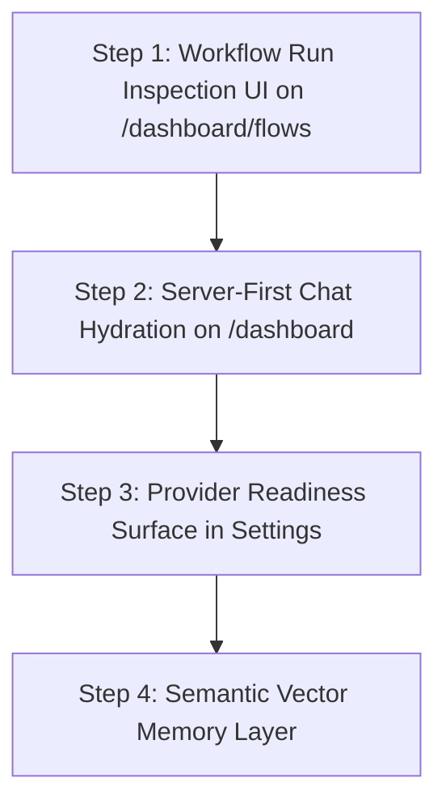

# Product Completion Plan

> **Updated:** 2026-08-22  
> **Status:** Authoritative roadmap reflecting the current working tree and shipped in-loop tool-calling engine.

---

## Current State

The product has a robust retention operations backend, an in-loop self-healing AI SDK 6 agent runtime with conservative fuzzy routing, multi-tenant database models, live integration syncs, and a functional operator console.

### What Is Shipped & Verified Live (118 Tests Passing)
- **Multi-Tenant Foundation**: Authenticated Supabase dashboard with RLS isolation across 21 database tables.
- **Data Normalization**: Normalized customer accounts, contacts, timeline events, signals, and outcome tracking.
- **Direct & Syncable Integrations**: 8 syncable providers (Stripe, PostHog, Gmail, Intercom, HubSpot, Slack, Sentry, Linear), 3 tool-only integrations (Notion, Airtable, Calendar), and Tavily web research.
- **Provider Guards**: Strict `wrapToolWithLiveIntegrationGuard` interceptors preventing mock data fabrication on auth failures.
- **Deterministic Risk Engine**: 6-factor deterministic churn risk scoring and automated daily brief generator.
- **AI SDK 6 Agent Runtime**:
  - `ToolLoopAgent` with Azure OpenAI / OpenAI support and endpoint URL normalization.
  - Conservative adaptive Levenshtein fuzzy domain routing (dist $\le 1$ for 4–5 chars, dist $\le 2$ for 6+ chars).
  - In-loop dynamic `prepareStep` tool expansion via `requestMoreTools` meta-tool without stream resets.
  - Hard persona authorization boundaries (`Alex`, `Henry`, `Sarah`) and staged workflow allowlists (`detect` $\rightarrow$ `analyze` $\rightarrow$ `draft` $\rightarrow$ `verify`).
  - Step-aware runtime instruction blocks.
- **Memory & Trust**:
  - Dual-memory: compacted transcript persistence in `agent_conversations` + durable `account_memories` refresh queue.
  - Human-in-the-loop: strict gating requiring verified founder approval before drafts can be sent.
  - HMAC-SHA256 assistant history signing.
- **Observability**: `agent_runs` logging with model-aware token costs, redacted step traces, and tool expansion request tracking. Grouped workflow inspection APIs (`/api/agent/runs`).

---

## Completed Milestones

### 1. Data Ingestion & Integration Health
- [x] Stripe & PostHog webhook ingestion with idempotency tracking.
- [x] Gmail thread syncing and reply draft creation.
- [x] Google Calendar OAuth with single complete Calendar scope.
- [x] Health status persistence (`connected`, `needs_attention`, `disconnected`).
- [x] Pipedream dependency cleanup; direct API & OAuth storage.

### 2. Agent Execution & Tool Reliability (TC-1, TC-2, TC-3)
- [x] Zero false negatives: Typo-resilient fuzzy domain matching with independent domain scoring.
- [x] Zero false positives: Provider live guards preventing fabricated data.
- [x] Zero dead ends: `requestMoreTools` meta-tool with in-loop `prepareStep` dynamic `activeTools` schema expansion.
- [x] Robust error classification and automatic fallback model failover (`AGENT_FALLBACK_MODEL_ID` + `maxRetries: 3`).
- [x] Full regression test matrix with 118 passing unit tests.

### 3. Product Surfaces
- [x] `/dashboard` with streaming `AgentFeed`, reasoning traces, and persona switcher.
- [x] `/dashboard/accounts` and `/dashboard/accounts/[id]` with timeline and signals.
- [x] `/dashboard/drafts` for founder review, edit, approve, reject, and send actions.
- [x] `/dashboard/settings` with direct credential modals and live catalog state.

---

## High-Leverage Next Work (Backlog)

### Priority 1 — Run Inspection UI (`/dashboard/flows`)
- **Current State**: Backend workflow grouping and list/detail APIs (`/api/agent/runs` and `/api/agent/runs/[workflowId]`) are live and tested. The frontend route `/dashboard/flows` is an empty placeholder.
- **Action**:
  1. Build the founder-facing workflow inspection screen on `/dashboard/flows`.
  2. Display execution stages (`detect`, `analyze`, `draft`, `verify`), tool expansion events, provider latencies, and token spend.
  3. Deep-link account cards and draft notifications directly to their originating workflow runs.

### Priority 2 — First-Load Server Chat History Hydration
- **Current State**: Chat history persistence, HMAC signing, and compaction are active on the server, but the frontend currently boots primarily from local `sessionStorage`.
- **Action**:
  1. Fetch server-persisted transcript history on first load via `/api/agent/history`.
  2. Merge server history with local thread state and show a clear "Restored session" indicator.
  3. Enable frictionless cross-device and multi-tab founder continuity.

### Priority 3 — Provider Readiness Dashboard
- **Current State**: Backend catalog cleanly separates syncable, tool-only, and planned providers, and guards enforce live credentials.
- **Action**:
  1. Surface actionable post-connect readiness metrics on `/dashboard/settings` (e.g. verified scopes, last sync timestamp, remediation steps for `needs_attention`).
  2. Provide one-click sync retry buttons and token re-authentication modals.

### Priority 4 — Semantic Memory Retrieval
- **Current State**: Deterministic account memory synthesis and trailing rolling compaction.
- **Action**:
  1. Add vector embeddings for long-horizon account memories.
  2. Enable semantic retrieval in the agent loop for complex founder inquiries across months of customer history.

---

## Step-by-Step Execution Plan

1. **Step 1: Run Inspection UI (`/dashboard/flows`)**
   - Consume `GET /api/agent/runs` and render the list of automated cron runs, webhook follow-ups, and chat sessions.
   - Render step traces, tool expansion requests, and error cards with copyable IDs.
2. **Step 2: Server-First Chat Hydration**
   - Hook `ChatProvider` to hydrate active persona transcripts from `/api/agent/history` on initial mount.
3. **Step 3: Settings Readiness Surface**
   - Display active scopes and verified health directly on integration cards.
4. **Step 4: Semantic Vector Retrieval**
   - Implement pgvector index on `account_memories` for high-recall queries over historical churn cases.
