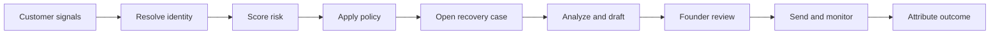
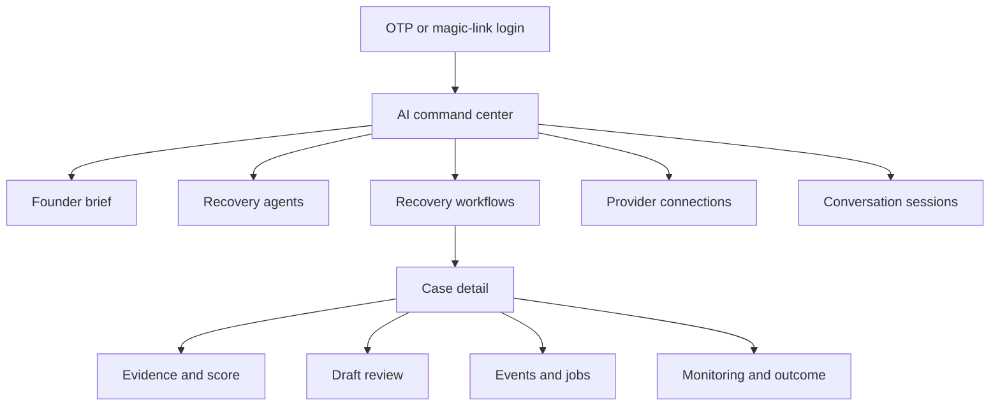
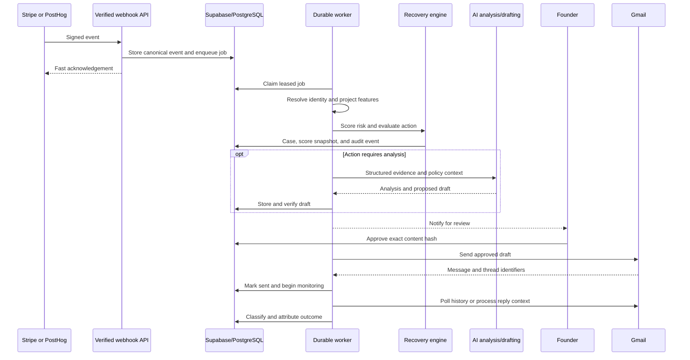
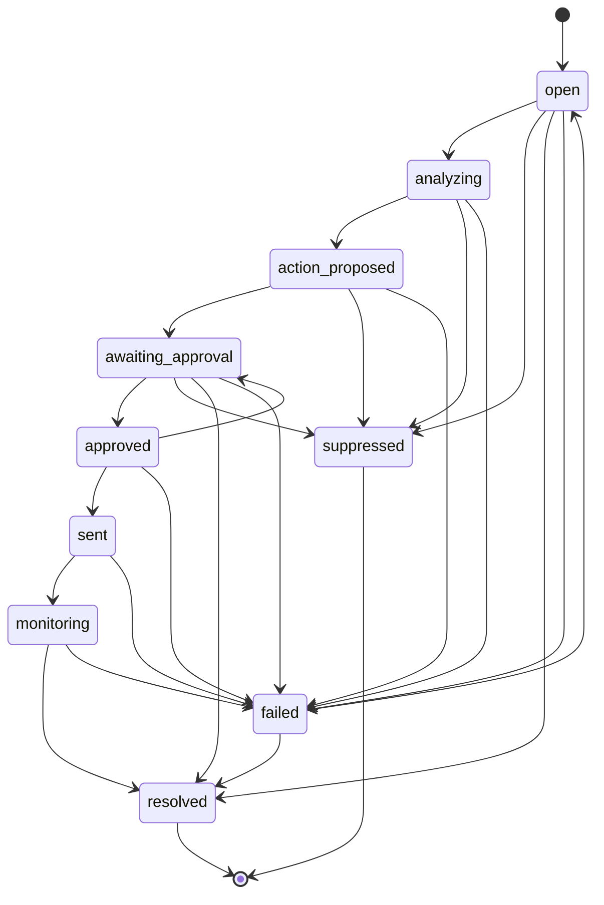
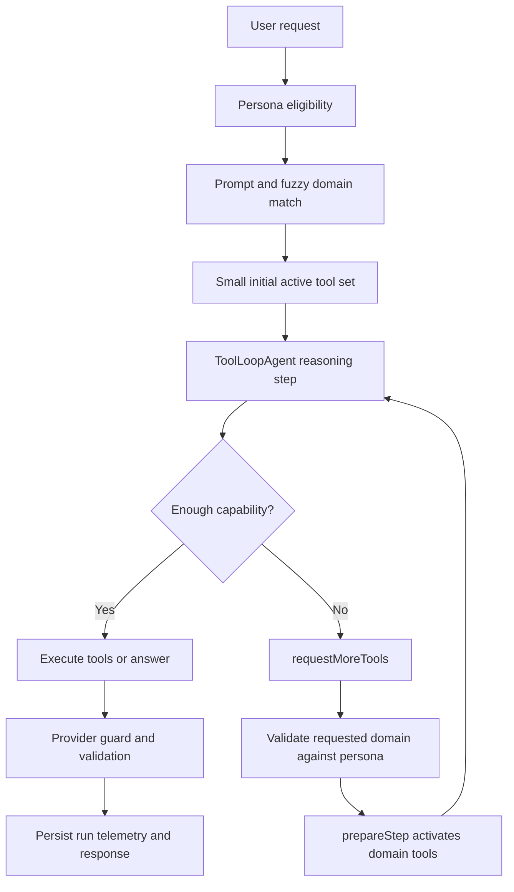
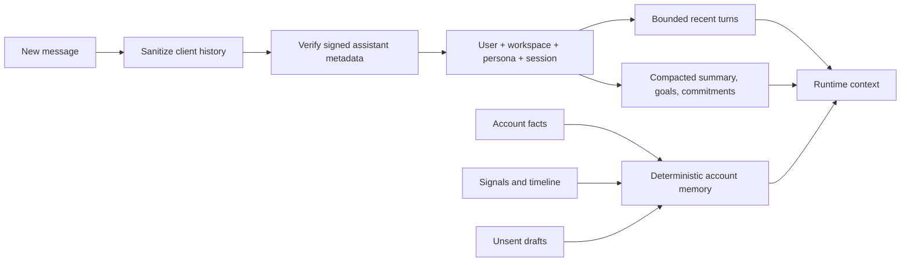
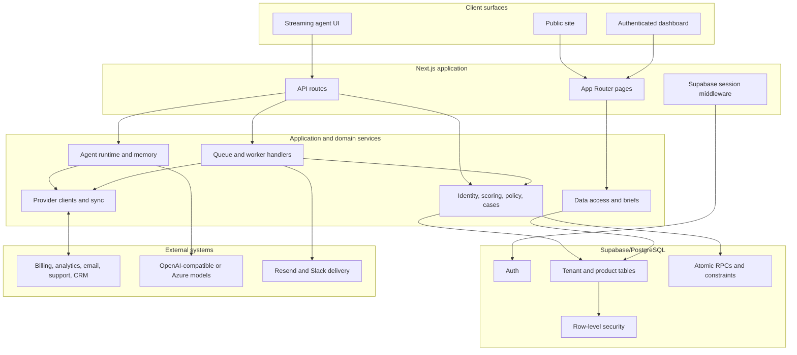
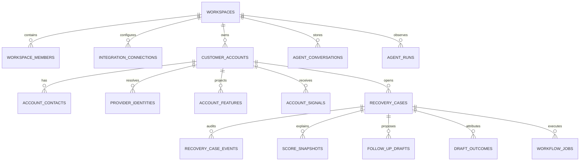

# Allel


**An AI-assisted revenue-recovery operating system for founder-led B2B SaaS teams.**

Allel connects fragmented customer signals from billing, product analytics, email, support, CRM, and engineering systems. It resolves those signals to the correct account, computes risk deterministically, creates an auditable recovery case, helps prepare the right response, routes the exact draft through founder approval, and measures what happened next.

> AI helps Allel reason, explain, draft, research, and operate connected tools. It does **not** own customer identity, risk truth, policy, approval integrity, case transitions, or revenue attribution. Those boundaries remain deterministic and auditable.

---

## Contents

- [Why Allel](#why-allel)
- [What the product does](#what-the-product-does)
- [Product experience](#product-experience)
- [End-to-end recovery workflow](#end-to-end-recovery-workflow)
- [Agent orchestration](#agent-orchestration)
- [System architecture](#system-architecture)
- [Recovery intelligence](#recovery-intelligence)
- [Integrations](#integrations)
- [Data and trust model](#data-and-trust-model)
- [API surface](#api-surface)
- [Repository guide](#repository-guide)
- [Run locally](#run-locally)
- [Operations and deployment](#operations-and-deployment)
- [Testing and validation](#testing-and-validation)
- [Known limitations](#known-limitations)
- [Documentation map](#documentation-map)

---

## Why Allel

Customer risk rarely appears in one system.

A failed Stripe invoice may be temporary. A 60% usage decline may be seasonal. A quiet Gmail thread may be normal. An unresolved Intercom issue may be harmless. But when those signals belong to the same account and occur together, they can represent imminent churn.

Most founder workflows still require someone to:

1. notice the signal;
2. identify the customer behind it;
3. collect evidence from several providers;
4. decide whether the risk is real;
5. choose a safe action;
6. write and review the outreach;
7. remember to follow up; and
8. prove whether revenue was actually recovered.

Allel turns that fragmented process into one evidence-backed operating loop.

### Product principles

| Principle | What it means in Allel |
|---|---|
| **Facts before language** | Provider facts and persisted account state are assembled before AI analysis. |
| **Identity before action** | Ambiguous provider records become explicit conflicts instead of unsafe account merges. |
| **Policy before automation** | Confidence thresholds, contact policy, cooldowns, and legal transitions constrain action. |
| **Approval binds content** | Recovery approval is tied to the exact draft content hash. |
| **Delivery is not success** | A sent message is monitored; revenue is counted only through outcome evidence. |
| **Every stage is inspectable** | Events, jobs, agent runs, case transitions, drafts, and outcomes leave audit records. |
| **Demo data stays labeled** | Seeded scenarios and test-mode metrics must never be presented as production outcomes. |

---

## What the product does



Allel provides four connected product capabilities:

### 1. Revenue-recovery engine

- Verifies Stripe and PostHog webhook ingress.
- Reconciles provider state on a schedule.
- Resolves provider events to canonical customer accounts.
- Projects billing, usage, and communication features.
- Calculates deterministic risk and confidence.
- Applies action policy, contact restrictions, and cooldowns.
- Creates durable recovery cases and score snapshots.
- Tracks recovery, protection, engagement, suppression, and unresolved risk.

### 2. Founder command center

- Streams AI-assisted conversations.
- Preserves user/workspace/persona/session-scoped history.
- Surfaces accounts, drafts, cases, briefs, and provider context.
- Routes requests to a large connected-tool registry without loading every tool schema at once.
- Records which tools and model steps actually executed.

### 3. Human-reviewed outreach

- Generates evidence-grounded recovery drafts.
- Verifies draft shape and policy.
- Binds founder approval to expected content.
- Queues approved drafts for durable Gmail delivery.
- Monitors Gmail history and classifies outcomes.

### 4. Cross-platform customer context

- Normalizes provider identities and account relationships.
- Supports synchronized and live tool-only integrations.
- Exposes account timelines, risk factors, drafts, outcomes, and memories.
- Delivers founder briefs and urgent context through configured channels.

---

## Product experience

The authenticated application uses a compact sidebar organized around **Brief**, **Agents**, **Automations**, **Connections**, and persisted conversation history.



### Main surfaces

| Surface | Route | What a reviewer can do |
|---|---|---|
| **Command center** | `/dashboard` | Chat with a persona, invoke connected tools, and revisit persisted sessions. |
| **Founder brief** | `/dashboard/brief` | Review prioritized account and recovery context. |
| **Agents** | `/dashboard/agents` | Open the recovery automation experience through the agent-oriented navigation. |
| **Automations** | `/dashboard/flows` | Search cases, inspect metrics and evidence, review drafts, replay work, and dispatch outreach. |
| **Connections** | `/dashboard/connections` | Connect and manage supported providers. |
| **Accounts** | `/dashboard/accounts` | Browse the account portfolio and open account-level details. |
| **Drafts** | `/dashboard/drafts` | Review recovery drafts and approval state. |
| **History/sessions** | `/dashboard/history`, `/dashboard/sessions` | Reopen command-center conversations. |
| **Inbox** | `/dashboard/inbox` | Placeholder only; an inbox product is not implemented yet. |

`/dashboard/agents` currently reuses the recovery-flow page. `/dashboard/connections` reuses settings, and history/session routes reuse the command center. These are intentional route aliases, not separate implementations.

### Public experience

The application also includes:

- marketing and waitlist at `/`;
- `/about` and `/pricing`;
- public product documentation at `/docs` and `/docs/[slug]`;
- `/privacy` and `/terms`; and
- OTP/magic-link authentication at `/auth/login` and `/auth/callback`.

---

## End-to-end recovery workflow

### Durable execution pipeline



### Job chain

The worker supports these durable job types:

```text
process_provider_event
  → project_account_features
  → evaluate_recovery_case
  → run_case_analysis
  → generate_case_draft
  → verify_case_draft
  → notify_founder
  → send_approved_draft
  → sync_gmail_history
  → classify_case_outcome
```

Handlers can enqueue the next idempotent job. Workers claim jobs with leases, use bounded concurrency, heartbeat model-heavy work, retry retryable failures with backoff, and retain error state for inspection.

### Recovery-case state machine



The preferred transition path is the `transition_recovery_case` database RPC, which locks the row, validates the expected current status, updates the case, and appends the event atomically. A TypeScript optimistic-concurrency fallback exists for environments missing the RPC.

---

## Agent orchestration

Allel's agent is an operating interface over the product—not the product's source of truth.

### Personas

| Internal ID | Display name | Role | Capability boundary |
|---|---|---|---|
| `alex` | **Allel** | AI Co-founder | Generalist, eligible for every registered tool. The internal ID remains for backward compatibility. |
| `henry` | **Henry** | Head of Growth | Research, CRM/support context, drafts, read-oriented calendar access, and selected collaboration tools. |
| `sarah` | **Sarah** | Head of Retention | Billing, usage, account risk, recovery cases, outreach, Slack escalation, and calendar operations. |

### Tool orchestration

At the verified snapshot, `ALL_TOOLS` contains **164 registered tools**. Allel avoids sending every tool schema on every chat step.



The routing contract is:

1. A persona defines the maximum eligible tool set.
2. Prompt keywords, fuzzy matching, and domain priorities select an initial subset.
3. Chat receives a synthetic `requestMoreTools` capability.
4. `prepareStep` expands only to tools already allowed for that persona.
5. Provider guards block unavailable or unhealthy integrations.
6. Run logging records tools, steps, tokens, duration, model, cost estimate, workflow context, and failures.

Current runtime settings:

| Setting | Value |
|---|---:|
| Maximum steps | 25 |
| Maximum output tokens | 4,096 |
| Temperature | 0.3 |
| SDK retries | 10 |
| Fallback model | Optional through `AGENT_FALLBACK_MODEL_ID` |
| Channel overrides | Chat and automation model IDs supported |

### Memory model



Conversation memory and account memory serve different purposes:

- **Conversation memory** preserves a scoped interaction and compacts older turns.
- **Account memory** is reconstructed from persisted account facts, signals, timeline events, and drafts.

Assistant metadata is signed with `AGENT_HISTORY_SIGNING_SECRET` and sanitized before reuse. Account-memory refreshes can be queued durably.

### Approval boundary

Two mechanisms exist and must not be confused:

- **Recovery draft approval is active:** approval is tied to the expected content hash and queues the durable send workflow.
- **Generic chat-tool approval is scaffolded but not enabled:** storage and `/api/agent/approvals` exist, but the generic interception list is currently empty.

The project therefore does not claim that every mutating tool invoked from chat receives universal manual approval.

Deep dives: [`docs/AGENT.md`](docs/AGENT.md) and [`docs/tool_calling.md`](docs/tool_calling.md).

---

## System architecture



### Layers and ownership

| Layer | Responsibility | Main location |
|---|---|---|
| UI and routes | Public site, dashboard, agent feed, case workflows | `platform/src/app`, `platform/src/ui` |
| API | Auth, chat, recovery, integrations, webhooks, cron, worker | `platform/src/app/api` |
| Agent | Personas, runtime, tools, memory, workflows, run inspection | `platform/src/agent` |
| Recovery | Identity, feature projection, scoring, policy, cases, outcomes | `platform/src/recovery` |
| Jobs | Queue, leases, retries, worker, stage handlers | `platform/src/jobs` |
| Integrations | Credentials, connection guards, provider clients, sync | `platform/src/integrations` |
| Data/foundation | Supabase clients, data access, security, AI provider setup | `platform/src/data`, `platform/src/foundation` |
| Persistence | Tables, RLS, indexes, constraints, triggers, RPCs | `database/migrations` |

### Technology

- **Web:** Next.js 15.5 App Router, React 19.1, TypeScript
- **UI:** Tailwind CSS 4, Base UI, Radix primitives, Motion, Lucide/Tabler icons
- **Data/auth:** Supabase Auth and PostgreSQL with RLS
- **AI:** AI SDK 6, OpenAI-compatible providers, Azure OpenAI support, Tavily research
- **Delivery/providers:** Stripe, Gmail/Calendar, PostHog, Intercom, Resend, Slack, and additional direct APIs
- **Hosting:** Vercel-compatible Next.js deployment and cron configuration

---

## Recovery intelligence

### Identity resolution

Allel prefers high-confidence identifiers in this order:

1. verified provider identity;
2. verified contact/email association;
3. provisional or inferred identity requiring review.

Ambiguous records create `identity_conflicts` instead of silently merging customers. Safe contact linking, provider-identity linking, and customer promotion use atomic RPCs and immutable promotion audit data.

### Scoring

| Domain | Weight |
|---|---:|
| Billing | 50% |
| Usage | 35% |
| Communication | 15% |

Risk thresholds are:

| Level | Minimum score |
|---|---:|
| Medium | 45 |
| High | 70 |
| Critical | 85 |

Hard overrides account for decisive signals such as cancellation, repeated payment failure, past-due state, severe usage decline, key-feature abandonment, and compound risk.

### Confidence and policy

- Automatic identity confidence minimum: `0.90`
- Action confidence minimum: `0.75`
- Low confidence forces founder review.
- Billing outreach cooldown: 72 hours
- Cancellation and usage outreach cooldown: 7 days
- Standard approval TTL: 24 hours
- Critical approval TTL: 2 hours
- One active draft per case by default

### Outcome windows

Attribution windows vary by recovery type: invoice recovery, cancellation recovery, cancellation-intent protection, usage recovery, and Gmail engagement are evaluated separately. “Revenue saved” is not inferred merely because an email was generated or sent.

---

## Integrations

### Current catalog

| Provider | Capability | Connection | Main purpose |
|---|---|---|---|
| Stripe | Sync-capable | Direct credentials + signed webhook | Billing, subscriptions, invoices, payment failures, revenue |
| PostHog | Sync-capable | Direct credentials + HMAC webhook | Usage, activation, events, cohorts, feature engagement |
| Gmail | Sync-capable | Google OAuth | Threads, drafts, delivery, replies, engagement monitoring |
| Intercom | Sync-capable | OAuth | Support conversations, contacts, frustration context |
| HubSpot | Sync-capable | Encrypted manual credential | CRM companies, contacts, deals, lifecycle context |
| Slack | Sync-capable | Encrypted manual credential | Brief delivery, alerts, team collaboration |
| Sentry | Sync-capable | Encrypted manual credential | Production issues connected to customer risk |
| Linear | Sync-capable | Encrypted manual credential | Engineering issues and customer-impact context |
| Airtable | Tool-only | Encrypted manual credential | Search and modify workspace records on demand |
| Google Calendar | Tool-only | Google OAuth | Availability, meetings, reminders, follow-up scheduling |
| Notion | Tool-only | Encrypted manual credential | Search and manage knowledge/workspace pages |
| Tavily | Agent research | Server environment key | Web search, extraction, crawl, and mapping |

Planned catalog entries: Jira, GitHub, Zendesk, Salesforce, Supabase, Google Docs, and Google Drive.

### What “connected” means

A connection does not imply that every provider record is copied into Supabase or injected into every model prompt.

- **Sync-capable** providers can project normalized product state.
- **Tool-only** providers are queried live when an eligible tool is selected.
- **Planned** providers are visible but intentionally unavailable.

See [`docs/INTEGRATION_AUDIT.md`](docs/INTEGRATION_AUDIT.md) for the verification model and open risks.

---

## Data and trust model

### Core data groups



Major persisted groups include:

- tenant membership and integration credentials;
- canonical accounts, contacts, provider identities, and conflicts;
- projected features, signals, timeline, and account memory;
- scores, score factors, snapshots, cases, case events, and policies;
- drafts, briefs, outcomes, scenario runs, webhook events, and workflow jobs;
- conversations, sessions, run telemetry, and approval requests.

### Security boundaries

- Dashboard requests use Supabase SSR sessions.
- Workspace membership and RLS enforce tenant access.
- Service-role credentials stay server-side.
- Provider secrets are encrypted before persistence.
- Stripe and PostHog webhooks verify signatures/HMAC.
- Cron and worker endpoints require bearer secrets in production.
- Assistant message metadata is signed and sanitized.
- High-integrity operations use database constraints and RPCs.
- Recovery approval binds to exact content before durable sending.

### Important RPCs

The schema includes operations for:

- atomic provider-event ingestion and job creation;
- workflow-job claiming;
- legal recovery-case transitions;
- exact recovery-draft approval;
- versioned outcome recording; and
- safe contact, provider-identity, and customer-promotion linking.

---

## API surface

| Group | Endpoints | Purpose |
|---|---|---|
| Agent | `/api/agent`, `/api/agent/history`, `/api/agent/sessions` | Streaming chat, memory, and session lifecycle |
| Agent inspection | `/api/agent/runs`, `/api/agent/runs/[workflowId]` | Paginated workflow/run inspection |
| Agent approvals | `/api/agent/approvals` | Generic approval-record API; runtime interception is not currently enabled |
| Auth | `/api/auth/login`, `/api/auth/verify-otp`, `/auth/callback` | OTP/magic-link login and session exchange |
| Briefs | `/api/brief`, `/api/brief/refresh` | Read, generate, and refresh founder briefs |
| Drafts | `/api/drafts/[id]/approve`, `/api/drafts/[id]/send` | Hash-checked approval and durable send queueing |
| Recovery | `/api/recovery/cases/**`, `/api/recovery/dispatch-draft` | Case detail, draft, replay, and dispatch surfaces |
| Metrics | `/api/metrics/revenue-saved` | Strict recovery, protection, at-risk, and engagement metrics |
| Connections | `/api/integrations/**` | Stripe/PostHog connection and OAuth callbacks |
| Webhooks | `/api/webhooks/stripe`, `/api/webhooks/posthog` | Authenticated event ingress |
| Automation | `/api/cron/daily-run`, `/api/internal/workflows/drain` | Reconciliation, brief generation, queue drain, Gmail polling |
| Public | `/api/waitlist` | Waitlist submission and optional notification |

---

## Repository guide

```text
allel/
├── README.md                    # GitHub product and engineering overview
├── database/
│   └── migrations/              # 29 ordered PostgreSQL/Supabase migrations
├── docs/
│   ├── README.md                # Documentation index
│   ├── ALLEL.md                 # Detailed product architecture
│   ├── AGENT.md                 # Agent runtime and memory
│   ├── tool_calling.md          # Tool routing contract
│   ├── INTEGRATION_AUDIT.md     # Provider architecture and risks
│   ├── TODO.md                  # Current engineering risk register
│   └── INTERVIEW_QA.md          # Review and demo preparation
├── platform/
│   ├── src/app/                 # App Router pages and APIs
│   ├── src/agent/               # Personas, runtime, tools, memory
│   ├── src/recovery/            # Identity, scoring, policy, cases, outcomes
│   ├── src/jobs/                # Durable queue and worker handlers
│   ├── src/integrations/        # Provider clients, guards, and sync
│   ├── src/data/                # Product data access
│   ├── src/foundation/          # AI, database, security, utilities
│   ├── src/ui/                  # Dashboard, chat, drafts, integrations
│   ├── scripts/                 # Migration, worker, readiness, demo scripts
│   └── artifacts/               # Generated demo/run evidence
└── prompt/                      # Historical build and coordination prompts
```

Generated `platform/artifacts/**/report.md` files are run evidence, not maintained documentation.

---

## Run locally

### Prerequisites

- Node.js 20-compatible runtime
- npm
- A Supabase project or local Supabase/PostgreSQL environment
- At least one configured AI provider
- Provider credentials only for integrations you intend to use

### 1. Install

```bash
cd platform
npm install
cp .env.example .env.local
```

The real `.env.example` is tracked but intentionally not reproduced here. Never commit `.env.local`, service-role keys, encryption keys, signing secrets, OAuth secrets, or provider tokens.

### 2. Configure core environment

```text
NEXT_PUBLIC_SUPABASE_URL
NEXT_PUBLIC_SUPABASE_ANON_KEY
SUPABASE_SERVICE_ROLE_KEY
ENCRYPTION_KEY
AGENT_HISTORY_SIGNING_SECRET
OPENAI_API_KEY
NEXT_PUBLIC_APP_URL
```

Production must use a dedicated `AGENT_HISTORY_SIGNING_SECRET`. Local development may fall back to `OPENAI_API_KEY`; production intentionally fails without the dedicated secret.

Optional model selection:

```text
OPENAI_MODEL_ID
AGENT_MODEL_ID
AGENT_CHAT_MODEL_ID
AGENT_AUTOMATION_MODEL_ID
AGENT_FALLBACK_MODEL_ID
AZURE_OPENAI_API_KEY
AZURE_OPENAI_ENDPOINT
AZURE_OPENAI_BASE_URL
```

Automation and provider configuration includes `CRON_SECRET`, `WORKER_SECRET`, Google OAuth, Intercom OAuth, Stripe, PostHog, Tavily, and Resend variables. See [`platform/README.md`](platform/README.md) for the complete grouped list.

### 3. Apply the database

For a blank environment, apply every SQL file in `database/migrations/` in filename order.

> The custom `migrations:apply` runner currently manages only the latest 12 recovery/identity migrations. It is not a complete blank-database bootstrap. Use Supabase CLI or `psql` for all 29 files until the runner is expanded.

### 4. Start the application

```bash
npm run dev
```

Open `http://localhost:3000`.

### 5. Validate

```bash
npm test
npm run build
```

---

## Operations and deployment

### Common commands

From `platform/`:

```bash
npm run dev
npm test
npm run build
npm run lint
npm run scenario:evaluate
npm run migrations:plan
npm run migrations:apply
npm run agent:readiness -- --workspace-id=<uuid>
npm run workflows:drain -- --workspace-id=<uuid>
npm run demo:data:plan
npm run demo:data:seed
npm run demo:data:inspect
npm run demo:data:evaluate
npm run demo:data:reset
npm run demo:reset-apex
```

Sending is disabled by default in the CLI drain workflow unless explicitly allowed.

### Schedules

`platform/vercel.json` schedules:

```text
/api/cron/daily-run  →  0 4 * * *  →  04:00 UTC daily
```

The daily route verifies `CRON_SECRET`, reconciles workspace providers, processes queued work, generates briefs, and attempts configured delivery.

The worker-drain endpoint accepts `CRON_SECRET` or `WORKER_SECRET` in production. It is **not** independently scheduled in the repository, so production needs a frequent external scheduler or dedicated worker for low queue latency and Gmail History polling.

### Scenario system

The deterministic recovery scenario tooling can plan, seed, inspect, evaluate, and reset test data. Use `RECOVERY_TEST_MODE=true` for isolated scenario workflows and label every scenario-derived account, metric, email, and outcome as seeded/test data.

---

## Testing and validation

Verified on **2026-09-05**:

| Check | Result |
|---|---:|
| Test suite | **439 passed, 0 failed** |
| Production build | **Passed** |
| Test files | 39 |
| SQL migrations | 29 |
| Registered agent tools | 164 |

Coverage includes agent routing and tools, memory and trusted metadata, workflow stages, run inspection, provider connection guards, provider sync behavior, durable jobs, identity, scoring, recovery cases, scenarios, UI message handling, and unified customer scans.

These are point-in-time repository facts—not a production SLA, security certification, benchmark, or claim of real recovered revenue. Re-run the checks after changes.

---

## Known limitations

This project documents its current risks rather than hiding them:

1. **Direct dispatch truthfulness:** two direct recovery-dispatch routes can mark a case/draft sent after Gmail failure and contain Apex demo fallbacks. Prefer the hash-approved durable send path.
2. **Legacy table reference:** runtime code references `draft_responses`, but repository migrations do not create it.
3. **Partial migration runner:** the custom runner covers 12 of 29 migrations.
4. **Worker scheduling:** frequent queue draining and Gmail History polling are not scheduled by `vercel.json`.
5. **Generic chat approvals:** approval storage/API exists, but universal chat mutation interception is disabled.
6. **AI readiness:** `isAIConfigured()` currently reports true without validating credentials.
7. **Inbox:** `/dashboard/inbox` is a placeholder.
8. **Scenario-specific UI:** parts of the recovery-flow presentation contain seeded account diagnostics; they must remain clearly separated from live provider facts.

See [`docs/TODO.md`](docs/TODO.md) for acceptance criteria and affected paths.

---

## Documentation map

| Start here when you need… | Document |
|---|---|
| Product, workflow, UI, architecture, and setup | **This README** |
| Documentation ownership and archive status | [`docs/README.md`](docs/README.md) |
| Detailed system architecture | [`docs/ALLEL.md`](docs/ALLEL.md) |
| Application setup, environment, routes, and scripts | [`platform/README.md`](platform/README.md) |
| Agent personas, memory, trust, and telemetry | [`docs/AGENT.md`](docs/AGENT.md) |
| Tool selection and in-loop expansion | [`docs/tool_calling.md`](docs/tool_calling.md) |
| Provider capability and integration risks | [`docs/INTEGRATION_AUDIT.md`](docs/INTEGRATION_AUDIT.md) |
| Current engineering risks | [`docs/TODO.md`](docs/TODO.md) |
| Interview and demo preparation | [`docs/INTERVIEW_QA.md`](docs/INTERVIEW_QA.md) |
| External Framer operations | [`docs/framer.md`](docs/framer.md) |

Historical competition reports, plans, and narratives remain in `docs/` with archive banners. They preserve project history but do not override current source-backed documentation.

---

## License and intellectual property

Copyright © 2026 Kushagara Singh. All rights reserved.

This software and source code are proprietary. Permission is granted solely for hackathon evaluation and review. Commercial use, redistribution, or unauthorized reproduction is prohibited. See [`LICENSE`](LICENSE).
