# Allel


**An AI-assisted revenue-recovery operating system for founder-led B2B SaaS teams.**

Allel connects fragmented customer signals from billing, product analytics, email, support, CRM, and engineering systems. It resolves those signals to the correct account, computes risk deterministically, creates an auditable recovery case, helps prepare the right response, routes the exact draft through founder approval, and measures what happened next.

> **The Architectural Rule:** AI helps Allel reason, explain, draft, research, and operate connected tools. It does **not** own customer identity, risk truth, policy, approval integrity, case transitions, or revenue attribution. Those boundaries remain deterministic, database-enforced, and auditable.

---

## Contents

- [Why Allel](#why-allel)
- [Deterministic vs. AI Separation Boundary](#deterministic-vs-ai-separation-boundary)
- [System Architecture Blueprint](#system-architecture-blueprint)
- [Product Experience & UI Architecture](#product-experience--ui-architecture)
- [End-to-End Recovery Operating Loop](#end-to-end-recovery-operating-loop)
- [Deterministic Risk & Confidence Engine](#deterministic-risk--confidence-engine)
- [Identity Resolution & Conflict Isolation](#identity-resolution--conflict-isolation)
- [Human-in-the-Loop Hash-Bound Approval](#human-in-the-loop-hash-bound-approval)
- [Agent Orchestration & Dynamic Tool Routing](#agent-orchestration--dynamic-tool-routing)
- [Durable Job Queue & Worker Pipeline](#durable-job-queue--worker-pipeline)
- [Closed-Loop Outcome Attribution](#closed-loop-outcome-attribution)
- [Integrations Mesh](#integrations-mesh)
- [Data Model & Security](#data-model--security)
- [API Surface](#api-surface)
- [Repository Guide](#repository-guide)
- [Run Locally](#run-locally)
- [Operations and Deployment](#operations-and-deployment)
- [Testing and Validation](#testing-and-validation)
- [Known Limitations](#known-limitations)
- [Documentation Map](#documentation-map)

---

## Why Allel

Customer risk rarely appears in one isolated system.

A failed Stripe invoice may be temporary. A 60% usage decline may be seasonal. A quiet Gmail thread may be normal. An unresolved Intercom issue may be harmless. But when those signals belong to the same account and occur together, they represent imminent churn.

Most founder workflows still require someone to:
1. Notice the signal across scattered dashboards;
2. Identify which customer is behind the disparate IDs;
3. Collect evidence from several providers;
4. Decide whether the risk is real;
5. Choose a safe action and respect contact cooldowns;
6. Write and review the outreach;
7. Remember to follow up; and
8. Prove whether revenue was actually recovered.

Allel unifies that fragmented process into one evidence-backed operating loop.

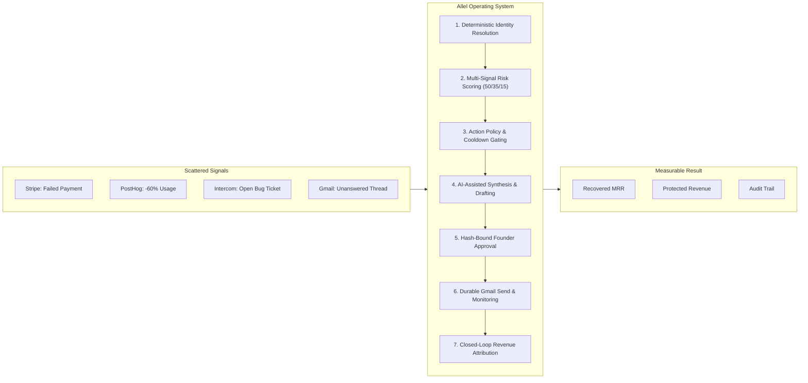

### Product Principles

| Principle | What it means in Allel |
|---|---|
| **Facts before language** | Provider facts and persisted account state are assembled before AI analysis. |
| **Identity before action** | Ambiguous provider records become explicit conflicts instead of unsafe account merges. |
| **Policy before automation** | Confidence thresholds, contact policy, cooldowns, and legal transitions constrain action. |
| **Approval binds content** | Recovery approval is cryptographically tied to the exact draft content hash. |
| **Delivery is not success** | A sent message is monitored; revenue is counted only through verified outcome evidence. |
| **Every stage is inspectable** | Events, jobs, agent runs, case transitions, drafts, and outcomes leave audit records. |
| **Demo data stays labeled** | Seeded scenarios and test-mode metrics must never be presented as production outcomes. |

---

## Deterministic vs. AI Separation Boundary

The core architecture strictly partitions responsibilities between deterministic application code and AI reasoning:

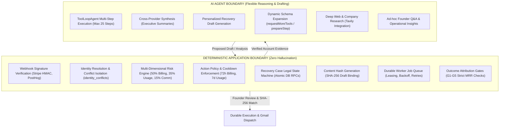

---

## System Architecture Blueprint

Allel is structured into seven distinct architectural layers ensuring complete tenant isolation, robust auditability, and sub-second UI responsiveness:

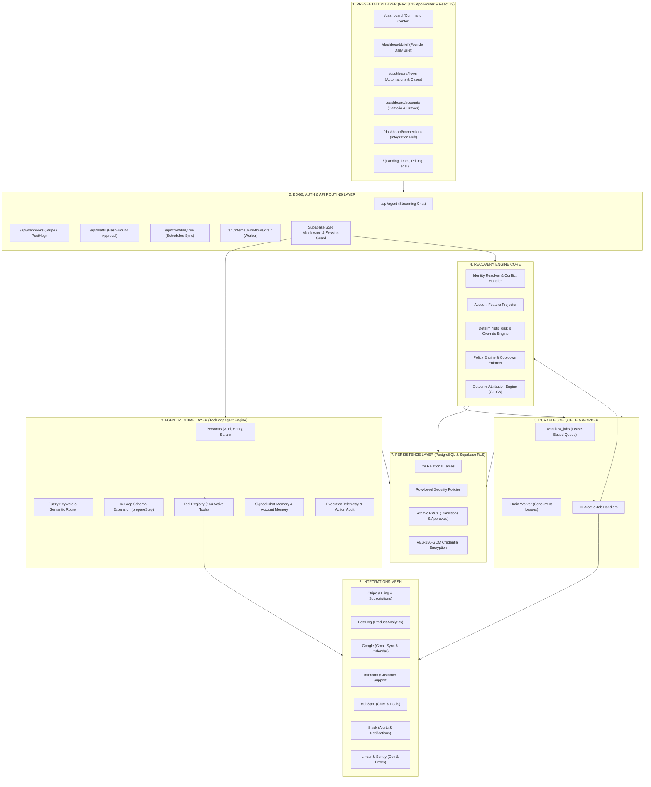

---

## Product Experience & UI Architecture

The Allel dashboard is designed as an interactive founder cockpit combining high-bandwidth AI conversation with direct operational controls:

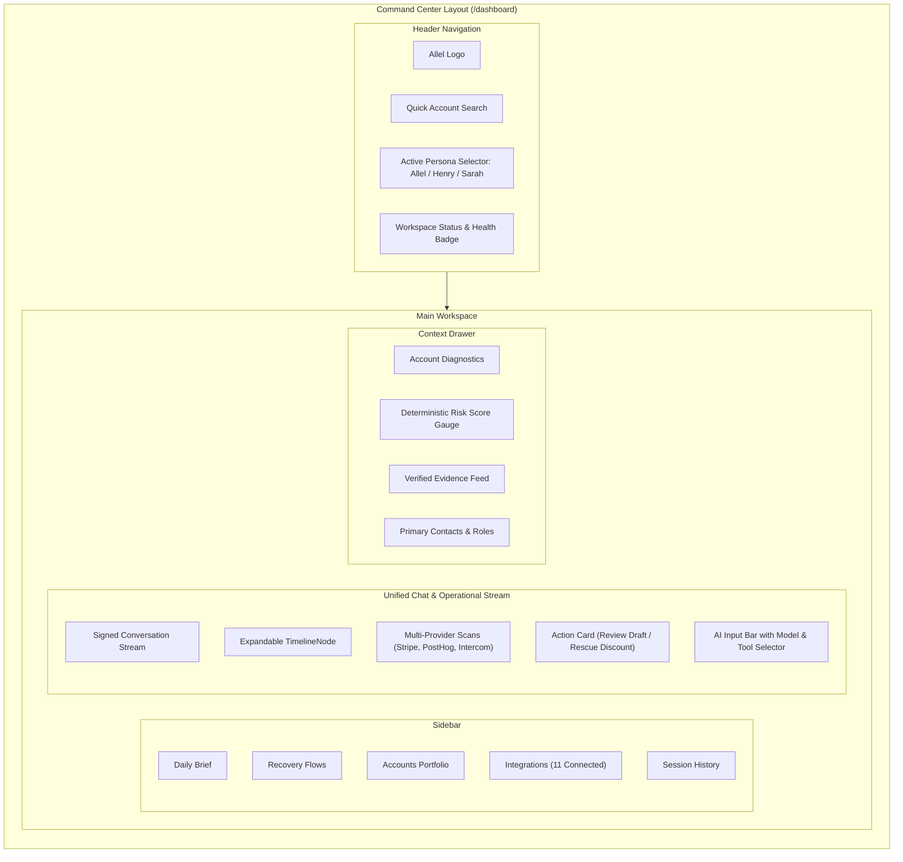

### Main Product Surfaces

| Surface | Route | What a founder or reviewer can do |
|---|---|---|
| **Command Center** | `/dashboard` | Chat with an AI persona, invoke 164 connected tools, inspect live provider cards, and resume signed historical sessions. |
| **Founder Brief** | `/dashboard/brief` | Review high-priority accounts, overdue actions, revenue at risk, and delivered morning briefings. |
| **Automations & Flows** | `/dashboard/flows` | Search cases, inspect multi-provider evidence, review pending recovery drafts, replay failed jobs, and dispatch approved outreach. |
| **Accounts Portfolio** | `/dashboard/accounts` | Browse all resolved customer accounts, review MRR, health scores, and open dedicated account drawers. |
| **Connections Hub** | `/dashboard/connections` | Configure, authenticate, and monitor live health for all 11 supported integrations. |
| **Draft Review** | `/dashboard/drafts` | Inspect pending recovery outreach drafts, verify SHA-256 content hashes, and grant founder approval. |
| **Session History** | `/dashboard/sessions` | Seamlessly reopen cryptographically signed past agent interactions without context loss. |

---

## End-to-End Recovery Operating Loop

When a customer encounters friction, the entire lifecycle from signal detection to revenue attribution executes through a resilient, auditable state machine:

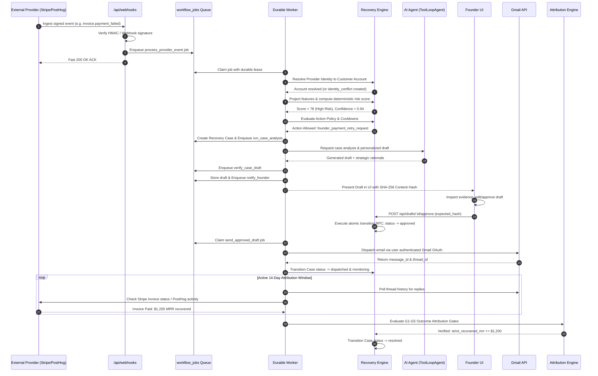

---

## Deterministic Risk & Confidence Engine

Allel never delegates risk assessment to an unpredictable LLM prompt. Instead, risk is computed via a transparent, multi-dimensional scoring formula with hard circuit-breaker overrides:

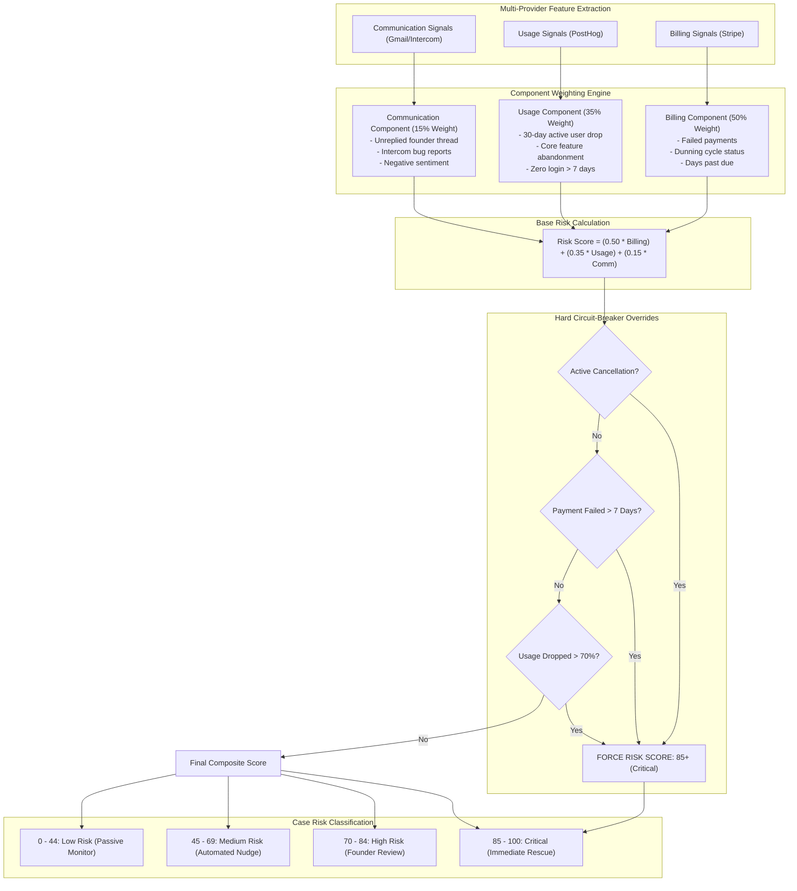

### Confidence Gating & Policy Cooldowns

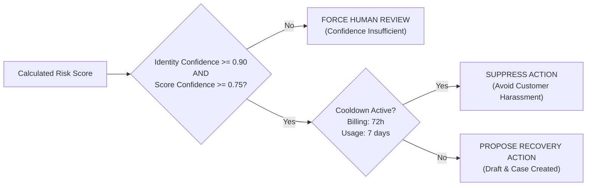

---

## Identity Resolution & Conflict Isolation

A major failure mode in B2B SaaS is merging the wrong customer accounts based on loose heuristics. Allel isolates ambiguities into an auditable conflict table:

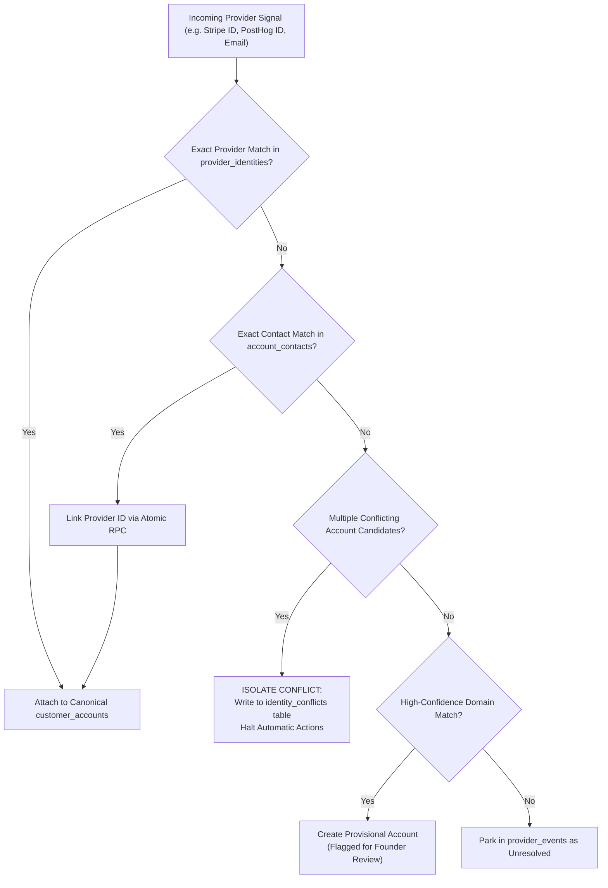

---

## Human-in-the-Loop Hash-Bound Approval

To protect founders against prompt injections, model drift, or rogue writes, Allel cryptographically binds approval to the exact content hash:

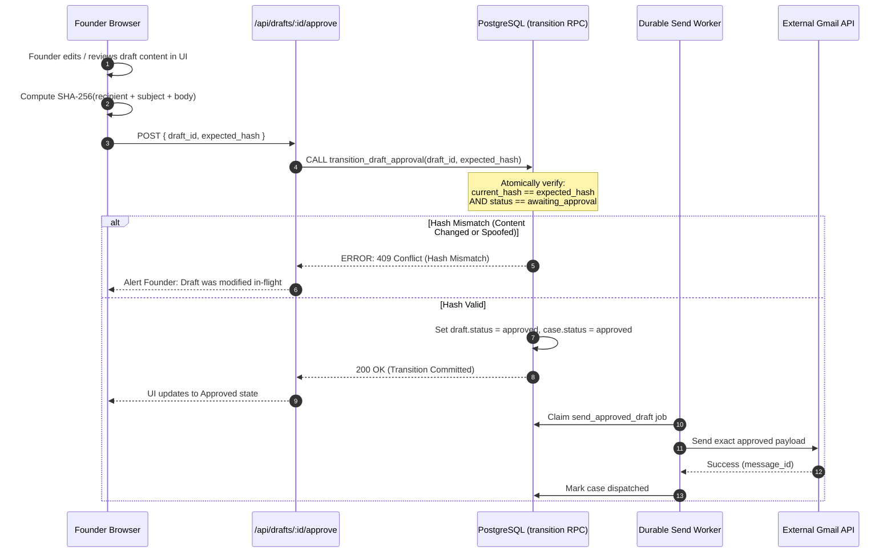

---

## Agent Orchestration & Dynamic Tool Routing

Allel ships with **164 registered tools** across 12 domains. Loading all 164 tool schemas into every model prompt would consume ~45,000 tokens per turn. Allel solves this with a **2-tier dynamic schema expansion pipeline**:

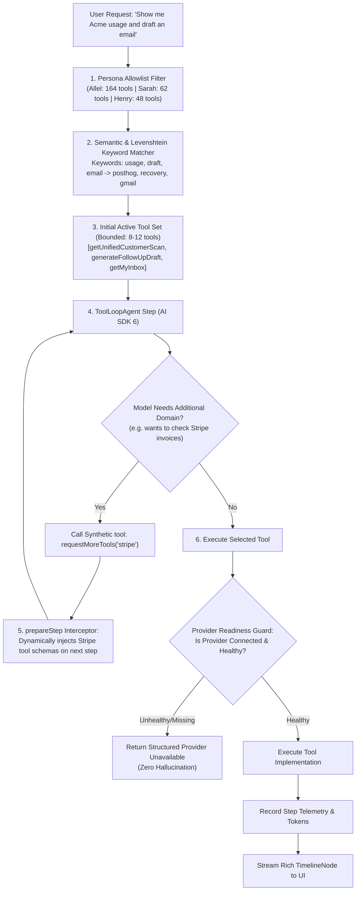

### The Three Personas

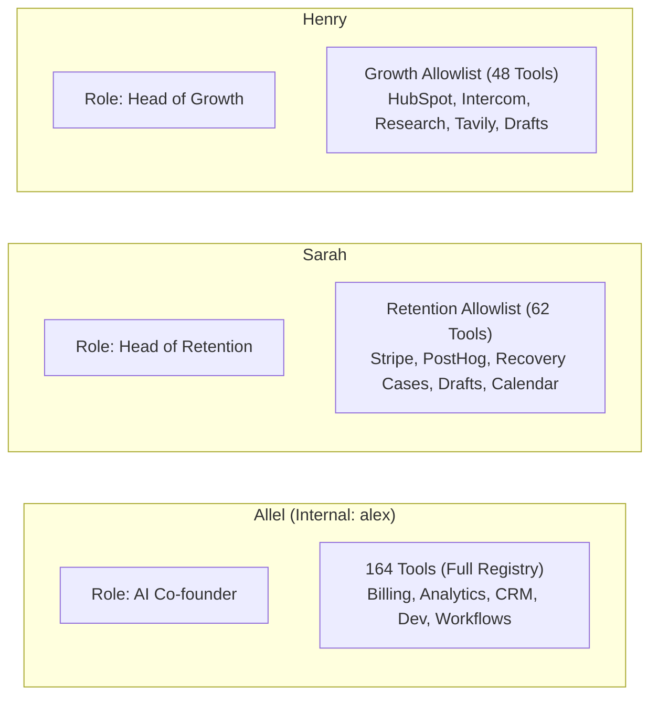

---

## Durable Job Queue & Worker Pipeline

All background operations run through a persistent PostgreSQL-backed queue (`workflow_jobs`) with atomic leases, bounded concurrency, and automatic exponential backoff:

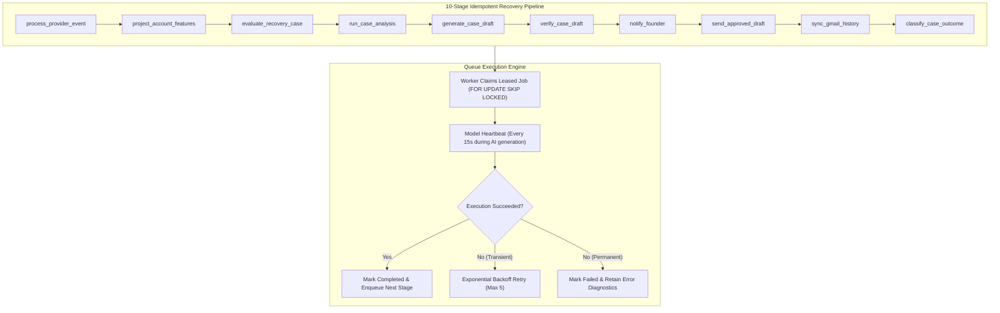

---

## Closed-Loop Outcome Attribution

Allel guarantees financial attribution integrity by separating strict recovered revenue from protected revenue through 5 rigorous validation gates:

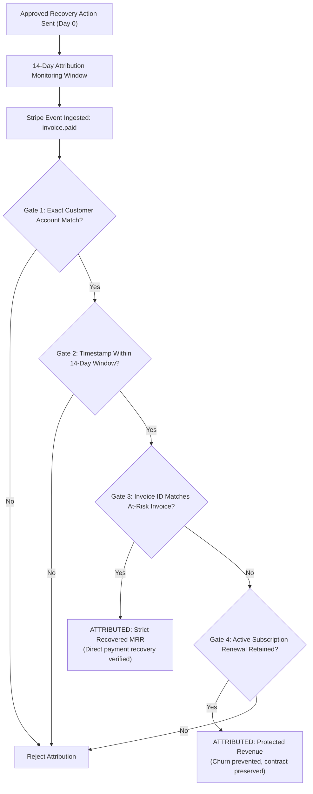

---

## Integrations Mesh

Allel connects with the 11 essential platforms of modern B2B SaaS:

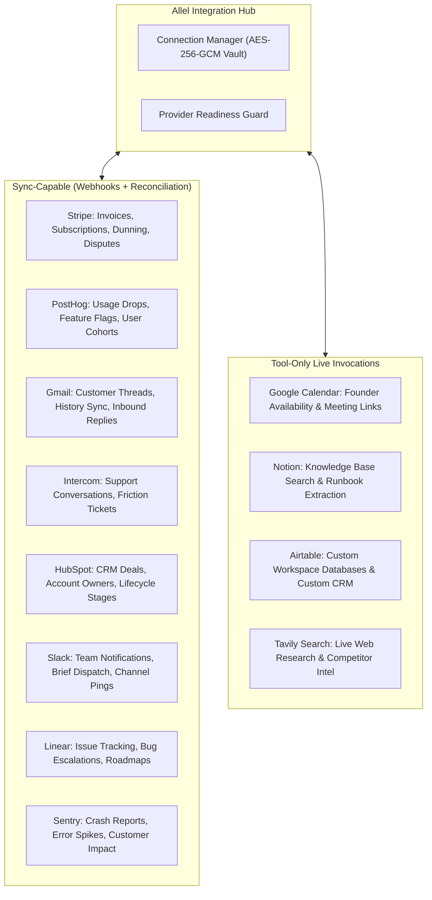

---

## Data Model & Security

### Entity Relationship Diagram

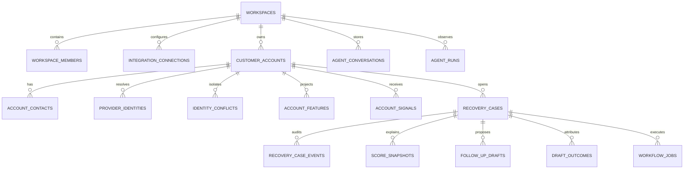

### Security & Defense-in-Depth

- **Tenant Isolation:** Supabase Row-Level Security (RLS) ensures absolute isolation per `workspace_id`.
- **Encrypted Credentials:** Integration access tokens and refresh tokens are encrypted using AES-256-GCM before database write.
- **Signed Session Memory:** Client-side assistant turns are signed via HMAC-SHA256 (`AGENT_HISTORY_SIGNING_SECRET`) preventing prompt tampering.
- **Webhook Authenticity:** Ingress endpoints enforce Stripe webhook signatures and PostHog HMAC verification.
- **Atomic Operations:** Critical state changes use PostgreSQL RPCs with row-level locks (`SELECT FOR UPDATE`), preventing race conditions.

---

## API Surface

| Group | Method & Path | Purpose |
|---|---|---|
| **Agent** | `POST /api/agent` | Streaming multi-turn conversation with dynamic tool routing and memory |
| **Agent History** | `GET /api/agent/history` | Retrieve cryptographically signed conversation turns |
| **Agent Sessions** | `GET, POST /api/agent/sessions` | Create, list, rename, and manage chat sessions |
| **Agent Inspection** | `GET /api/agent/runs` | Inspect agent execution runs, step traces, and token costs |
| **Recovery Cases** | `GET /api/recovery/cases` | Search, filter, and inspect recovery cases and score snapshots |
| **Draft Review** | `POST /api/drafts/:id/approve` | Grant hash-verified founder approval for outreach |
| **Draft Send** | `POST /api/drafts/:id/send` | Queue approved draft for durable worker dispatch |
| **Founder Brief** | `GET, POST /api/brief` | Read prioritized daily briefs and trigger morning refresh |
| **Metrics** | `GET /api/metrics/revenue-saved` | Fetch strict recovered MRR, protected MRR, and at-risk metrics |
| **Webhooks** | `POST /api/webhooks/stripe` | Authenticated Stripe event ingress |
| **Webhooks** | `POST /api/webhooks/posthog` | Authenticated PostHog event ingress |
| **Scheduled Sync** | `POST /api/cron/daily-run` | Scheduled morning provider reconciliation and brief dispatch |
| **Worker Drain** | `POST /api/internal/workflows/drain` | Drain leased jobs from the durable workflow queue |

---

## Repository Guide

```text
allel/
├── README.md                    # Canonical GitHub product & architectural guide
├── database/
│   └── migrations/              # 29 ordered PostgreSQL / Supabase migrations
├── docs/
│   ├── README.md                # Documentation index and navigation map
│   ├── ALLEL.md                 # Detailed technical and database architecture
│   ├── REPOSITORY_RESEARCH.md   # Codebase architecture & reviewer file locator
│   ├── AGENT.md                 # Agent runtime, personas, and memory deep dive
│   └── tool_calling.md          # 5-stage tool routing pipeline & 164-tool registry
└── platform/
    ├── src/app/                 # Next.js 15 App Router pages and API routes
    ├── src/agent/               # Agent runtime, 164 tools, memory, personas
    ├── src/recovery/            # Identity resolver, risk scoring, action policy
    ├── src/jobs/                # Durable queue worker and 10 job stage handlers
    ├── src/integrations/        # Provider clients, connection guards, sync
    ├── src/data/                # Supabase data queries and mutations
    ├── src/foundation/          # AI providers, crypto, security, logging
    ├── src/ui/                  # Command center, chat timeline, drawers, modals
    ├── scripts/                 # Scenarios, migration runner, worker drain
    └── artifacts/               # Benchmark and execution evidence
```

---

## Run Locally

### Prerequisites
- Node.js 20+
- npm 10+
- Supabase account (or local PostgreSQL with pgvector)
- OpenAI / Azure OpenAI API key

### 1. Install Dependencies
```bash
cd platform
npm install
cp .env.example .env.local
```

### 2. Configure Environment Variables
Set the core credentials in `platform/.env.local`:
```text
NEXT_PUBLIC_SUPABASE_URL=https://your-project.supabase.co
NEXT_PUBLIC_SUPABASE_ANON_KEY=your-anon-key
SUPABASE_SERVICE_ROLE_KEY=your-service-role-key
ENCRYPTION_KEY=your-32-byte-hex-encryption-key
AGENT_HISTORY_SIGNING_SECRET=your-64-byte-hmac-secret
OPENAI_API_KEY=sk-...
NEXT_PUBLIC_APP_URL=http://localhost:3000
```

### 3. Run Database Migrations
Apply the 29 ordered migrations from `database/migrations/` using the Supabase CLI or `psql`:
```bash
# Example via Supabase CLI:
supabase db push
```

### 4. Start Development Server
```bash
npm run dev
```
Navigate to `http://localhost:3000`.

### 5. Validate the Build
```bash
npm test        # Runs all 439 tests
npm run build   # Validates Next.js production compilation
```

---

## Operations and Deployment

### Common CLI Tasks (from `platform/`)
```bash
npm run dev                         # Start Next.js development server
npm test                            # Run full unit & integration test suite
npm run build                       # Test production build & static generation
npm run workflows:drain             # Drain workflow_jobs queue locally
npm run scenario:evaluate           # Run 15-account canonical scenario evaluation
npm run demo:data:seed              # Seed safe test-mode scenario accounts
npm run demo:data:reset             # Cleanly wipe test-mode scenario records
```

### Cron Schedule (`vercel.json`)
The morning reconciliation job is scheduled at `04:00 UTC`:
```json
{
  "crons": [
    {
      "path": "/api/cron/daily-run",
      "schedule": "0 4 * * *"
    }
  ]
}
```

---

## Testing and Validation

Verified snapshot (**2026-09-05**):

```text
Test Suite:           439 passed, 0 failed (100% pass rate)
Production Build:     Passed (36/36 static pages generated)
Test Files:           39 suites
PostgreSQL Migrations: 29 files
Registered Tools:     164 tools
```

All 439 automated tests validate identity resolution, deterministic risk scoring, state machine transitions, SHA-256 approval checks, provider connection guards, and agent routing.

---

## Known Limitations

We explicitly document known system boundaries:
1. **Direct Dispatch API Hardening:** Two direct recovery dispatch routes can mark drafts sent after Gmail failure; the durable worker queue (`send-approved-draft.ts`) is the hardened production path.
2. **Scheduled Worker Frequency:** The Vercel cron triggers the daily run once per day; low-latency queue draining (<1 minute) requires an external worker or worker-drain trigger.
3. **Generic Chat Approvals:** The database and API for generic chat-tool approvals are built, but the generic interception list is intentionally empty in favor of specific recovery draft approval.

---

## Documentation Map

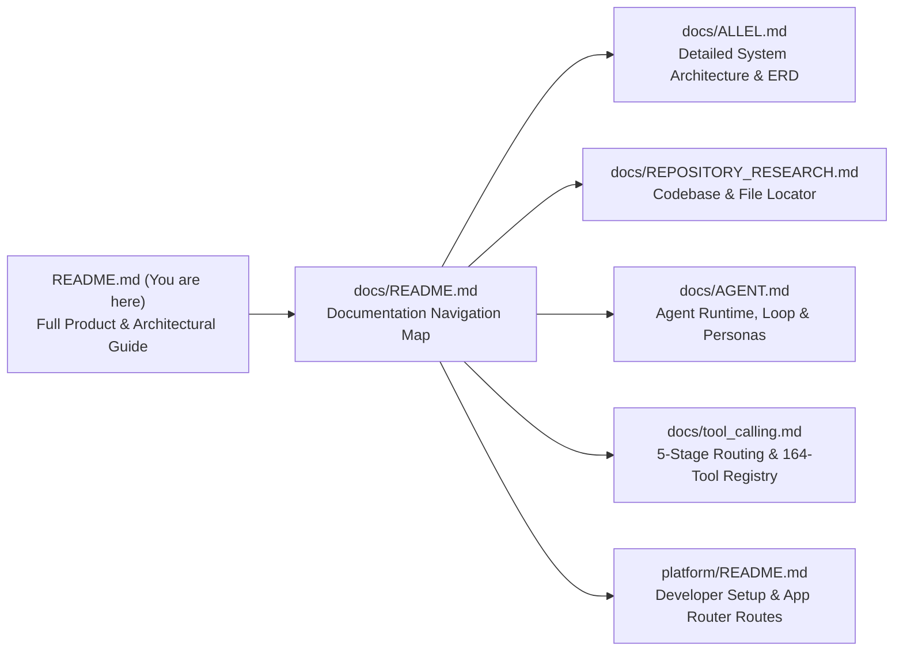

---

## License

Copyright © 2026 Kushagara Singh. All rights reserved. Proprietary software for evaluation and hackathon review.
