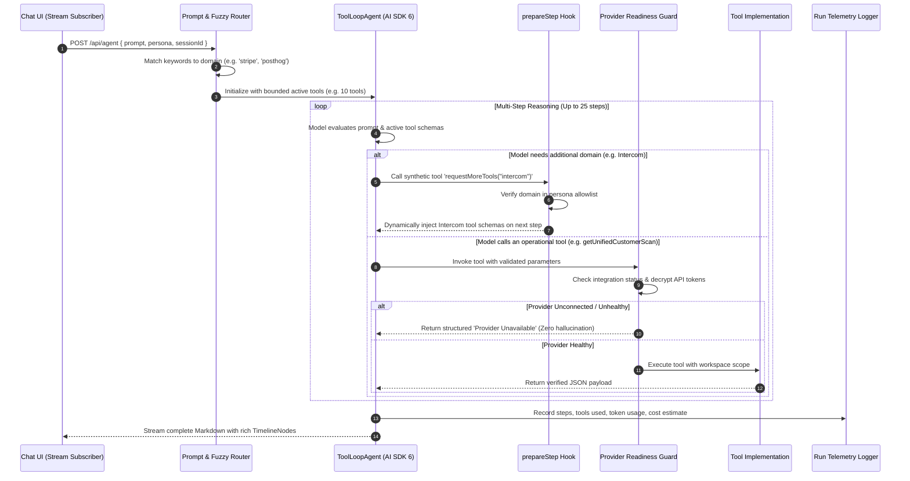
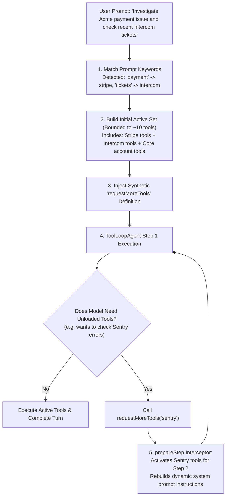
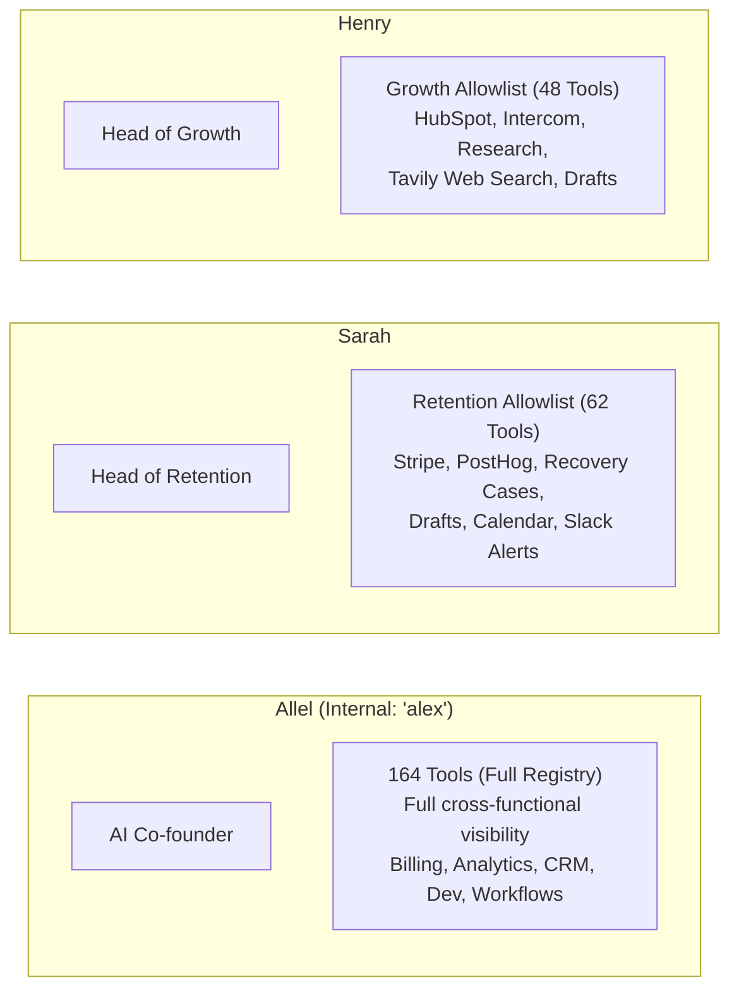
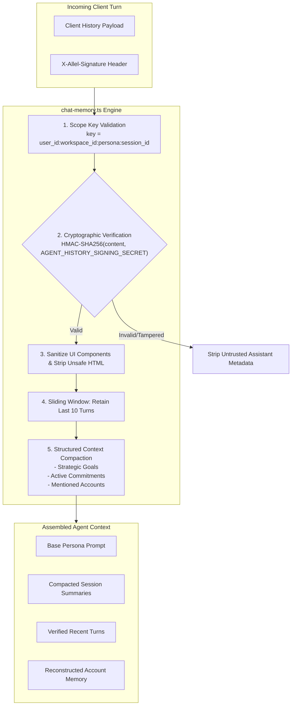
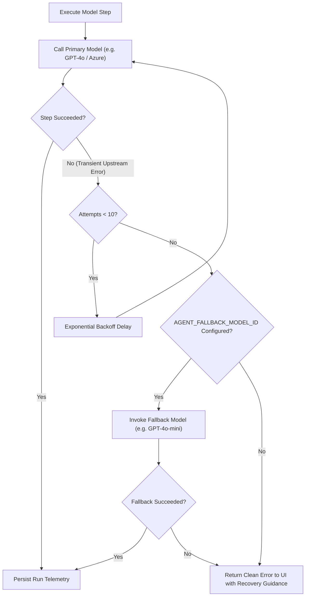
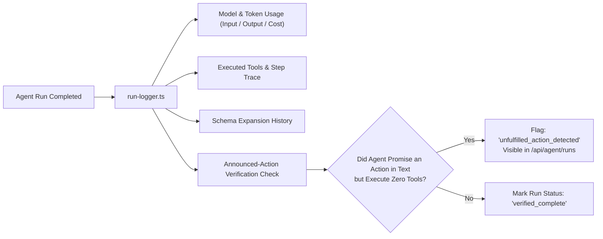

# Allel Agent Runtime & Orchestration

> **Specialized technical reference.** Start with the repository [`README.md`](../README.md) for the product overview. Architecture blueprint: [`ALLEL.md`](ALLEL.md). Tool selection details: [`tool_calling.md`](tool_calling.md).
> Last source audit: **2026-09-05**. Verified against `platform/src/agent/`.

---

## Contents

- [1. Agent Runtime Architecture](#1-agent-runtime-architecture)
- [2. Multi-Step Execution Loop](#2-multi-step-execution-loop)
- [3. Dynamic Schema Expansion Pipeline](#3-dynamic-schema-expansion-pipeline)
- [4. Persona Hierarchy & Capabilities](#4-persona-hierarchy--capabilities)
- [5. Memory Architecture & Cryptographic Integrity](#5-memory-architecture--cryptographic-integrity)
- [6. Self-Healing, Retries & Model Fallbacks](#6-self-healing-retries--model-fallbacks)
- [7. Execution Telemetry & Audit Trail](#7-execution-telemetry--audit-trail)
- [8. Codebase Implementation & Source Locations](#8-codebase-implementation--source-locations)

---

## 1. Agent Runtime Architecture

Allel builds AI SDK 6 `ToolLoopAgent` instances over a comprehensive registry of **164 registered tools** (`platform/src/agent/runtime/agent.ts`). The agent acts as an intelligent operating interface across connected SaaS tools, never hallucinating or mutating state without deterministic validation:

```mermaid
flowchart TB
    subgraph Input["Turn Ingestion"]
        UserMsg["User Message / Prompt"]
        PersonaSel["Selected Persona: Allel / Henry / Sarah"]
        SessionCtx["Session Context (user_id, workspace_id, session_id)"]
    end

    subgraph MemorySubsystem["Memory & Trust Subsystem"]
        SignedMem["Signed Conversation Turns (HMAC-SHA256)"]
        Sanitizer["History Sanitizer & Schema Normalizer"]
        Compactor["Context Compactor (Goals, Commitments, Summaries)"]
        AccountMem["Deterministic Account Memory (Signals, Invoices, Timeline)"]
    end

    subgraph DynamicRouting["Routing & Schema Pipeline"]
        Allowlist["Persona Tool Allowlist Filter"]
        FuzzyRouter["Semantic & Fuzzy Keyword Domain Router"]
        ActiveSubset["Bounded Active Tool Subset (8-12 tools)"]
        SyntheticTool["requestMoreTools Synthetic Domain Activator"]
        PrepareStep["prepareStep In-Loop Dynamic Schema Expansion"]
    end

    subgraph ExecutionSubsystem["Execution & Guard Subsystem"]
        LoopEngine["ToolLoopAgent (Max 25 Steps, Temp 0.3)"]
        ProviderGuards["Live Provider Readiness & Credential Guards"]
        Telemetry["Telemetry Logger (Tokens, Cost, Steps, Tools)"]
        MismatchCheck["Announced-Action Mismatch Detector"]
    end

    Input --> MemorySubsystem
    MemorySubsystem --> DynamicRouting
    DynamicRouting --> ExecutionSubsystem
    ExecutionSubsystem --> StreamOutput["Streamed UI Response & TimelineNodes"]
```

---

## 2. Multi-Step Execution Loop

Every turn executes through a stateful multi-step loop supporting up to 25 reasoning and tool execution steps:

---

## 3. Dynamic Schema Expansion Pipeline

Loading all 164 tool definitions on every turn would inflate the prompt by ~45,000 tokens, degrading model focus and increasing latency. Allel solves this with **on-demand domain activation**:

---

## 4. Persona Hierarchy & Capabilities

Allel provides three specialized personas with strictly enforced capability boundaries:

### Persona Tool Allowlists Comparison

| Capability Group | Allel (`alex`) | Sarah (Retention) | Henry (Growth) |
|---|:---:|:---:|:---:|
| **Account Intelligence** (Scans, Memory, Signals) | Full Access | Full Access | Full Access |
| **Billing & Stripe** (Invoices, Subscriptions, Dunning) | Full Access | Full Access | Read-Only |
| **Product Usage** (PostHog Events, Cohorts, Flags) | Full Access | Full Access | No Access |
| **Outreach & Gmail** (Threads, Draft Generation) | Full Access | Full Access | Full Access |
| **Calendar & Scheduling** (Google Calendar Events) | Full Access | Full Access | Read-Only |
| **Support & Friction** (Intercom Conversations) | Full Access | Read-Only | Full Access |
| **CRM & Pipelines** (HubSpot Companies & Deals) | Full Access | Read-Only | Full Access |
| **Engineering & Errors** (Linear Tasks, Sentry Issues) | Full Access | Read-Only | No Access |
| **Knowledge Base** (Notion Runbooks, Airtable) | Full Access | Read-Only | Full Access |
| **Web Research** (Tavily Search & Extraction) | Full Access | No Access | Full Access |

---

## 5. Memory Architecture & Cryptographic Integrity

To prevent cross-tenant memory leakage and prompt injection attacks, Allel isolates and cryptographically signs conversation memory:

---

## 6. Self-Healing, Retries & Model Fallbacks

External LLM providers occasionally suffer from rate limits, timeouts, or transient 5xx errors. Allel includes a multi-layered resilience pipeline:

---

## 7. Execution Telemetry & Audit Trail

Every agent run writes a durable telemetry trace to the `agent_runs` table:

---

## 8. Codebase Implementation & Source Locations

For code reviewers inspecting the agent runtime, memory, and orchestration layer, key implementation files in `platform/` include:

| Subsystem Component | Source Code Path | Architectural Responsibility |
|---|---|---|
| **AI SDK 6 Agent Loop** | [`platform/src/agent/runtime/agent.ts`](../platform/src/agent/runtime/agent.ts) | Core `ToolLoopAgent` orchestration, multi-step execution, dynamic schema expansion, and streaming. |
| **Session Memory & Cryptography** | [`platform/src/agent/memory/chat-memory.ts`](../platform/src/agent/memory/chat-memory.ts) | HMAC-SHA256 signature verification, history sanitization, sliding window, and context compaction. |
| **Account Memory Extraction** | [`platform/src/agent/memory/account-memory.ts`](../platform/src/agent/memory/account-memory.ts) | Extracts deterministic customer facts (signals, invoices, timeline) from Supabase. |
| **Persona Instructions & Allowlist** | [`platform/src/agent/personas/`](../platform/src/agent/personas/) | Persona prompt definitions (`allel-instructions.ts`, `sarah-instructions.ts`, `henry-instructions.ts`, `intent-identity-instructions.ts`). |
| **Run Telemetry & Token Audit** | [`platform/src/agent/runtime/run-logger.ts`](../platform/src/agent/runtime/run-logger.ts) | Writes execution metrics, model costs, tool traces, and unfulfilled action flags to `agent_runs`. |
| **Error Classifier & Fallbacks** | [`platform/src/agent/runtime/error-classifier.ts`](../platform/src/agent/runtime/error-classifier.ts) | Classifies 429/5xx errors, schedules exponential backoff retries, and switches to fallback models. |
| **Chat Streaming API Route** | [`platform/src/app/api/agent/route.ts`](../platform/src/app/api/agent/route.ts) | Edge/Node App Router route streaming agent tokens, tool events, and TimelineNodes to UI. |
| **Run Inspection API** | [`platform/src/app/api/agent/runs/route.ts`](../platform/src/app/api/agent/runs/route.ts) | Inspects and paginates execution traces, step latencies, and tool calls. |
| **Test Matrix: Memory Integrity** | [`platform/src/agent/memory/chat-memory.test.ts`](../platform/src/agent/memory/chat-memory.test.ts) | Validates HMAC tamper detection, session isolation, and turn reconciliation. |
| **Test Matrix: Session Management** | [`platform/src/agent/memory/chat-session.test.ts`](../platform/src/agent/memory/chat-session.test.ts) | Tests scoped session keys, deduplication, and workspace scoping. |
| **Test Matrix: Telemetry Logging** | [`platform/src/agent/runtime/run-inspection.test.ts`](../platform/src/agent/runtime/run-inspection.test.ts) | Tests run serialization, redaction, and token cost attribution. |

