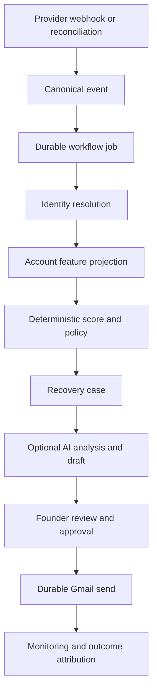

# Allel — Detailed Product and Architecture Guide

> **Maintained technical reference.** Start with the repository [`README.md`](../README.md) for the complete GitHub-facing product walkthrough.
> Last source audit: **2026-09-05**. Code and migrations win if this document drifts.

## 1. Product definition

Allel is a revenue-recovery workspace for founder-led B2B SaaS teams. It joins customer signals from billing, usage, email, support, CRM, and engineering systems into an account-level workflow that answers:

1. Which customer is this event about?
2. Is the account actually at risk?
3. Which action is permitted and useful?
4. What should the founder review or send?
5. Did the action produce a measurable outcome?

Allel is intentionally not a generic autonomous CRM. Deterministic code owns identity, scoring, policy, case transitions, approval integrity, and outcome attribution. The model assists with synthesis, drafting, and connected-tool tasks.

## 2. Operating loop



The daily run reconciles connected providers, drains queued work, generates founder briefs, and delivers configured notifications. Signed webhooks provide event-driven ingestion. The worker queue makes recovery stages retryable and inspectable.

## 3. Architecture

| Layer | Responsibility | Primary paths |
|---|---|---|
| Web/UI | Marketing, auth, account, draft, brief, agent, and recovery views | `platform/src/app`, `platform/src/ui` |
| API | Authenticated application and protected automation endpoints | `platform/src/app/api` |
| Agent | Personas, tools, routing, memory, run logging | `platform/src/agent` |
| Recovery | Identity, scoring, policy, cases, outcomes, scenarios | `platform/src/recovery` |
| Jobs | Durable queue, worker, and stage handlers | `platform/src/jobs` |
| Integrations | Provider clients, sync, connection guards, encryption | `platform/src/integrations` |
| Data | Workspace/account/brief access and Supabase clients | `platform/src/data`, `platform/src/foundation/database` |
| Persistence | Tables, RLS, constraints, triggers, and RPCs | `database/migrations` |

### Runtime triggers

- **Interactive:** `POST /api/agent` streams persona chat with scoped tools and persisted memory.
- **Event-driven:** Stripe/PostHog webhooks verify signatures, persist canonical events, and enqueue jobs.
- **Scheduled:** `/api/cron/daily-run` performs reconciliation, queue work, and brief delivery.
- **Worker:** `/api/internal/workflows/drain` or `npm run workflows:drain` claims and processes durable jobs.

## 4. Product surfaces

Public pages include marketing, pricing, docs, legal pages, waitlist, and OTP/magic-link authentication.

The authenticated dashboard includes:

- Command center and persisted agent sessions
- Account portfolio and account detail
- Recovery-case workflow (`/dashboard/flows`)
- Draft review and founder brief
- Integration management

`/dashboard/inbox` is currently a placeholder. `/dashboard/agents`, `/dashboard/history`, and `/dashboard/sessions` reuse existing recovery or command-center experiences rather than independent products.

## 5. Recovery and identity system

### Identity

Resolution prefers verified provider identifiers and then verified email/contact relationships. Uncertain entities can remain provisional. Ambiguous mappings create explicit `identity_conflicts`; safe link and promotion operations use database RPCs and immutable promotion audit records.

Relevant code: `platform/src/recovery/identity.ts` and the August/September identity migrations.

### Scoring and policy

Current scoring weights are:

- Billing: 50%
- Usage: 35%
- Communication: 15%

Risk thresholds are 45, 70, and 85, with hard overrides for high-signal events such as cancellation, payment failure, past-due state, severe usage decline, and key-feature loss. Identity confidence below `0.90` or score confidence below `0.75` forces founder review. Contact policy and action cooldowns constrain outreach.

Relevant code: `platform/src/recovery/config.ts`, `scoring.ts`, and `policy.ts`.

### Cases and outcomes

Recovery cases use a legal state machine and an atomic transition RPC where available. Score snapshots preserve why a decision was made. Draft approval binds approval to an expected content hash. Outcomes separate recovery/protection claims from unresolved risk and store attribution evidence.

The preferred send path is approval plus durable worker execution (`platform/src/recovery/draft-approval.ts`, `platform/src/jobs/handlers/send-approved-draft.ts`). Two direct recovery dispatch APIs still require hardening; see [`TODO.md`](TODO.md).

## 6. Agent system

Three persona IDs exist:

| ID | Display | Scope |
|---|---|---|
| `alex` | Allel, AI Co-founder | Generalist; eligible for all registered tools |
| `henry` | Head of Growth | Research, pipeline/context reads, drafts, and selected collaboration tools |
| `sarah` | Head of Retention | Billing, usage, recovery, accounts, outreach, and scheduling |

There are **164 registered tools** as of the audit date. Chat does not send all tool schemas on every first step: prompt/domain routing selects an initial subset, and `requestMoreTools` can activate eligible domains in-loop. Provider guards block tools when a required live connection is unavailable.

The runtime allows up to 25 steps, 4,096 output tokens, model retries, and an optional fallback model. It records model, steps, tools, tokens, estimated cost, duration, workflow fields, and announced-action mismatches.

Conversation history is scoped by user, workspace, persona, and session. Trusted assistant metadata is signed. Long conversations are compacted, while deterministic account memory is assembled from account state, signals, timeline, and drafts.

See [`AGENT.md`](AGENT.md) and [`tool_calling.md`](tool_calling.md).

## 7. Integrations

### Implemented sync-capable providers

Stripe, PostHog, Gmail, Intercom, HubSpot, Slack, Sentry, and Linear.

### Implemented tool-only providers

Airtable, Google Calendar, and Notion.

### Planned catalog entries

Jira, GitHub, Zendesk, Salesforce, Supabase, Google Docs, and Google Drive.

Google and Intercom use OAuth routes. Stripe and PostHog have dedicated direct-connect endpoints. Other implemented providers use encrypted, manually supplied credentials. Tavily uses a server environment key for web research.

“Connected” does not imply that all provider content is copied locally or injected into every prompt. Sync-capable, tool-only, and planned are distinct capabilities. See [`INTEGRATION_AUDIT.md`](INTEGRATION_AUDIT.md).

## 8. Data model

The repository contains 29 ordered SQL migrations. Major table groups are:

- **Tenant/integrations:** `workspaces`, `workspace_members`, `integration_connections`, `integration_tokens`, `provider_sync_cursors`
- **Accounts/identity:** `customer_accounts`, `account_contacts`, `provider_identities`, `identity_conflicts`, `customer_identity_promotions`
- **Signals/memory:** `account_features`, `account_signals`, `account_timeline`, `account_memories`, `account_memory_refresh_queue`
- **Recovery/scoring:** `churn_scores`, `churn_score_factors`, `score_snapshots`, `recovery_cases`, `recovery_case_events`, `contact_policies`, `draft_outcomes`, `recovery_scenario_runs`
- **Agent/workflow:** `agent_conversations`, `agent_runs`, `tool_approval_requests`, `webhook_events`, `workflow_jobs`
- **Outputs:** `follow_up_drafts`, `founder_briefs`, `founder_brief_items`

Important RPCs include atomic event ingestion/job creation, job claiming, case transition, draft approval, outcome recording, and safe identity linking/promotion.

## 9. Trust and security boundaries

- Dashboard/API operations require Supabase authentication and workspace membership.
- Service-role access is server-only.
- Integration credentials are encrypted before persistence.
- Stripe and PostHog webhook ingress verifies provider signatures/HMAC.
- Cron and worker endpoints require bearer secrets in production.
- Assistant history metadata is signed and sanitized before reuse.
- Recovery draft approval uses content hashes and durable send jobs.
- RLS and database constraints provide tenant and integrity enforcement.

A crucial distinction: the generic `tool_approval_requests` API exists, but the runtime's generic manual-approval interception list is currently empty. Do not claim that every mutating chat tool is automatically approval-gated. The recovery draft approval path is separate and active.

## 10. Operations

From `platform/`:

```bash
npm test
npm run build
npm run agent:readiness -- --workspace-id=<uuid>
npm run workflows:drain -- --workspace-id=<uuid>
npm run scenario:evaluate
```

Vercel schedules the daily route at 04:00 UTC. A separate frequent scheduler/worker is needed for prompt queue draining and Gmail History polling.

For a fresh database, apply all `database/migrations/*.sql` in filename order. The custom migration runner currently manages only the latest 12 recovery/identity migrations.

## 11. Current limitations and risks

The active risk register is [`TODO.md`](TODO.md). Highest-priority verified items are:

1. Direct dispatch routes can mark outreach sent/monitoring after Gmail failure and contain Apex demo fallbacks.
2. `draft_responses` is referenced by runtime code but is absent from repository migrations.
3. Fresh-install migration automation is incomplete.
4. Frequent queue/Gmail History draining is not scheduled by repository deployment config.
5. Generic chat mutation approvals are not enabled despite approval storage/API support.
6. AI readiness reporting currently does not verify credentials.
7. `/dashboard/inbox` remains a placeholder.

These caveats are part of the product truth, not hidden implementation detail.

## 12. Validation snapshot

Verified on **2026-09-05**:

- `npm test`: 439 passed, 0 failed
- `npm run build`: passed
- 39 test files
- 29 migration files
- 164 registered tools

Re-run validation after changes. Historical documents contain earlier counts and plans and are not authoritative.
