# Allel — Detailed Product and Architecture Guide

> **Maintained technical reference.** Start with the repository [`README.md`](../README.md) for the complete GitHub-facing product walkthrough.
> Last source audit: **2026-09-05**. Source code and database migrations outrank prose.

---

## Contents

- [1. System Architecture Blueprint](#1-system-architecture-blueprint)
- [2. Deterministic vs. AI Separation Boundary](#2-deterministic-vs-ai-separation-boundary)
- [3. Complete Database Schema (ERD)](#3-complete-database-schema-erd)
- [4. End-to-End Recovery Operating Loop](#4-end-to-end-recovery-operating-loop)
- [5. Identity Resolution & Conflict Isolation](#5-identity-resolution--conflict-isolation)
- [6. Multi-Dimensional Risk Engine & Overrides](#6-multi-dimensional-risk-engine--overrides)
- [7. Recovery Case State Machine](#7-recovery-case-state-machine)
- [8. Human-in-the-Loop Hash-Bound Approval](#8-human-in-the-loop-hash-bound-approval)
- [9. Durable Job Queue & Worker Pipeline](#9-durable-job-queue--worker-pipeline)
- [10. Closed-Loop Revenue Attribution (G1–G5)](#10-closed-loop-revenue-attribution-g1g5)
- [11. Daily Cron & Brief Delivery Pipeline](#11-daily-cron--brief-delivery-pipeline)

---

## 1. System Architecture Blueprint

Allel is partitioned into seven distinct, decoupled subsystems. Client interaction, deterministic recovery logic, AI orchestration, background workers, and external integrations operate through strictly defined interfaces:

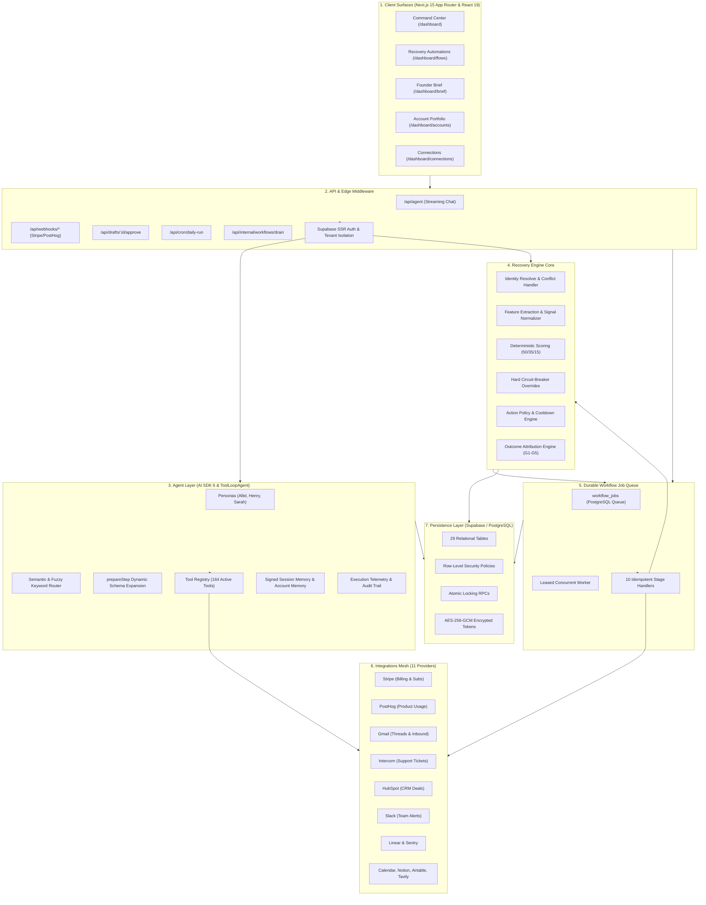

---

## 2. Deterministic vs. AI Separation Boundary

To eliminate AI hallucinations and ensure production reliability, Allel strictly partitions responsibilities:

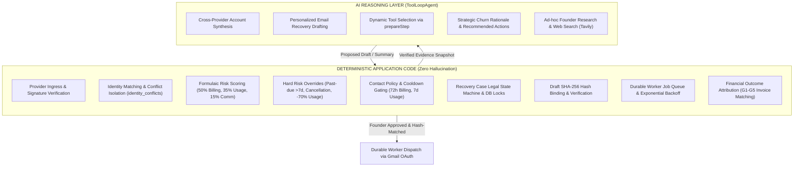

---

## 3. Complete Database Schema (ERD)

The PostgreSQL persistence model connects workspaces, customer accounts, multi-provider identities, recovery cases, drafts, audit trails, and background jobs:

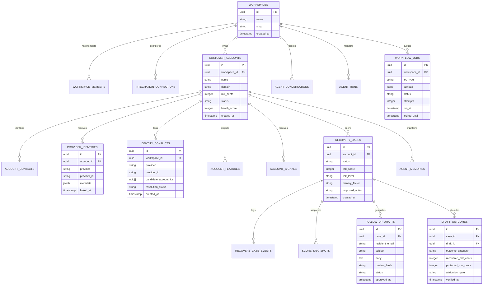

---

## 4. End-to-End Recovery Operating Loop

When a customer signal arrives, the recovery engine coordinates feature extraction, deterministic scoring, policy checks, draft generation, hash verification, and delivery:

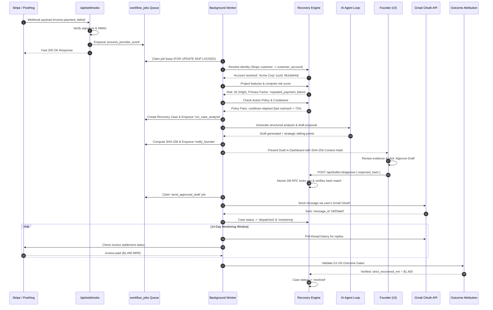

---

## 5. Identity Resolution & Conflict Isolation

Accurate identity resolution is the foundation of trustworthy recovery. Allel isolates ambiguities into an explicit conflict table rather than creating duplicate accounts or making false merges:

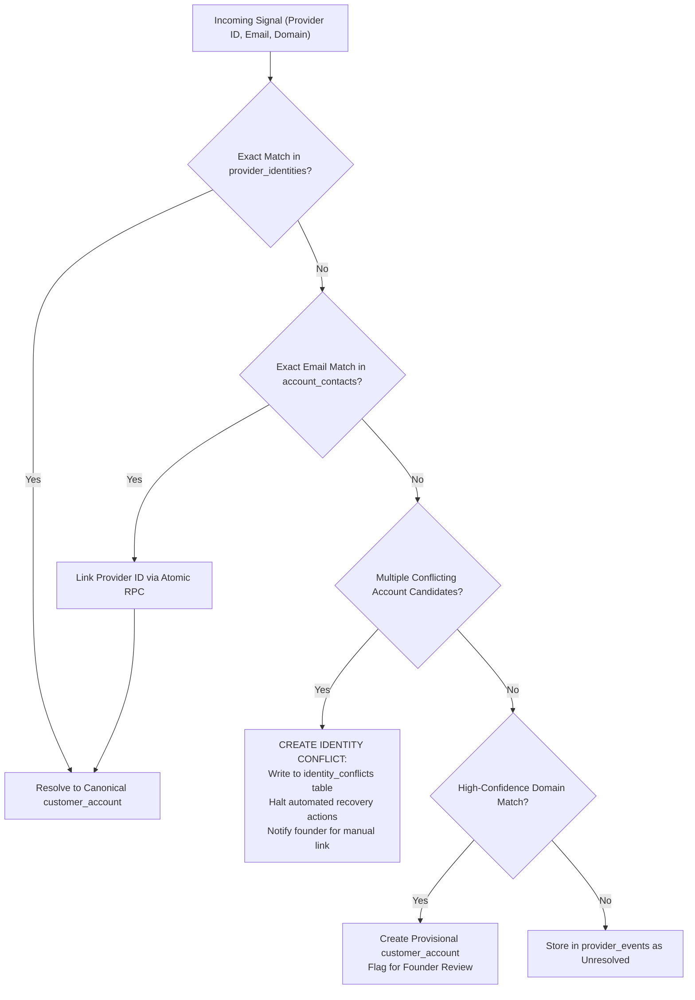

---

## 6. Multi-Dimensional Risk Engine & Overrides

Risk is deterministically computed from three orthogonal domains:

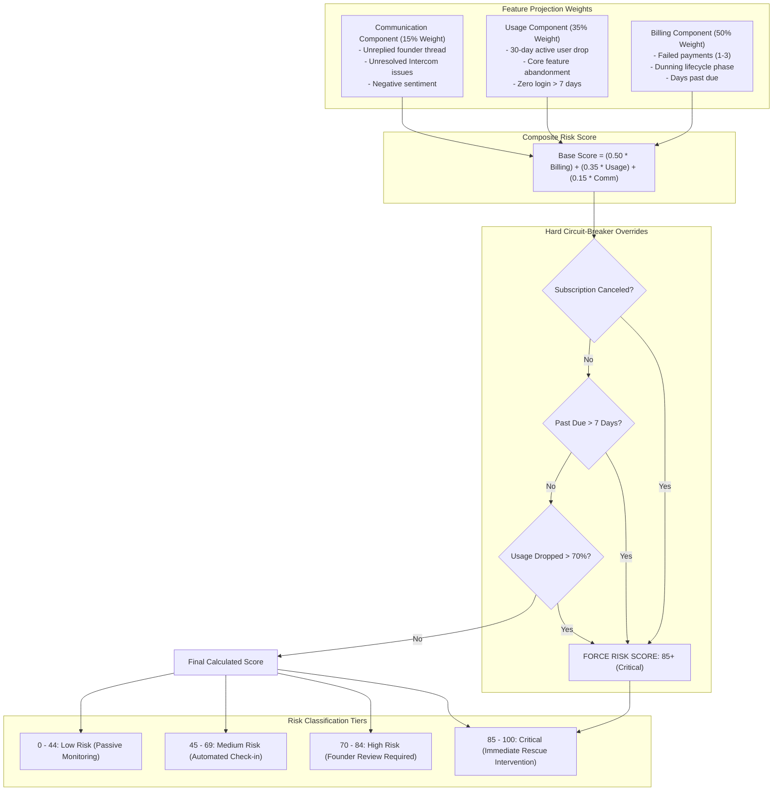

---

## 7. Recovery Case State Machine

All recovery cases follow strict, audited state transitions enforced at the database level:

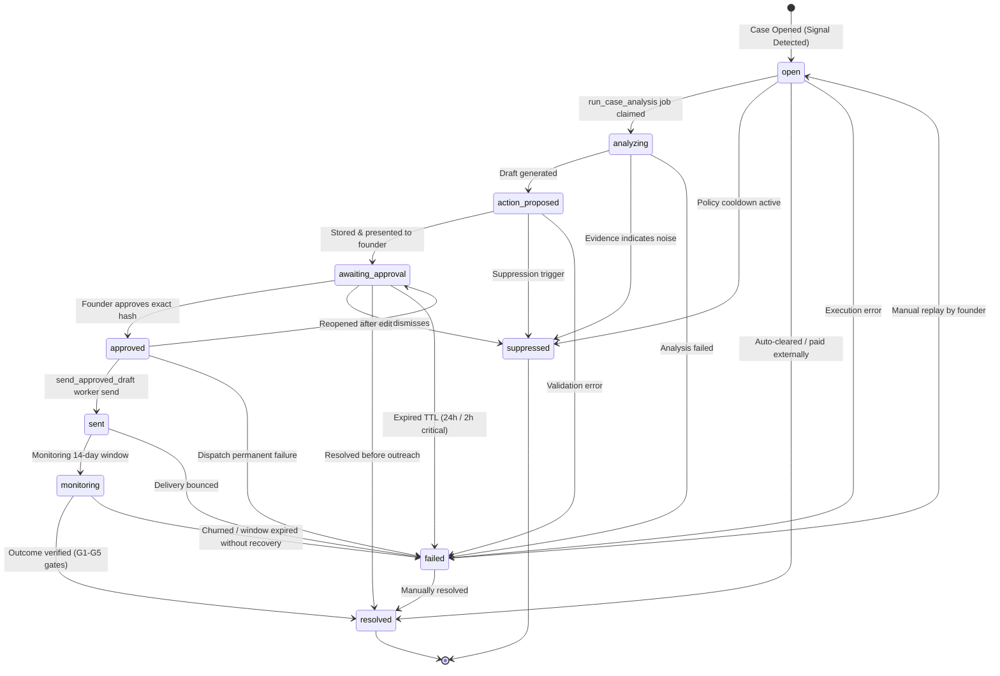

---

## 8. Human-in-the-Loop Hash-Bound Approval

Every draft requires explicit founder approval cryptographically bound to the exact content hash to prevent modification or prompt injection:

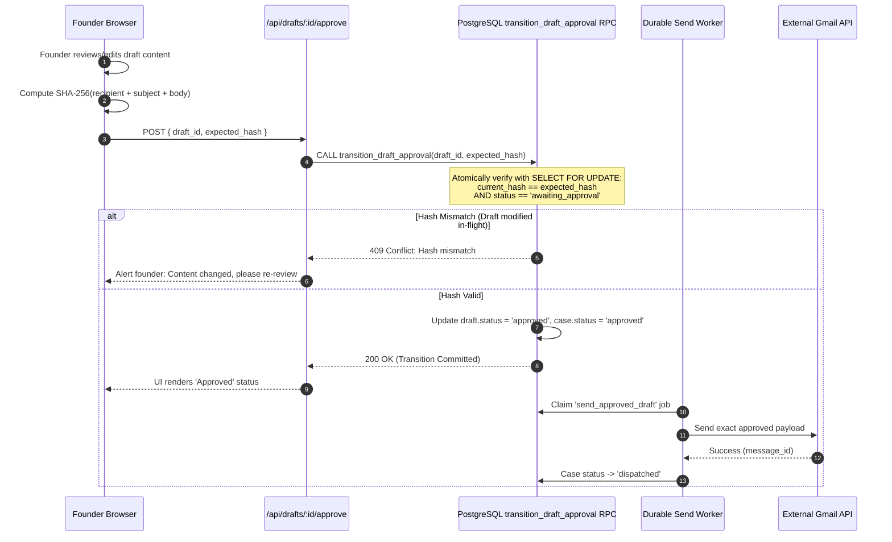

---

## 9. Durable Job Queue & Worker Pipeline

All asynchronous and model-heavy operations execute through `workflow_jobs` with atomic leases, bounded concurrency, and exponential backoff:

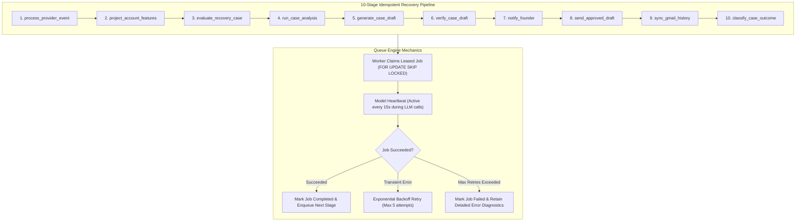

---

## 10. Closed-Loop Revenue Attribution (G1–G5)

Allel enforces strict financial attribution standards to prove whether recovered revenue was genuinely driven by the recovery intervention:

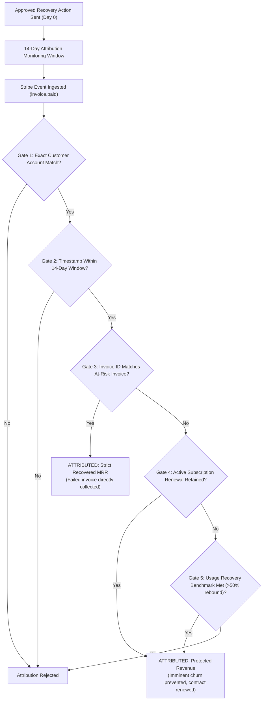

---

## 11. Daily Cron & Brief Delivery Pipeline

Every morning at `04:00 UTC`, the automated reconciliation cron orchestrates provider sync, queue processing, and founder brief delivery:

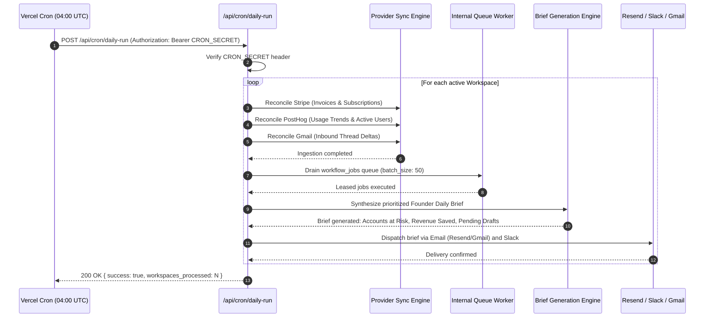
