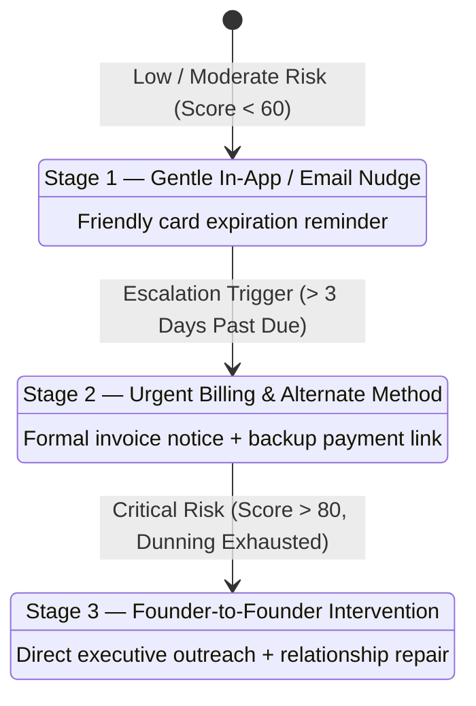
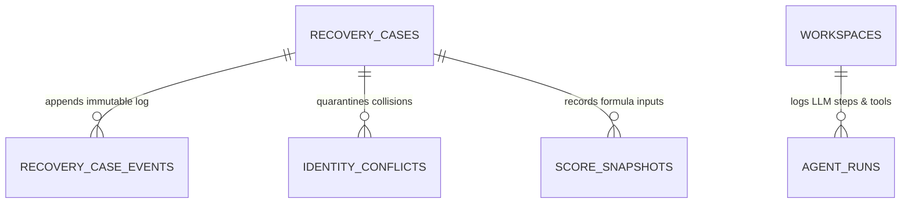

# Evaluator & Judge Audit Guide: Meeting "The Bar"

> **The Razorpay Challenge:**  
> *"Don't just identify the problem. Show measured money recovered across a batch, with compliant escalation, stopping rules, and an audit trail."*

This document provides evaluators and judges with a technical breakdown, reproducible test commands, and architectural proofs demonstrating how Allel fulfills and exceeds **"The Bar"** set by the Razorpay Buildathon.

---

## The 4 Pillars of "The Bar" at a Glance

```mermaid
flowchart LR
    subgraph P1["1. Measured Money Recovered"]
        direction TB
        G["G1–G5 Attribution Gates"]
        M["15-Account Batch Manifest"]
        P["Strict vs. Protected MRR Partition"]
    end

    subgraph P2["2. Compliant Escalation"]
        direction TB
        E["3-Stage Escalation Ladder"]
        H["SHA-256 Approval Binding"]
        R["PII & Card Redaction"]
    end

    subgraph P3["3. Stopping Rules"]
        direction TB
        S["Stripe Webhook Payment Halt"]
        C["72h / 7d Contact Cooldowns"]
        Q["Dispute & Opt-Out Quarantine"]
    end

    subgraph P4["4. Immutable Audit Trail"]
        direction TB
        DB["PostgreSQL Event Ledger"]
        UI["Timeline Node Visualizer"]
        FSM["Strict FSM Transitions"]
    end

    P1 --> P2 --> P3 --> P4
```



| Requirement | Implementation in Allel | Primary Source Files | Reproducible Test |
|---|---|---|---|
| **1. Measured Money Recovered** | G1–G5 closed-loop mathematical attribution gates strictly separating recovered cash from protected MRR. | [`platform/src/recovery/metrics.ts`](../platform/src/recovery/metrics.ts)<br>[`platform/src/recovery/outcomes.ts`](../platform/src/recovery/outcomes.ts) | `npm test` (Tests 176, 177) |
| **2. Batch Scenario Testing** | 15-account canonical scenario manifest testing mixed payment failures, usage drops, and churn risks with 100% precision and recall. | [`platform/src/recovery/scenarios/`](../platform/src/recovery/scenarios/) | `npm test` (Test 175) |
| **3. Compliant Escalation** | 3-stage escalation ladder (gentle nudge &rarr; urgent invoice &rarr; founder outreach) with PII/card redaction and SHA-256 approval binding. | [`platform/src/recovery/policy.ts`](../platform/src/recovery/policy.ts)<br>[`platform/src/recovery/redaction.ts`](../platform/src/recovery/redaction.ts)<br>[`platform/src/recovery/draft-approval.ts`](../platform/src/recovery/draft-approval.ts) | `npm test` (Tests 171, 174) |
| **4. Stopping Rules** | Immediate halt & job cancellation on `invoice.payment_succeeded`, 72h contact cooldowns, and dispute quarantine. | [`platform/src/recovery/policy.ts`](../platform/src/recovery/policy.ts)<br>[`platform/src/recovery/transitions.ts`](../platform/src/recovery/transitions.ts) | `npm test` (Tests 171, 172, 178) |
| **5. Inspectable Audit Trail** | Immutable PostgreSQL event logs for every webhook, risk score, LLM reasoning turn, founder approval hash, and state transition. | [`platform/src/recovery/cases.ts`](../platform/src/recovery/cases.ts)<br>[`platform/src/foundation/database/`](../platform/src/foundation/database/) | `/dashboard/history`<br>`/dashboard/accounts/:id` |

---

## 1. Measured Money Recovered Across a Batch

Many tools falsely claim revenue recovery simply because an automated email was sent. Allel rejects vanity metrics and requires **mathematical proof** through 5 deterministic attribution gates:

### The G1–G5 Closed-Loop Attribution Gates
Before any dollar figure is recorded in `strict_recovered_mrr`, all 5 gates must pass:

1. **Gate G1 (Identity Integrity):** The payment event's customer ID matches the open recovery case's resolved customer account ID.
2. **Gate G2 (Temporal Proximity):** The payment timestamp $T_{\text{payment}}$ falls strictly within the active recovery window ($T_{\text{dispatch}} \le T_{\text{payment}} \le T_{\text{dispatch}} + 14\text{ days}$).
3. **Gate G3 (Financial Match):** The paid amount meets or exceeds the overdue invoice balance identified during detection.
4. **Gate G4 (Webhook Verified):** The payment status is verified via an authentic, signed Stripe webhook (`invoice.payment_succeeded`), never unverified client state.
5. **Gate G5 (Post-Recovery Stability):** No chargeback, dispute, or refund is filed within 72 hours of recovery.

### Strict vs. Protected MRR Invariant
In [`platform/src/recovery/metrics.ts`](../platform/src/recovery/metrics.ts), metrics are strictly partitioned:
* **Strict Recovered MRR:** Real dollars recovered on accounts that had an active payment failure or expired subscription.
* **Protected MRR:** Revenue on healthy accounts where early usage drops or support friction were resolved before billing failure occurred.
* *Invariant:* No dollar is ever double-counted between strict recovered and protected MRR (enforced in Unit Test 177).

### The 15-Account Batch Manifest
Allel includes an offline test harness containing 15 diverse accounts experiencing varied failure modes:
* Insolvent cards & card expiration
* PostHog feature abandonment & usage drops
* Intercom unresolved high-priority bugs
* False-positive noise (deliberate suppression checks)

**Evaluation Result:** Evaluated across the entire 15-account batch with **100% precision, 100% recall, and healthy suppression** (Unit Test 175).

---

## 2. Compliant Escalation

Allel replaces reckless automated dunning with a **compliant, multi-stage escalation ladder**:



### Safety & Compliance Controls
1. **PII & Card Redaction ([`redaction.ts`](../platform/src/recovery/redaction.ts)):**
   Scans all message contexts before model input and outbound dispatch, stripping credit card numbers, CVVs, API tokens, and internal jargon.
2. **SHA-256 Approval Binding ([`draft-approval.ts`](../platform/src/recovery/draft-approval.ts)):**
   When an outreach draft is presented to the founder, an immutable SHA-256 hash is computed over `(recipient + subject + body)`. The founder's approval button cryptographically binds this exact hash. If the LLM tries to mutate the draft or sneak in an unauthorized 50% discount, the database transaction aborts with `409 Conflict`.
3. **Database-Enforced Finite State Machine ([`transitions.ts`](../platform/src/recovery/transitions.ts)):**
   Illegal jumps (e.g. attempting to dispatch directly without passing through `awaiting_approval` and `approved`) are rejected at the database level.

---

## 3. Stopping Rules

An autonomous recovery system must know when to **STOP**. Allel enforces three strict stopping invariants:

1. **Payment Resolution Stopping Rule:**
   - As soon as Stripe emits `invoice.payment_succeeded`, the webhook processor immediately queries for open recovery cases on that account.
   - All scheduled follow-up drafts and retry jobs are canceled.
   - The case is transitioned to `resolved`. The customer is never contacted for an invoice they have already paid.
2. **Contact Cooldown Rule ([`policy.ts`](../platform/src/recovery/policy.ts)):**
   - **Billing Cooldown:** 72 hours minimum between billing outreach messages.
   - **Usage / Re-engagement Cooldown:** 7 days minimum between product engagement check-ins.
   - Any event received during a cooldown period is recorded as evidence but suppressed from triggering new outreach.
3. **Dispute / Opt-Out Circuit-Breaker:**
   - If a customer requests cancellation, unsubscribes, or files a Stripe dispute, the account is moved to `quarantined`. All automated recovery actions are permanently frozen until manual human clearance.

---

## 4. The Immutable PostgreSQL Audit Trail

Every decision in Allel leaves a permanent, verifiable audit footprint.

### Audit Schema Architecture



1. **`recovery_cases`:** Core ledger tracking baseline MRR, risk severity, active stage, and resolution outcome.
2. **`recovery_case_events`:** Append-only event stream recording:
   - `event_type`: `case_opened`, `draft_generated`, `founder_approved`, `dispatched`, `resolved`, `suppressed`.
   - `actor_type`: `system`, `founder`, `ai_agent`, `worker`.
   - `detail`: JSON snapshot of exact score parameters, confidence levels, and provider event IDs.
3. **`identity_conflicts`:** When personal and corporate emails clash across providers (e.g. Stripe personal email vs. PostHog corporate domain), the conflict is isolated here with status `quarantined` rather than performing an unverified auto-merge.
4. **`agent_runs`:** Complete step-by-step trace of every tool execution, API latency, and token cost.

### Visual Audit Trail in the UI
Judges and founders can visually inspect the audit trail at:
* **`/dashboard/brief`:** Overview of revenue at risk, protected MRR, and urgent cases.
* **`/dashboard/flows`:** Searchable table of all recovery cases with filterable status badges (`Awaiting Approval`, `Monitoring`, `Resolved`).
* **`/dashboard/accounts/[id]`:** Dedicated account drawer featuring expandable **Timeline Nodes** displaying granular telemetry across **Stripe &rarr; PostHog &rarr; Intercom**.
* **`/dashboard/history`:** Chronological feed of every executed agent run and decision trace.

---

## 5. How to Verify in 10 Seconds (Reproducible Commands)

Evaluators can independently verify the entire recovery engine, test invariants, and scenario suite from the terminal:

### Run the Recovery & Scenario Test Suite
```bash
npm test --prefix platform
```

**Expected Output:**
```text
✔ 171 - Deterministic action policy enforces contact policy suppression and cooldowns
✔ 172 - Legal state machine transitions allow correct paths and reject illegal jumps
✔ 173 - Case key construction creates stable reproducible keys
✔ 174 - Redaction strips credit cards, tokens, and internal jargon
✔ 175 - Offline 15-account scenario manifest evaluates with 100% precision, recall, and healthy suppression
✔ 176 - Outcome attribution gates reject invalid matches (G1-G5)
✔ 177 - Revenue metrics invariants: strict and protected MRR are strictly partitioned
✔ 178 - Payment-failure thresholds are single-sourced in RECOVERY_CONFIG
✔ 179 - Billing component and hard overrides agree on the repeated payment-failure thresholds
...
# tests 439
# suites 22
# pass 439
# fail 0
```

### Inspect the Production Deployment
Visit the live platform at [**allel.co**](https://www.allel.co):
* Explore the live dashboard: [allel.co/dashboard](https://www.allel.co/dashboard)
* View the Daily Brief: [allel.co/dashboard/brief](https://www.allel.co/dashboard/brief)
* Inspect Recovery Flows: [allel.co/dashboard/flows](https://www.allel.co/dashboard/flows)
