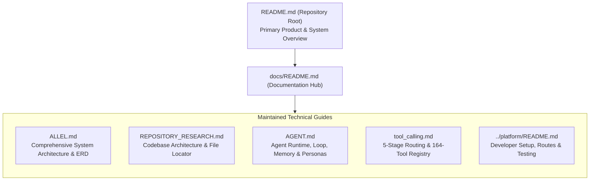

# Allel Documentation Hub

> Canonical technical navigation map. Last source audit: **2026-09-05**.
> Primary GitHub landing guide: [`../README.md`](../README.md).

---

## Documentation Navigation Flowchart



---

## Maintained References

| Document | Purpose & Ownership |
|---|---|
| [`../README.md`](../README.md) | **Primary product guide.** Complete architecture, workflows, diagrams, and setup instructions. |
| [`AUDIT_TRAIL.md`](AUDIT_TRAIL.md) | **"The Bar" evaluator guide.** Measured money recovered, compliant escalation, stopping rules, and audit trail proof. |
| [`ALLEL.md`](ALLEL.md) | **Deep technical blueprint.** PostgreSQL ERD, state machines, identity resolution, integrations mesh, and scoring math. |
| [`REPOSITORY_RESEARCH.md`](REPOSITORY_RESEARCH.md) | **Reviewer guide.** Complete codebase file locator, database research, end-to-end trace walkthroughs, and architecture map. |
| [`../platform/README.md`](../platform/README.md) | **Developer reference.** Local installation, environment variables, routes, CLI tasks, and migrations. |
| [`AGENT.md`](AGENT.md) | **Agent runtime.** `ToolLoopAgent` execution, multi-step loops, memory signing, and personas. |
| [`tool_calling.md`](tool_calling.md) | **Tool routing.** 5-stage selection pipeline, `prepareStep` dynamic expansion, and 164-tool taxonomy. |

---

## Documentation Principles

1. **Source Code Outranks Prose:** Database migrations, TypeScript types, and executed tests take precedence over documentation claims.
2. **Dated Verifications:** All volatile metrics (test pass counts, tool counts, migration counts) include the verification snapshot date (**2026-09-05**).
3. **Deterministic vs. AI Clarity:** Every document explicitly identifies the boundary between deterministic code and AI reasoning.
4. **Historical Isolation:** Archived documents retain prominent archive headers and are never cited as current operational facts.

---

## Current Verification Snapshot

Snapshot audited on **2026-09-05**:

```text
Test Suite:           439 passed, 0 failed (100% pass)
Next.js Build:        36/36 static pages generated
PostgreSQL Migrations: 29 files
Registered Tools:     164 tools in ALL_TOOLS
Active Personas:      3 (Allel, Sarah, Henry)
Connected Providers:  11 supported integrations
```
