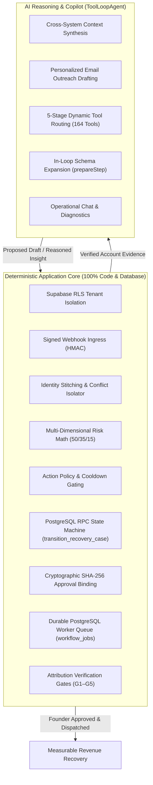

# Allel Codebase Architecture & Repository Research Guide

> **Canonical Code Reviewer Guide.** Audited **2026-09-05**.
> Designed for evaluators, code reviewers, and system architects inspecting the Allel codebase.
> Companion architecture specifications: [`ALLEL.md`](ALLEL.md), [`AGENT.md`](AGENT.md), [`tool_calling.md`](tool_calling.md).

---

## Contents

- [1. Executive Architectural Summary](#1-executive-architectural-summary)
- [2. Verified System Metrics Snapshot](#2-verified-system-metrics-snapshot)
- [3. Complete Repository Directory & File Locator](#3-complete-repository-directory--file-locator)
- [4. End-to-End Tracing Guide for Code Reviewers](#4-end-to-end-tracing-guide-for-code-reviewers)
  - [Trace 1: Webhook Ingress to Case Creation](#trace-1-webhook-ingress-to-case-creation)
  - [Trace 2: Draft Synthesis & Hash-Bound Approval](#trace-2-draft-synthesis--hash-bound-approval)
  - [Trace 3: Closed-Loop Attribution & Revenue Gates](#trace-3-closed-loop-attribution--revenue-gates)
  - [Trace 4: Agent Routing & In-Loop Dynamic Tool Expansion](#trace-4-agent-routing--in-loop-dynamic-tool-expansion)
- [5. Database Schema & Migration Matrix](#5-database-schema--migration-matrix)
- [6. Security, Cryptography & Tenant Isolation](#6-security-cryptography--tenant-isolation)
- [7. How to Verify Locally](#7-how-to-verify-locally)

---

## 1. Executive Architectural Summary

**Allel** is an AI-assisted revenue-recovery operating system for founder-led B2B SaaS teams. It resolves fragmented customer signals from billing (**Stripe**), usage telemetry (**PostHog**), customer communications (**Gmail**), and customer support (**Intercom**); calculates multi-signal churn risk without hallucinations; manages an auditable legal state machine; synthesizes evidence-backed recovery outreach; enforces cryptographic founder approval; dispatches via a durable worker queue; and attributes recovered revenue through 5 rigorous outcome gates.

### The Architectural Boundary
The fundamental rule governing Allel's codebase is the strict separation between deterministic business truth and AI reasoning:



---

## 2. Verified System Metrics Snapshot

Audited against the active repository on **2026-09-05**:

| Metric | Verified Count | Verification Source |
|---|---|---|
| **Automated Tests** | **439 passing, 0 failing** | `npm test` in `platform/` across 39 test suites |
| **Next.js Production Build** | **36/36 static pages generated** | `npm run build` in `platform/` |
| **PostgreSQL Migrations** | **29 ordered migration files** | `database/migrations/` |
| **Active Registered Tools** | **164 tools** | `platform/src/agent/tools/tools.ts` (`ALL_TOOLS`) |
| **Supported Integrations** | **11 provider integrations** | `platform/src/integrations/` |
| **Active Personas** | **3 personas** (Allel, Sarah, Henry) | `platform/src/agent/personas/` |
| **Evaluation Scenarios** | **15 canonical SaaS profiles** | `platform/scripts/scenario-evaluator.ts` |

---

## 3. Complete Repository Directory & File Locator

Use this locator to instantly find the source files corresponding to any system functionality:

```text
allel/
├── README.md                               # Primary product overview & architecture diagrams
├── database/
│   └── migrations/                         # 29 ordered Supabase / PostgreSQL migrations
│       ├── 20260406_init_product_tables.sql
│       ├── 20260822_recovery_core.sql       # Recovery cases, RPCs, state transitions
│       ├── 20260822_recovery_queue.sql      # workflow_jobs queue table
│       ├── 20260830_recovery_authoritative_integrity.sql
│       ├── 20260831_identity_atomic_rpcs.sql # Atomic identity resolution & conflict isolation
│       └── 20260906_fix_draft_outcomes_draft_id_nullable.sql
├── docs/                                   # Architectural specifications & technical guides
│   ├── README.md                           # Documentation index and hub
│   ├── ALLEL.md                            # Comprehensive architecture blueprint & ERD
│   ├── AGENT.md                            # AI SDK 6 runtime, loop, and memory architecture
│   ├── tool_calling.md                     # 5-stage dynamic tool routing & 164-tool taxonomy
│   └── REPOSITORY_RESEARCH.md              # (You are here) Reviewer codebase & locator guide
└── platform/                               # Next.js 15 App Router application
    ├── src/
    │   ├── app/                            # Pages and API endpoints
    │   │   ├── (auth)/                     # Supabase authentication pages (login, callback)
    │   │   ├── dashboard/                  # Product command center UI
    │   │   │   ├── page.tsx                # Main Chat & Feed interface
    │   │   │   ├── flows/page.tsx          # Recovery Cases & Scenario Reviewer console
    │   │   │   ├── accounts/page.tsx       # Customer portfolio & risk scores
    │   │   │   ├── drafts/page.tsx         # Founder outreach approval console
    │   │   │   ├── connections/page.tsx    # Provider credentials & OAuth management
    │   │   │   └── brief/page.tsx          # Founder Daily Brief
    │   │   └── api/                        # HTTP endpoints
    │   │       ├── agent/route.ts          # Edge/Node streaming chat endpoint
    │   │       ├── agent/runs/route.ts     # Execution telemetry and run inspector API
    │   │       ├── webhooks/stripe/route.ts# Stripe webhook ingress with HMAC verification
    │   │       ├── webhooks/posthog/route.ts# PostHog webhook ingress
    │   │       ├── drafts/[id]/approve/route.ts # SHA-256 hash-validated approval route
    │   │       ├── recovery/cases/[id]/dispatch/route.ts # Direct recovery dispatch route
    │   │       └── cron/daily-run/route.ts # 04:00 UTC reconciliation & brief generation
    │   │
    │   ├── recovery/                       # Deterministic Recovery Engine Core
    │   │   ├── identity/identity-resolver.ts# Cross-provider email matching & conflict isolation
    │   │   ├── scoring/risk-scorer.ts      # 50/35/15 deterministic scoring & hard overrides
    │   │   ├── policy/action-policy.ts     # 72h / 7d cooldowns & suppression rules
    │   │   ├── state/case-machine.ts       # Legal state machine transitions
    │   │   ├── config.ts                   # Authoritative thresholds & constants
    │   │   ├── customer-scan-service.ts    # Multi-provider unified account scan service
    │   │   └── metrics.ts                  # Strict vs. Protected MRR partitioning invariants
    │   │
    │   ├── drafts/                         # Founder Approval & Financial Attribution
    │   │   ├── send-draft.ts               # Hash validation & Gmail API dispatch
    │   │   ├── outcome-tracker.ts          # Outcome verification gates (G1–G5)
    │   │   └── recipient-validator.ts      # Recipient address safety verification
    │   │
    │   ├── jobs/                           # PostgreSQL Durable Job Queue & Worker
    │   │   ├── queue.ts                    # Enqueue, lease (SKIP LOCKED), and retry logic
    │   │   ├── worker.ts                   # Durable queue worker loop
    │   │   └── handlers/                   # 12 Stage Handlers:
    │   │       ├── process-provider-event.ts
    │   │       ├── project-account-features.ts
    │   │       ├── evaluate-recovery-case.ts
    │   │       ├── run-case-analysis.ts
    │   │       ├── generate-case-draft.ts
    │   │       ├── notify-founder.ts
    │   │       ├── send-approved-draft.ts
    │   │       ├── sync-gmail-history.ts
    │   │       ├── classify-case-outcome.ts
    │   │       ├── reconcile-provider-state.ts
    │   │       ├── refresh-founder-brief.ts
    │   │       └── verify-case-draft.ts
    │   │
    │   ├── agent/                          # AI Orchestration Layer
    │   │   ├── runtime/agent.ts            # ToolLoopAgent (AI SDK 6), 5-stage routing, prepareStep
    │   │   ├── runtime/run-logger.ts       # Writes token counts, costs, and traces to agent_runs
    │   │   ├── runtime/error-classifier.ts # Retries and model fallback routing
    │   │   ├── memory/chat-memory.ts       # HMAC-SHA256 memory signing & context compaction
    │   │   ├── memory/account-memory.ts    # Deterministic account fact reconstruction
    │   │   ├── personas/                   # Allel, Sarah, Henry persona prompts
    │   │   ├── tools/tools.ts              # 164 registered tool implementations
    │   │   └── workflows/announced-action.ts# Detects unfulfilled agent promises
    │   │
    │   ├── integrations/                   # 11 External Provider Integrations
    │   │   ├── _core/encryption.ts         # AES-256-GCM credential vault
    │   │   ├── _core/connection-guard.ts   # Live provider guard interceptors
    │   │   ├── stripe/                     # Stripe client, webhook sync, billing tools
    │   │   ├── posthog/                    # PostHog client, usage queries, flag toggles
    │   │   ├── gmail/                      # Gmail OAuth, message threads, drafts, history
    │   │   ├── intercom/                   # Intercom conversations, tickets, customer notes
    │   │   ├── hubspot/                    # HubSpot companies, deals, contacts
    │   │   ├── linear/                     # Linear issues, project boards
    │   │   ├── sentry/                     # Sentry error issues, project exceptions
    │   │   ├── slack/                      # Slack channels, notifications, incident alerts
    │   │   ├── notion/                     # Notion page search, knowledge retrieval
    │   │   ├── airtable/                   # Airtable bases, record queries
    │   │   ├── google-calendar/            # Google Calendar events, meeting scheduling
    │   │   └── web-research/               # Tavily search, extraction, and competitor crawl
    │   │
    │   ├── ui/                             # React Components & Presentation Layer
    │   │   ├── chat/timeline-nodes.tsx     # Rich diagnostic timeline nodes (Stripe, PostHog, etc.)
    │   │   ├── chat/agent-feed.tsx         # Streaming feed, draft cards, approval action buttons
    │   │   ├── flows/                      # Recovery automations console components
    │   │   └── shared/                     # Header, navigation sidebar, modals
    │   │
    │   └── foundation/                     # Infrastructure Foundations
    │       ├── database/client.ts          # Browser Supabase client
    │       ├── database/server.ts          # Server Supabase client (cookies)
    │       ├── database/service.ts         # Service-role Supabase client (admin tasks)
    │       └── ai/ai.ts                    # Azure OpenAI & OpenAI provider configuration
    │
    └── scripts/                            # Operational & Evaluation CLI Tools
        ├── scenario-evaluator.ts           # 15-scenario deterministic evaluation matrix
        ├── drain-workflows.ts              # Local queue worker draining utility
        └── apply-migrations.cjs            # Migration verification runner
```

---

## 4. End-to-End Tracing Guide for Code Reviewers

Reviewers can trace four primary execution paths through the codebase:

### Trace 1: Webhook Ingress to Case Creation
1. **Entry Point:** Webhook arrives at [`platform/src/app/api/webhooks/stripe/route.ts`](../platform/src/app/api/webhooks/stripe/route.ts).
2. **Signature Verification:** The raw body is verified via HMAC signature (`stripe.webhooks.constructEvent`).
3. **Queue Ingestion:** The event is queued into `workflow_jobs` (`job_type: 'process_provider_event'`) using [`platform/src/jobs/queue.ts`](../platform/src/jobs/queue.ts).
4. **Worker Lease:** The worker in [`platform/src/jobs/worker.ts`](../platform/src/jobs/worker.ts) claims the job with `SELECT ... FOR UPDATE SKIP LOCKED`.
5. **Identity Resolution:** The job handler invokes [`platform/src/recovery/identity/identity-resolver.ts`](../platform/src/recovery/identity/identity-resolver.ts). If unambiguous, it matches `customer_accounts`; if multiple matches exist, it creates a row in `identity_conflicts` without corrupting customer data.
6. **Deterministic Scoring:** [`platform/src/recovery/scoring/risk-scorer.ts`](../platform/src/recovery/scoring/risk-scorer.ts) computes the risk score ($50\%$ billing, $35\%$ usage, $15\%$ communication). Hard overrides immediately escalate repeated payment failures.
7. **Policy Gating:** [`platform/src/recovery/policy/action-policy.ts`](../platform/src/recovery/policy/action-policy.ts) checks whether the account is within the 72-hour contact cooldown.
8. **Case Transition:** If risk is critical and policy passes, the database RPC `transition_recovery_case` creates or moves the case to `review_pending`.

### Trace 2: Draft Synthesis & Hash-Bound Approval
1. **Case Analysis:** Worker invokes [`platform/src/jobs/handlers/run-case-analysis.ts`](../platform/src/jobs/handlers/run-case-analysis.ts) which triggers `ToolLoopAgent`.
2. **Context Synthesis:** The agent reads account facts, invoices, and support tickets, then synthesizes an outreach draft tailored to the founder voice.
3. **Draft Record Creation:** The draft is saved into `follow_up_drafts` with a SHA-256 hash computed across `workspace_id:account_id:subject:body`.
4. **Founder Presentation:** The draft appears in the UI (`/dashboard/drafts` or `/dashboard/flows`) as a `DraftedEmailCard`.
5. **Approval Submission:** The founder reviews and approves the draft, sending `POST /api/drafts/:id/approve` with the exact draft hash.
6. **Cryptographic Validation:** [`platform/src/drafts/send-draft.ts`](../platform/src/drafts/send-draft.ts) re-hashes the stored draft and verifies `sha256(current) === expected_hash`. If any byte differs, the transaction aborts with `409 Conflict`.
7. **Dispatch:** The durable worker executes Gmail delivery and marks the draft `sent` and case `monitoring`.

### Trace 3: Closed-Loop Attribution & Revenue Gates
1. **14-Day Monitoring:** The case enters a 14-day observation window tracked by [`platform/src/jobs/handlers/classify-case-outcome.ts`](../platform/src/jobs/handlers/classify-case-outcome.ts).
2. **Payment Event:** A subsequent `invoice.paid` event arrives from Stripe.
3. **5-Gate Verification:** [`platform/src/drafts/outcome-tracker.ts`](../platform/src/drafts/outcome-tracker.ts) tests the recovery against gates G1–G5:
   - **G1 (Account Anchor):** Invoice must belong to the exact resolved account.
   - **G2 (Timing Gate):** Payment must have occurred after the approved outreach was sent.
   - **G3 (Window Gate):** Payment must occur within the 14-day attribution window.
   - **G4 (Value Gate):** Recovered amount must match or exceed the delinquent invoice value.
   - **G5 (Dispute Check):** No chargeback or refund has occurred on the invoice.
4. **Partitioned Metrics:** Only payments passing all 5 gates are counted as `recovered_mrr_cents`; non-delinquent renewals are strictly recorded as `protected_mrr_cents` (`platform/src/recovery/metrics.ts`).

### Trace 4: Agent Routing & In-Loop Dynamic Tool Expansion
1. **Incoming Request:** User types "Check Acme's recent Linear bugs and payment status" into `/dashboard`.
2. **Stage 1 (Persona Filter):** Only tools permitted for the active persona (`Allel: 164`, `Sarah: 62`, `Henry: 48`) are considered.
3. **Stage 2 (Keyword Matcher):** Detects domain terms: `payment` $\rightarrow$ Stripe; `linear` $\rightarrow$ Linear.
4. **Stage 3 (Bounded Active Set):** Loads only the active domain tools (e.g. 8–12 tools), keeping prompt tokens under 4,000.
5. **Stage 4 (prepareStep Expansion):** When the model needs an unloaded tool, it invokes `requestMoreTools({ domain: "sentry" })`. The `prepareStep` hook dynamically injects the Sentry schema into the active tool set on the fly without breaking the streaming turn.
6. **Stage 5 (Provider Guard):** [`platform/src/integrations/_core/connection-guard.ts`](../platform/src/integrations/_core/connection-guard.ts) verifies that the integration is connected and valid before invoking the upstream API.

---

## 5. Database Schema & Migration Matrix

Allel maintains **29 ordered PostgreSQL migrations** in `database/migrations/`. The database is not merely a passive datastore—it actively enforces tenant isolation, atomic state transitions, concurrency locking, and identity consistency via PostgreSQL Stored Procedures (RPCs).

### 5.1 Core Database Tables & Schema

| Table Name | Primary Key | Foreign Keys / Scoping | Indexes & Invariants | Architectural Responsibility |
|---|---|---|---|---|
| `workspaces` | `id (uuid)` | N/A | `slug` (unique) | Top-level tenant boundary. All data is isolated by `workspace_id`. |
| `customer_accounts` | `id (uuid)` | `workspace_id -> workspaces.id` | `(workspace_id, domain)` (unique) | Canonical customer account record, normalized MRR, and churn risk level. |
| `account_contacts` | `id (uuid)` | `account_id -> customer_accounts.id` | `(account_id, email)` | Verified primary customer contacts for outreach dispatch. |
| `provider_identities` | `id (uuid)` | `account_id -> customer_accounts.id` | `(workspace_id, provider, provider_id)` (unique) | Maps external provider records (e.g. Stripe `cus_123`, PostHog `distinct_id`) to the canonical account. |
| `identity_conflicts` | `id (uuid)` | `workspace_id -> workspaces.id` | `(workspace_id, provider, provider_id)` | Isolates ambiguous provider identities when multiple accounts share credentials. |
| `recovery_cases` | `id (uuid)` | `account_id -> customer_accounts.id` | `(workspace_id, status)` | State machine for at-risk accounts (`open`, `review_pending`, `approved`, `monitoring`, `resolved`). |
| `follow_up_drafts` | `id (uuid)` | `case_id -> recovery_cases.id` | `(workspace_id, status)` | Outreach email drafts bound to SHA-256 cryptographic content hashes. |
| `draft_outcomes` | `id (uuid)` | `case_id -> recovery_cases.id` | `(workspace_id, verified_at)` | Verifiable financial recovery records (`recovered_mrr_cents`, `protected_mrr_cents`, `attribution_gate`). |
| `workflow_jobs` | `id (uuid)` | `workspace_id -> workspaces.id` | `(status, run_at, locked_until)` | Durable background job queue supporting row leasing (`FOR UPDATE SKIP LOCKED`). |
| `agent_runs` | `id (uuid)` | `workspace_id -> workspaces.id` | `(workspace_id, created_at)` | Observability store recording token usage, model execution costs, and unfulfilled action flags. |
| `agent_conversations` | `id (uuid)` | `workspace_id -> workspaces.id` | `(user_id, workspace_id, session_id)` | Scoped chat history turns cryptographically protected by HMAC-SHA256 signatures. |
| `agent_memories` | `id (uuid)` | `account_id -> customer_accounts.id` | `(workspace_id, account_id)` | Reconstructed customer facts (signals, invoices, timeline events) for agent context. |

---

### 5.2 Atomic PostgreSQL RPCs & Concurrency Guarantees

To ensure 100% financial and operational correctness under concurrent webhook traffic, Allel uses database-enforced Stored Procedures:

1. **`transition_recovery_case(p_case_id, p_new_status, p_actor, p_reason)`**
   - Implemented in: `database/migrations/20260822_recovery_core.sql` & `20260830_recovery_authoritative_integrity.sql`
   - Locks the target row with `SELECT ... FOR UPDATE`.
   - Validates legal state transitions (e.g. `review_pending` cannot jump directly to `resolved`).
   - Atomically writes an immutable event into `recovery_case_events` with timestamps and actor attribution.

2. **`resolve_customer_identity(p_workspace_id, p_provider, p_provider_id, p_email, p_domain, p_name)`**
   - Implemented in: `database/migrations/20260831_identity_atomic_rpcs.sql`
   - Executes atomic customer identification by matching email domain anchors and existing provider mappings.
   - If an ambiguous match is detected (e.g. email matches two distinct accounts), it automatically routes the record to `identity_conflicts` without corrupting customer data.

3. **`claim_workflow_jobs(p_worker_id, p_batch_size, p_lease_seconds)`**
   - Implemented in: `database/migrations/20260822_recovery_queue.sql`
   - Uses PostgreSQL `SELECT ... FOR UPDATE SKIP LOCKED` to guarantee exactly-once leasing across distributed worker instances.

---

### 5.3 Complete Migration History (29 Files)

The database schema has evolved through 29 structured, chronological migrations:

```text
database/migrations/
├── 1.  20260406_init_product_tables.sql              # Workspaces, accounts, contacts, initial schema
├── 2.  20260407_backend_engine.sql                   # Accounts and customer data projections
├── 3.  20260407_backend_reliability.sql              # Idempotency and error state tracking
├── 4.  20260408_expand_integration_catalog.sql       # Integration connections and token storage
├── 5.  20260408_fix_workspace_members_rls_recursion.sql # Infinite recursion fix in member policies
├── 6.  20260421_agent_write_tools.sql                # Write permissions and tool state tracking
├── 7.  20260422_backend_completeness.sql             # Expanded contact fields and account signals
├── 8.  20260422_fix_integration_provider_constraints.sql # Provider enum and health checks
├── 9.  20260424_account_memories.sql                 # Account memory table and facts queue
├── 10. 20260424_agent_conversation_sessions.sql      # Multi-persona chat session state
├── 11. 20260424_agent_memory_and_run_logging.sql     # agent_runs and execution trace storage
├── 12. 20260424_chat_compaction_and_run_inspection.sql # Conversation compaction schemas
├── 13. 20260424_workflow_hardening_and_memory_queue.sql # Workflow step hardening
├── 14. 20260709_draft_outcome_tracking.sql           # draft_outcomes and financial attribution
├── 15. 20260711_score_history.sql                    # Historical score snapshots
├── 16. 20260715_tool_approval_requests.sql           # Generic tool approval request schema
├── 17. 20260822_recovery_core.sql                    # Core recovery cases, RPCs, and drafts
├── 18. 20260822_recovery_hardening.sql               # State transition validation constraints
├── 19. 20260822_recovery_queue.sql                   # Durable workflow_jobs queue table
├── 20. 20260822_recovery_rls_and_rpc.sql             # RLS policies and transition RPCs
├── 21. 20260829_recovery_scenario_runs.sql           # Test-mode scenario isolation
├── 22. 20260829_recovery_workflow_integrity.sql      # Worker queue leases and backoff logic
├── 23. 20260830_recovery_authoritative_integrity.sql # Exact approval hash binding RPCs
├── 24. 20260831_identity_atomic_rpcs.sql             # Atomic identity resolution & conflict tables
├── 25. 20260831_identity_hardening.sql               # Identity foreign keys and provider anchors
├── 26. 20260901_agent_conversation_delete_policy.sql # Session pruning and cleanup policies
├── 27. 20260901_identity_security_and_integrity.sql  # Provider token scoping and validation
├── 28. 20260902_identity_integrity_hardening.sql     # Conflict quarantine RPCs
└── 29. 20260906_fix_draft_outcomes_draft_id_nullable.sql # Draft outcome attribution edge cases
```

---

## 6. Security, Cryptography & Tenant Isolation

1. **Database Tenant Isolation:** Every query enforces Supabase Row-Level Security (RLS) filtering by `workspace_id = auth.uid()` or verified workspace membership.
2. **Credential Encryption:** All integration tokens, refresh tokens, and API secrets are encrypted at rest using AES-256-GCM with PBKDF2 key derivation ([`platform/src/integrations/_core/encryption.ts`](../platform/src/integrations/_core/encryption.ts)).
3. **Approval Integrity:** Draft approvals require the caller to submit the expected SHA-256 hash. The database RPC acquires a row lock (`SELECT FOR UPDATE`) and rejects approvals if the draft body has changed.
4. **Memory Tamper Resistance:** Client chat history submissions are signed using HMAC-SHA256 (`AGENT_HISTORY_SIGNING_SECRET`). Unsigned or mismatched turns are sanitized to prevent prompt injection.
5. **No Synthetic Data in Production:** `wrapToolWithLiveIntegrationGuard` ensures that offline or misconfigured integrations return structured errors rather than fabricating customer facts.

---

## 7. How to Verify Locally

Reviewers can execute automated checks directly from `platform/`:

```bash
cd platform

# 1. Run full unit and integration test suite (439 tests)
npm test

# 2. Run specific draft workflow and state machine tests
npm test -- src/drafts/draft-workflows.test.ts

# 3. Validate TypeScript compilation (zero errors)
npx tsc --noEmit

# 4. Verify Next.js production build & static generation
npm run build

# 5. Run 15-scenario deterministic evaluation matrix
npm run scenario:evaluate
```
