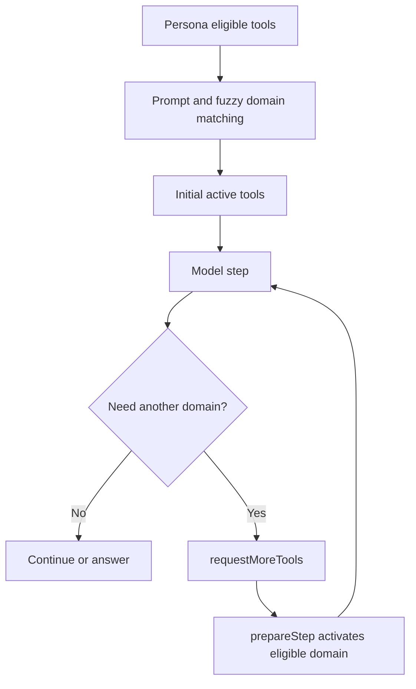

# Agent Tool Calling and Routing

> Current implementation contract. Last source audit: **2026-09-05**.
> General agent reference: [`AGENT.md`](AGENT.md).

## Goals

The router must give the model enough capability to complete a request without sending every tool schema on every step. It must also keep provider failures explicit and preserve a trace of what actually executed.

## Selection pipeline



### 1. Persona eligibility

- Allel (`alex`) is eligible for all registry tools.
- Henry and Sarah have explicit allowlists in `platform/src/agent/personas/personas.ts`.
- Eligibility is the upper bound; it is not the first-step active set.

### 2. Initial routing

`platform/src/agent/runtime/agent.ts` maps prompt terms and fuzzy keywords to domains such as Gmail, Slack, Stripe, Notion, PostHog, Linear, Intercom, HubSpot, Sentry, Airtable, Calendar, recovery, accounts, and web research.

The router prioritizes likely tools and builds a bounded initial set. This resolves the old documentation contradiction: **all eligible tools are not active from step one in chat**.

### 3. In-loop expansion

Chat includes the synthetic `requestMoreTools` tool. The model supplies a permitted domain and reason. On the next step, `prepareStep` adds eligible tools for requested domains and rebuilds runtime instructions. Expansion never bypasses the persona allowlist.

### 4. Provider readiness

Provider-dependent tools are wrapped by live connection guards. A connected row, valid token access, and recorded health are distinct concerns. Missing or unhealthy connections should produce explicit unavailability rather than synthetic provider content.

There is no separate shipped `ProviderReadiness` UI contract; older plans describing one were aspirational.

## Execution limits and retries

Current agent configuration:

```text
max steps          25
max output tokens  4096
temperature        0.3
SDK retries        10
```

The route also classifies failures and may retry a turn or use `AGENT_FALLBACK_MODEL_ID`. Do not use the old “four retries starting at one second” description; it no longer matches source.

## Auditing

Each run can record:

- persona and channel
- model
- active/used tools
- tool expansion requests
- step and token counts
- estimated cost and duration
- workflow/stage/provider/account fields
- output summary and errors
- announced-action mismatch

Run inspection APIs group records by workflow.

## Safety boundary

Routing controls visibility and provider guards control readiness; neither is a universal approval system. Generic manual interception is currently disabled because `MANUAL_APPROVAL_REQUIRED_TOOL_NAMES` is empty. Recovery draft approval remains a separate active, hash-checked workflow.

## Measuring the registry

From `platform/`:

```bash
npx tsx -e "import { ALL_TOOLS } from './src/agent/runtime/agent'; console.log(Object.keys(ALL_TOOLS).length)"
```

The command printed `164` on **2026-09-05**. Avoid unsupported token-reduction or concurrency claims unless accompanied by a reproducible benchmark artifact.
