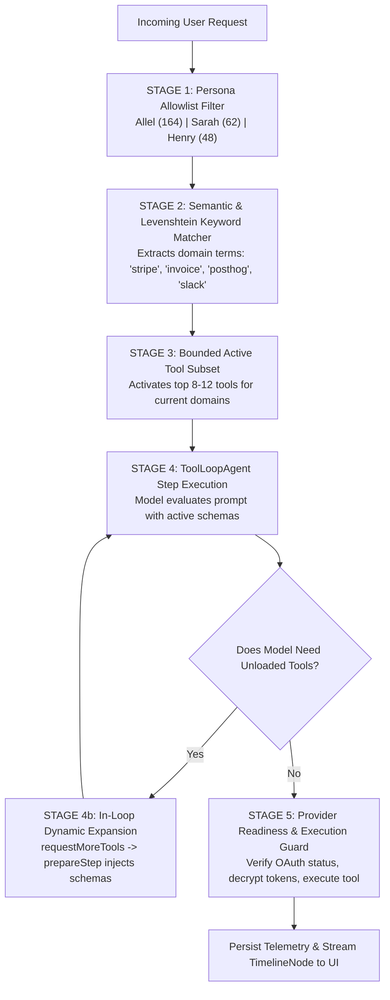
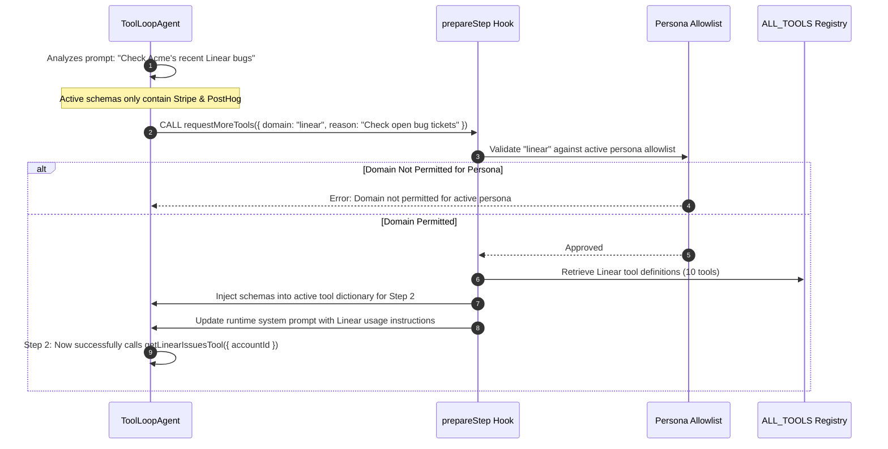
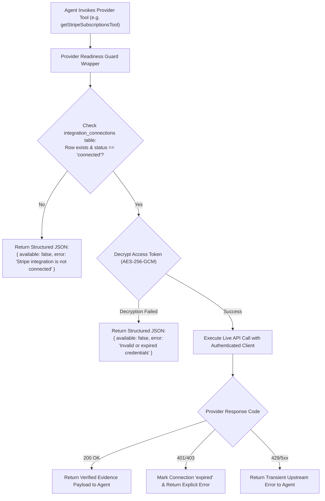
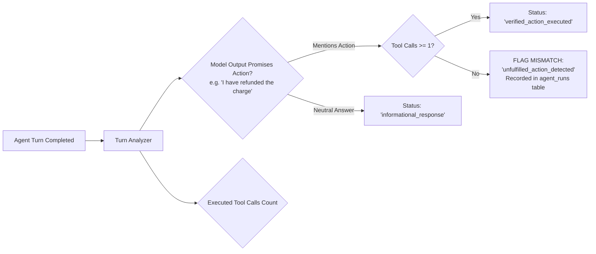

# Agent Tool Calling & Dynamic Routing

> **Specialized technical reference.** Start with the repository [`README.md`](../README.md) for the product overview. Agent runtime: [`AGENT.md`](AGENT.md).
> Last source audit: **2026-09-05**. Verified against `platform/src/agent/runtime/agent.ts` (164 tools in `ALL_TOOLS`).

---

## Contents

- [1. The 5-Stage Tool Routing Pipeline](#1-the-5-stage-tool-routing-pipeline)
- [2. Complete 164-Tool Registry Taxonomy](#2-complete-164-tool-registry-taxonomy)
- [3. Dynamic Schema Expansion (`prepareStep`)](#3-dynamic-schema-expansion-preparestep)
- [4. Provider Readiness & Credential Guard](#4-provider-readiness--credential-guard)
- [5. Telemetry & Announced-Action Audit](#5-telemetry--announced-action-audit)

---

## 1. The 5-Stage Tool Routing Pipeline

Allel orchestrates a large registry of **164 registered tools** without overwhelming model context or paying unnecessary token costs. It uses a 5-stage routing pipeline:

---

## 2. Complete 164-Tool Registry Taxonomy

The 164 tools in `ALL_TOOLS` are organized into 12 functional domains:

```mermaid
flowchart TB
    subgraph Registry["Allel Tool Registry (164 Active Tools)"]
        direction TB
        subgraph Core["Account & Intelligence (14 Tools)"]
            T_Scan["runRevenueRiskScan, getUnifiedCustomerScan, getUnifiedFleetScan"]
            T_Acc["getAccountDetails, getAccountMemory, getAllAccounts, updateAccountRisk"]
            T_Draft["generateFollowUpDraft, createSignal, addTimelineEvent, createRescueDiscountTool"]
        end

        subgraph Billing["Billing & Subscriptions - Stripe (26 Tools)"]
            T_StripeRead["getStripeCustomerOverviewTool, getStripeSubscriptionsTool, getStripeInvoicesTool"]
            T_StripeActions["createStripeCouponTool, cancelStripeSubscriptionTool, refundStripeCharge"]
        end

        subgraph Analytics["Product Analytics - PostHog (18 Tools)"]
            T_PHRead["getPostHogEventsTool, getPostHogFeatureFlagTool, getPostHogTrendsTool"]
            T_PHActions["togglePostHogFeatureFlag, createPostHogCohortTool"]
        end

        subgraph Email["Email & Communications - Gmail (16 Tools)"]
            T_GmailRead["getMyInbox, getGmailThreadDetailTool, searchGmailMessagesTool"]
            T_GmailActions["createDraftEmailTool, sendEmailTool, replyToEmailTool"]
        end

        subgraph Support["Customer Support - Intercom (12 Tools)"]
            T_Intercom["getIntercomConversationsTool, replyIntercomConversationTool, getIntercomCustomerTool"]
        end

        subgraph CRM["Sales & Deals - HubSpot (14 Tools)"]
            T_HubSpot["getHubSpotCompanyTool, getHubSpotDealsTool, updateHubSpotDealStageTool"]
        end

        subgraph Dev["Engineering & Errors - Linear & Sentry (18 Tools)"]
            T_Linear["getLinearIssuesTool, createLinearIssueTool, updateLinearIssueStatusTool"]
            T_Sentry["getSentryProjectErrorsTool, getSentryIssueDetailsTool"]
        end

        subgraph Collab["Collaboration & Knowledge (24 Tools)"]
            T_Slack["postSlackMessageTool, getSlackChannelsTool"]
            T_Calendar["getCalendarEventsTool, createCalendarEventTool"]
            T_Notion["getNotionPageTool, searchNotionDatabaseTool"]
            T_Airtable["getAirtableRecordsTool, updateAirtableRecordTool"]
        end

        subgraph Research["External Intel - Tavily (8 Tools)"]
            T_Tavily["tavilySearchTool, tavilyExtractTool, tavilyCrawlTool"]
        end

        subgraph Synthetic["Dynamic Control (14 Tools)"]
            T_Expand["requestMoreTools, requestAccountContextTool"]
        end
    end
```

---

## 3. Dynamic Schema Expansion (`prepareStep`)

To enable the model to discover tools on the fly without sending all 164 schemas upfront, Allel employs the synthetic `requestMoreTools` tool:

---

## 4. Provider Readiness & Credential Guard

Allel wraps all provider-backed tools with a **Provider Readiness Guard** (`platform/src/agent/runtime/agent.ts`). This ensures that missing or broken integrations return structured diagnostic data instead of letting the model hallucinate fabricated responses:

---

## 5. Telemetry & Announced-Action Audit

To prevent agents from falsely promising actions in chat without actually performing them, Allel audits tool calls against model responses:

