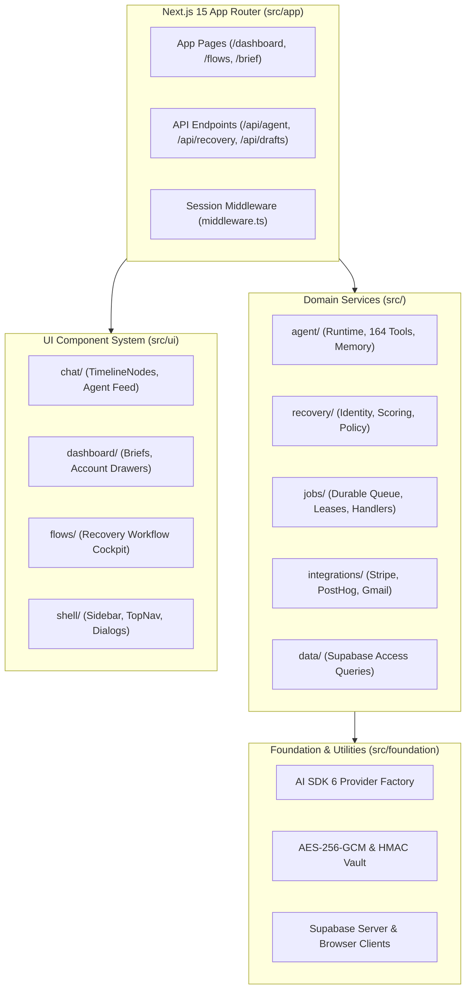
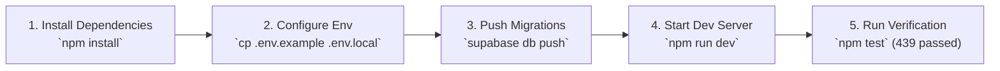

# Allel Platform — Developer & Operational Guide

> **Developer reference for `platform/`.** For full product overview, see root [`README.md`](../README.md). For detailed system architecture, see [`docs/ALLEL.md`](../docs/ALLEL.md).
> Last source audit: **2026-09-05**. Verified against repository source tree.

---

## Contents

- [1. Platform Architecture](#1-platform-architecture)
- [2. Directory Layout](#2-directory-layout)
- [3. Local Development Setup](#3-local-development-setup)
- [4. Environment Variables Configuration](#4-environment-variables-configuration)
- [5. Database Migrations](#5-database-migrations)
- [6. Application Routes & APIs](#6-application-routes--apis)
- [7. Operational CLI Tasks](#7-operational-cli-tasks)
- [8. Testing & Validation Suite](#8-testing--validation-suite)

---

## 1. Platform Architecture

The `platform` directory contains the full Next.js 15 App Router application, agent runtime, recovery engine, job queue, integration clients, and UI design system:



---

## 2. Directory Layout

```text
platform/
├── package.json                 # Next.js 15.5, React 19.1, AI SDK 6 dependencies
├── tsconfig.json                # TypeScript configuration with @/* path aliases
├── vercel.json                  # Production deployment & daily cron schedule
├── src/
│   ├── app/                     # App Router pages and authenticated API routes
│   │   ├── (auth)/              # Login and authentication callback pages
│   │   ├── dashboard/           # Main cockpit: /brief, /flows, /accounts, /connections
│   │   └── api/                 # REST endpoints: /agent, /recovery, /drafts, /webhooks
│   ├── agent/                   # Agent orchestration subsystem
│   │   ├── runtime/             # ToolLoopAgent engine and 164 registered tools
│   │   ├── personas/            # Persona definitions (Allel, Henry, Sarah) & instructions
│   │   ├── memory/              # Scoped conversation memory & HMAC signing
│   │   └── tools/               # Tool implementations across 12 domains
│   ├── recovery/                # Revenue recovery core subsystem
│   │   ├── identity.ts          # Deterministic identity resolution & conflicts
│   │   ├── scoring.ts           # 50/35/15 multi-dimensional risk scoring
│   │   ├── policy.ts            # Action policy & cooldown gating
│   │   ├── cases.ts             # Recovery case state machine transitions
│   │   └── draft-approval.ts    # SHA-256 hash-bound founder approval
│   ├── jobs/                    # Background execution engine
│   │   ├── queue.ts             # Leased job claiming (FOR UPDATE SKIP LOCKED)
│   │   ├── worker.ts            # Queue drain loop with bounded concurrency
│   │   └── handlers/            # 10 idempotent stage handlers
│   ├── integrations/            # Provider clients (Stripe, PostHog, Gmail, etc.)
│   ├── data/                    # Database queries and mutations
│   ├── foundation/              # Security, crypto, Supabase client, AI provider setup
│   ├── ui/                      # React 19 component library
│   │   ├── chat/                # TimelineNodes, message bubbles, action buttons
│   │   ├── dashboard/           # Brief views, account cards, stat widgets
│   │   └── primitives/          # Radix & Base UI buttons, inputs, modals
│   ├── scripts/                 # Scenarios, migration runner, worker CLI
│   └── artifacts/               # Test run evidence and evaluation reports
```

---

## 3. Local Development Setup



### Quick Commands

```bash
# 1. Install dependencies
npm install

# 2. Setup local environment
cp .env.example .env.local

# 3. Start local development server
npm run dev
# App will be accessible at http://localhost:3000

# 4. Run test suite
npm test

# 5. Verify production compilation
npm run build
```

---

## 4. Environment Variables Configuration

| Variable | Required | Description |
|---|:---:|---|
| `NEXT_PUBLIC_SUPABASE_URL` | Yes | Supabase project URL |
| `NEXT_PUBLIC_SUPABASE_ANON_KEY` | Yes | Supabase public anonymous key |
| `SUPABASE_SERVICE_ROLE_KEY` | Yes | Supabase elevated service-role key (server-side only) |
| `ENCRYPTION_KEY` | Yes | 32-byte hex key for AES-256-GCM token encryption |
| `AGENT_HISTORY_SIGNING_SECRET` | Yes | 64-byte secret for HMAC-SHA256 chat memory signing |
| `OPENAI_API_KEY` | Yes | OpenAI API key for agent reasoning and drafting |
| `OPENAI_MODEL_ID` | No | Default model ID (defaults to `gpt-4o`) |
| `AGENT_FALLBACK_MODEL_ID` | No | Optional fallback model during upstream rate limits |
| `STRIPE_SECRET_KEY` | Optional | Stripe restricted/secret API key for billing sync |
| `STRIPE_WEBHOOK_SECRET` | Optional | Stripe webhook signing secret |
| `POSTHOG_API_KEY` | Optional | PostHog personal API key for product usage sync |
| `CRON_SECRET` | Yes | Bearer secret required to trigger `/api/cron/daily-run` |
| `WORKER_SECRET` | Yes | Bearer secret required to drain `/api/internal/workflows/drain` |

---

## 5. Database Migrations

The database schema is defined in `database/migrations/` (29 ordered PostgreSQL files):

```bash
# Apply migrations using Supabase CLI
supabase db push

# Or apply sequentially via psql:
for file in database/migrations/*.sql; do
  psql "$DATABASE_URL" -f "$file"
done
```

---

## 6. Application Routes & APIs

### Authenticated Pages

| Route | Purpose | Component |
|---|---|---|
| `/dashboard` | AI Command Center & Streaming Chat | `src/app/dashboard/page.tsx` |
| `/dashboard/brief` | Founder Daily Morning Brief | `src/app/dashboard/brief/page.tsx` |
| `/dashboard/flows` | Recovery Automations Cockpit | `src/app/dashboard/flows/page.tsx` |
| `/dashboard/accounts` | Customer Accounts Portfolio | `src/app/dashboard/accounts/page.tsx` |
| `/dashboard/connections` | Integrations Management Hub | `src/app/dashboard/connections/page.tsx` |
| `/dashboard/drafts` | Pending Outreach Review | `src/app/dashboard/drafts/page.tsx` |

### Core API Endpoints

| Endpoint | Method | Functionality |
|---|:---:|---|
| `/api/agent` | `POST` | Multi-turn streaming chat with dynamic tool routing |
| `/api/agent/history` | `GET` | Retrieve cryptographically signed conversation turns |
| `/api/recovery/cases` | `GET` | List and filter active recovery cases |
| `/api/drafts/:id/approve` | `POST` | Grant hash-verified founder approval |
| `/api/drafts/:id/send` | `POST` | Dispatch approved recovery email via Gmail worker |
| `/api/brief` | `GET, POST` | Retrieve or generate founder morning brief |
| `/api/metrics/revenue-saved` | `GET` | Query strict recovered MRR and protected MRR |
| `/api/webhooks/stripe` | `POST` | Ingest Stripe signed webhook events |
| `/api/webhooks/posthog` | `POST` | Ingest PostHog signed webhook events |
| `/api/cron/daily-run` | `POST` | Morning scheduled reconciliation and brief dispatch |
| `/api/internal/workflows/drain` | `POST` | Background worker queue drain endpoint |

---

## 7. Operational CLI Tasks

```bash
# Run local worker queue drain
npm run workflows:drain -- --workspace-id=<uuid>

# Evaluate canonical 15-account recovery scenario
npm run scenario:evaluate

# Seed safe test-mode scenario accounts
npm run demo:data:seed

# Inspect seeded accounts and risk scores
npm run demo:data:inspect

# Cleanly wipe all test-mode scenario data
npm run demo:data:reset
```

---

## 8. Testing & Validation Suite

Point-in-time verified snapshot (**2026-09-05**):

```text
npm test       --> 439 passed, 0 failed (39 test suites, 100% pass)
npm run build  --> Passed (36/36 static pages compiled cleanly)
```

Run tests at any time:
```bash
npm test
```
